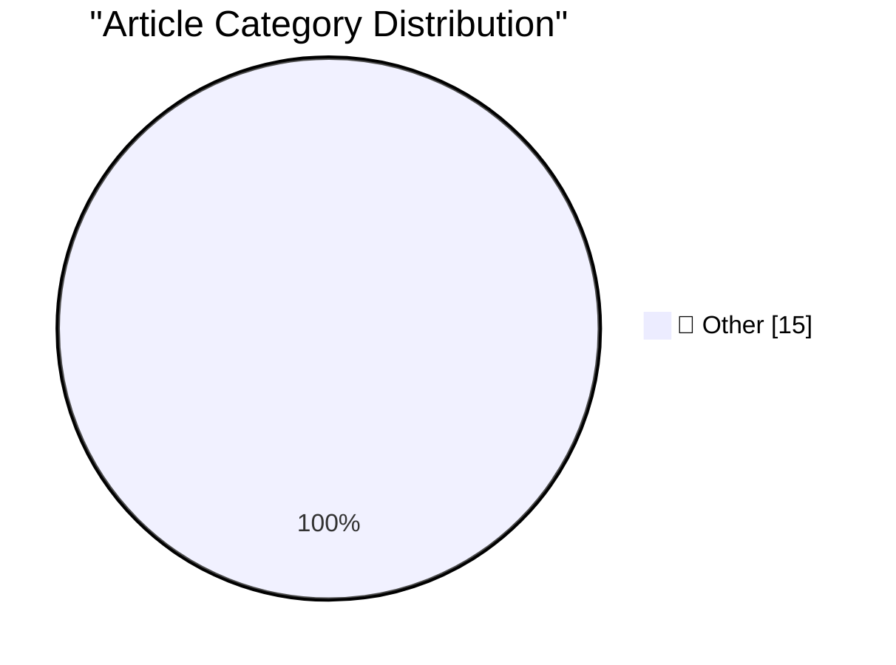

# 📰 AI Blog Daily Digest — 2026-08-15

> ⚠️ **Degraded run.** AI scoring failed for every batch — rankings and categories below are placeholder defaults, not AI-judged.

> From 92 top tech blogs (curated by Karpathy), AI-selected Top 15

## 🏆 Must Read

🥇 **Don't classify. Hallucinate!**

simonwillison.net · 2h ago · 📝 Other

> Don&#x27;t classify. Hallucinate! I still have quite a bit of older content on my blog that I never got round to tagging. My blog has 1,856 tags - likely too many to feed to an LLM in one go and say "

🥈 **sqlite-utils 4.2.1**

simonwillison.net · 1 days ago · 📝 Other

> Release: sqlite-utils 4.2.1 Fixes a crashing bug in sqlite-utils 4.2 . I'd introduced code that looks like this: from typing_extensions import Self It turned out the typing-extensions package was not 

🥉 **sqlite-utils 4.2**

simonwillison.net · 1 days ago · 📝 Other

> Release: sqlite-utils 4.2 Lots of improvements in this one relating to the table.transform() feature , which adds support for complex alter table operations by creating a fresh table, copying across t

---

## 📊 Data Overview

| Scanned | Articles | Range | Selected |
|:---:|:---:|:---:|:---:|
| 47/92 | 1229 → 34 | 48h | **15** |

### Category Distribution

---

## 📝 Other

### 1. Don't classify. Hallucinate!

[Link](https://simonwillison.net/2026/Aug/14/dont-classify-hallucinate/) — **simonwillison.net** · 2h ago · ⭐ 15/30

> Don&#x27;t classify. Hallucinate! I still have quite a bit of older content on my blog that I never got round to tagging. My blog has 1,856 tags - likely too many to feed to an LLM in one go and say "

---

### 2. sqlite-utils 4.2.1

[Link](https://simonwillison.net/2026/Aug/13/sqlite-utils-2/) — **simonwillison.net** · 1 days ago · ⭐ 15/30

> Release: sqlite-utils 4.2.1 Fixes a crashing bug in sqlite-utils 4.2 . I'd introduced code that looks like this: from typing_extensions import Self It turned out the typing-extensions package was not 

---

### 3. sqlite-utils 4.2

[Link](https://simonwillison.net/2026/Aug/13/sqlite-utils/) — **simonwillison.net** · 1 days ago · ⭐ 15/30

> Release: sqlite-utils 4.2 Lots of improvements in this one relating to the table.transform() feature , which adds support for complex alter table operations by creating a fresh table, copying across t

---

### 4. llm-gemini 0.33

[Link](https://simonwillison.net/2026/Aug/13/llm-gemini/) — **simonwillison.net** · 1 days ago · ⭐ 15/30

> Release: llm-gemini 0.33 It's been a while since the last llm-gemini release. This version of the plugin adds support for today's Gemini 3.7 Flash release, plus gemini-3.6-flash , gemini-3.5-flash-lit

---

### 5. alchemy-utils 0.1a1

[Link](https://simonwillison.net/2026/Aug/13/alchemy-utils/) — **simonwillison.net** · 1 days ago · ⭐ 15/30

> Release: alchemy-utils 0.1a1 Performance boost for DuckDB exports and CSV imports, see here .

---

### 6. Who’s Tracking You? Use This New Service to Find Out

[Link](https://krebsonsecurity.com/2026/08/whos-tracking-you-use-this-new-service-to-find-out/) — **krebsonsecurity.com** · 12h ago · ⭐ 15/30

> It can be daunting to determine who's responsible for showing ads on the websites we visit, or who's harvesting data from the mobile apps we use every day. That information is already semi-public, but

---

### 7. ★ You Don’t Need to Worry About Scratching Your iPhone Camera Lenses

[Link](https://daringfireball.net/2026/08/iphone_camera_lens_scratch_resistance) — **daringfireball.net** · 6h ago · ⭐ 15/30

> The exposed lens covers are made of sapphire, not glass, and are thus incredibly scratch resistant. And even if, somehow, do you pick up a scratch on a lens cover, it almost certainly won’t affect ima

---

### 8. Google’s ‘Material 3’ Design Write-Up Is 93.3 Percent Embarrassing

[Link](https://design.google/library/expressive-material-design-google-research) — **daringfireball.net** · 7h ago · ⭐ 15/30

> This page from Google Design on their “Material 3” UI language came to my attention after my snarky post about the ungainly new to-do app they bizarrely bragged about on Twitter/X this week. I don’t t

---

### 9. Ceramic Shield 2 Is the Real Deal

[Link](https://www.tomsguide.com/phones/iphones/iphone-17-and-iphone-air-durability-testing-heres-how-the-new-iphones-stand-up-to-bending-scratching-and-dropping) — **daringfireball.net** · 1 days ago · ⭐ 15/30

> Philip Michaels, writing last September for Tom’s Guide: iPhone 17 torture test videos done by JerryRigEverything indicate that Ceramic Shield 2 certainly resists scratching, with scratch testing leav

---

### 10. Google Design Pisses Its Pants on Twitter/X

[Link](https://x.com/googledesign/status/2087195277094695096) — **daringfireball.net** · 1 days ago · ⭐ 15/30

> A few years ago I’d have looked at this post and maybe leaned toward the idea that a precocious 8th grader somewhere hacked into the @GoogleDesign Twitter account and tried to pass off their little to

---

### 11. Pluralistic: Capital formation (14 Aug 2026)

[Link](https://pluralistic.net/2026/08/14/one-chokable-throat/) — **pluralistic.net** · 12h ago · ⭐ 15/30

> Today's links Capital formation: Going legit means going mainstream. Hey look at this: Delights to delectate. Object permanence: London Copyfighters x Speaker's Corner; TSA v lipstick; Long Beach v ph

---

### 12. Edinburgh Fringe: Target Audience ★★★★★

[Link](https://shkspr.mobi/blog/2026/08/edinburgh-fringe-target-audience/) — **shkspr.mobi** · 5h ago · ⭐ 15/30

> Easily the best show I've seen at the Fringe. For plot-related reasons, a television company asks a literary genius to create a "pro-weapons sitcom". It is a fast paced mix of the sitcoms 2012 and Epi

---

### 13. Edinburgh Fringe: Stand-up Philosophy ★★★⯪☆

[Link](https://shkspr.mobi/blog/2026/08/edinburgh-fringe-stand-up-philosophy/) — **shkspr.mobi** · 8h ago · ⭐ 15/30

> For a pay-what-you-want show this was decent. Three comedians doing sets on the theme of philosophy - followed by a Q&A where the audience poses philosophical conundrums to them. It more-or-less works

---

### 14. Edinburgh Fringe: Waiting for Wonka ★★★⯪☆

[Link](https://shkspr.mobi/blog/2026/08/edinburgh-fringe-waiting-for-wonka/) — **shkspr.mobi** · 11h ago · ⭐ 15/30

> This play is fucked up! Such a brilliant concept - what happened to the kids from Charlie and the Chocolate Factory after they were rejected by Wonka? Stuck together in a Big-Brotheresque household, t

---

### 15. Edinburgh Fringe: Doris, Dolly and the Dressing Room Divas ★★★★⯪

[Link](https://shkspr.mobi/blog/2026/08/edinburgh-fringe-doris-dolly-and-the-dressing-room-divas/) — **shkspr.mobi** · 1 days ago · ⭐ 15/30

> Quite simply marvellous! Three Scottish divas giving us their interpretations of the greats while backed by an excellent pianist. So many shows at the Fringe skimp on sets and props - not this! A lusc

---

*Generated on 2026-08-15 | Scanned 47 sources → Found 1229 articles → Selected 15 articles*
*Based on [Hacker News Popularity Contest 2025](https://refactoringenglish.com/tools/hn-popularity/) RSS feeds list, curated by [Andrej Karpathy](https://x.com/karpathy).*
*Created by "Understand AI".*
