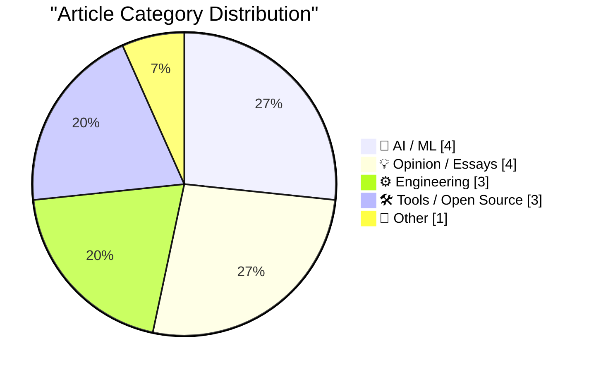
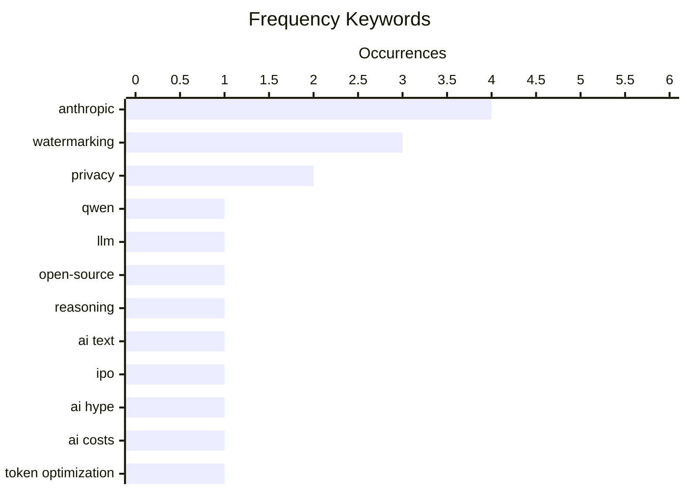

# 📰 AI Blog Daily Digest — 2026-08-17

> From 92 top tech blogs (curated by Karpathy), AI-selected Top 15

## 📝 Today's Highlights

Today’s tech discourse is dominated by the escalating debate over AI content provenance, with Anthropic’s watermarking plans drawing sharp criticism as both a weak legal appeasement and a fundamental perversion of writing. Meanwhile, the open-source AI frontier is advancing rapidly, as Alibaba’s Qwen 3.8 27B impresses with vision capabilities yet struggles with overthinking, prompting practical cost-reduction frameworks and hands-on testing tools. Finally, the engineering community continues to push foundational boundaries, from compressing Hadamard matrices to refining concurrent server design in Rust, signaling sustained depth in core systems work.

---

## 🏆 Must Read

🥇 **Qwen 3.8 27B is excellent, but it defaults to wildly overthinking things**

simonwillison.net · 30m ago · 🤖 AI / ML

> Qwen 3.8 27B, an Apache 2 licensed 27B parameter vision-capable LLM from Alibaba, shows significant benchmark improvements over its predecessor Qwen 3.6 27B and even the closed-weight Qwen 3.7-Plus, making it a strong contender for laptop deployment. However, the model defaults to 'wildly overthinking' problems, generating excessive reasoning tokens that slow responses and increase compute costs. The author suggests that while the model's quality is excellent, its verbosity in reasoning is a practical drawback that may require tuning or prompt engineering to mitigate. The core takeaway is that Qwen 3.8 27B is a top-tier open-weight model for local use, but its overthinking behavior is a notable trade-off.

💡 **Why it matters**: Essential reading for anyone considering running a capable LLM locally, as it highlights a real-world performance issue (overthinking) that benchmarks don't reveal.

🏷️ Qwen, LLM, open-source, reasoning

🥈 **AI text watermarking is not a big deal**

seangoedecke.com · 22h ago · 💡 Opinion / Essays

> Anthropic's plan to add hidden watermarks to Claude outputs is not a significant concern, contrary to public backlash. The watermarking does not degrade text quality, does not make AI outputs more detectable in practice (since watermarks are probabilistic and easily stripped), and does not violate user privacy. The author argues that watermarking is inevitable across the industry by 2027, driven by regulatory and platform pressures, and that users will not notice any meaningful change. The conclusion is that the controversy is overblown and users should not worry about switching models.

💡 **Why it matters**: Provides a balanced, technical counterpoint to the emotional debate around AI watermarking, helping readers understand why it's not a practical threat.

🏷️ watermarking, AI text, Anthropic, privacy

🥉 **The hyping of Anthropic’s IPO**

garymarcus.substack.com · 3h ago · 🤖 AI / ML

> The article critically examines the hype surrounding Anthropic's potential IPO, dissecting strong claims made by proponents. It likely questions the sustainability of Anthropic's valuation, its competitive position against OpenAI and Google, and the feasibility of its growth projections. The author, Gary Marcus, is known for skepticism toward AI hype, and here he applies that lens to financial claims, pointing out potential overestimations of market size and profitability. The core point is that the IPO hype may be disconnected from the underlying economic realities of the AI industry.

💡 **Why it matters**: A must-read for investors and tech observers to get a reality check on Anthropic's market narrative before making any decisions.

🏷️ Anthropic, IPO, AI hype

---

## 📊 Data Overview

| Scanned | Articles | Range | Selected |
|:---:|:---:|:---:|:---:|
| 88/92 | 2613 → 23 | 48h | **15** |

### Category Distribution



### High-Frequency Keywords



<details>
<summary>📈 ASCII Keyword Chart (Terminal Friendly)</summary>

```
anthropic    │ ████████████████████ 4
watermarking │ ███████████████░░░░░ 3
privacy      │ ██████████░░░░░░░░░░ 2
qwen         │ █████░░░░░░░░░░░░░░░ 1
llm          │ █████░░░░░░░░░░░░░░░ 1
open-source  │ █████░░░░░░░░░░░░░░░ 1
reasoning    │ █████░░░░░░░░░░░░░░░ 1
ai text      │ █████░░░░░░░░░░░░░░░ 1
ipo          │ █████░░░░░░░░░░░░░░░ 1
ai hype      │ █████░░░░░░░░░░░░░░░ 1
```

</details>

### 🏷️ Topic Tags

**anthropic**(4) · **watermarking**(3) · **privacy**(2) · qwen(1) · llm(1) · open-source(1) · reasoning(1) · ai text(1) · ipo(1) · ai hype(1) · ai costs(1) · token optimization(1) · open weights(1) · ai writing(1) · ethics(1) · eu regulation(1) · compliance(1) · hadamard matrix(1) · compression(1) · mathematics(1)

---

## 🤖 AI / ML

### 1. Qwen 3.8 27B is excellent, but it defaults to wildly overthinking things

[Link](https://simonwillison.net/2026/Aug/16/qwen-38-27b/) — **simonwillison.net** · 30m ago · ⭐ 25/30

> Qwen 3.8 27B, an Apache 2 licensed 27B parameter vision-capable LLM from Alibaba, shows significant benchmark improvements over its predecessor Qwen 3.6 27B and even the closed-weight Qwen 3.7-Plus, making it a strong contender for laptop deployment. However, the model defaults to 'wildly overthinking' problems, generating excessive reasoning tokens that slow responses and increase compute costs. The author suggests that while the model's quality is excellent, its verbosity in reasoning is a practical drawback that may require tuning or prompt engineering to mitigate. The core takeaway is that Qwen 3.8 27B is a top-tier open-weight model for local use, but its overthinking behavior is a notable trade-off.

🏷️ Qwen, LLM, open-source, reasoning

---

### 2. The hyping of Anthropic’s IPO

[Link](https://garymarcus.substack.com/p/the-hyping-of-anthropics-ipo) — **garymarcus.substack.com** · 3h ago · ⭐ 25/30

> The article critically examines the hype surrounding Anthropic's potential IPO, dissecting strong claims made by proponents. It likely questions the sustainability of Anthropic's valuation, its competitive position against OpenAI and Google, and the feasibility of its growth projections. The author, Gary Marcus, is known for skepticism toward AI hype, and here he applies that lens to financial claims, pointing out potential overestimations of market size and profitability. The core point is that the IPO hype may be disconnected from the underlying economic realities of the AI industry.

🏷️ Anthropic, IPO, AI hype

---

### 3. How I think about reducing AI costs

[Link](https://martinalderson.com/posts/how-i-think-about-reducing-ai-costs/?utm_source=rss&amp;utm_medium=rss&amp;utm_campaign=feed) — **martinalderson.com** · 22h ago · ⭐ 24/30

> The article presents a practical framework for reducing AI costs, focusing on four key areas: auditing token spend to identify waste, killing legacy models that are no longer cost-effective, migrating workloads to open-weight providers (e.g., Llama, Qwen) to cut API fees, and fixing agent/tool inefficiencies that silently burn tokens (e.g., redundant calls, poor prompt design). The author emphasizes that cost reduction is not just about choosing cheaper models but about optimizing the entire pipeline. The conclusion is that systematic auditing and targeted fixes can lead to significant savings without sacrificing performance.

🏷️ AI costs, token optimization, open weights

---

### 4. Training a Reinforcement Learning Model to Play Bonk.io

[Link](https://blog.pixelmelt.dev/training-a-reinforcement-learning-model-to-play-bonk-io/) — **blog.pixelmelt.dev** · 1 days ago · ⭐ 19/30

> The author dissects the web game Bonk.io to re-implement its physics engine from scratch, enabling the training of a reinforcement learning (RL) model to play the game. The post details the reverse-engineering process, including capturing network traffic and analyzing game behavior to replicate collision and movement mechanics. The custom physics engine allows for fast, headless simulation, which is essential for efficient RL training. The trained neural network demonstrates competent gameplay, showcasing a practical approach to applying RL to a real-time multiplayer game.

🏷️ reinforcement learning, game physics, neural network

---

## 💡 Opinion / Essays

### 5. AI text watermarking is not a big deal

[Link](https://seangoedecke.com/ai-text-watermarking-is-not-a-big-deal/) — **seangoedecke.com** · 22h ago · ⭐ 25/30

> Anthropic's plan to add hidden watermarks to Claude outputs is not a significant concern, contrary to public backlash. The watermarking does not degrade text quality, does not make AI outputs more detectable in practice (since watermarks are probabilistic and easily stripped), and does not violate user privacy. The author argues that watermarking is inevitable across the industry by 2027, driven by regulatory and platform pressures, and that users will not notice any meaningful change. The conclusion is that the controversy is overblown and users should not worry about switching models.

🏷️ watermarking, AI text, Anthropic, privacy

---

### 6. ★ Anthropic’s ‘Watermark’ Text Adulteration in Claude Is a Perversion of Writing

[Link](https://daringfireball.net/2026/08/anthropics_watermark_text_adulteration_in_claude_is_a_perversion_of_writing) — **daringfireball.net** · 3h ago · ⭐ 22/30

> The article strongly condemns Anthropic's plan to embed hidden watermarks in Claude's text outputs, calling it 'text adulteration' and a 'perversion of writing.' The author argues that any tool that sacrifices clarity, coherence, or meaning for the purpose of provenance tracking is unacceptable, as it prioritizes the company's needs over the user's. The core point is that the generation of text for a user should be solely focused on the user's requirements, not on hidden metadata. This is a principled stance against any form of output manipulation.

🏷️ watermarking, AI writing, Anthropic, ethics

---

### 7. ‘Anthropic’s Weak Watermarks Appease a Weak Law’

[Link](https://blog.j11y.io/2026-08-12_Anthropics-weak-watermarks-appease-a-weak-law/) — **daringfireball.net** · 5h ago · ⭐ 22/30

> The article critiques Anthropic's weak watermarking as a compliance measure for an EU regulation, arguing that the law itself is flawed. The author, James Padolsey, draws an analogy to calculators and spellcheckers, noting that their outputs are not treated as suspect, so why should AI text be? He argues that making assistance suspect only when the tool becomes capable enough to compose whole sentences is not a principled boundary. The conclusion is that the regulation is weak and the watermarking is a superficial appeasement that doesn't address deeper issues.

🏷️ watermarking, EU regulation, Anthropic, compliance

---

### 8. Quoting Dario Amodei

[Link](https://simonwillison.net/2026/Aug/16/dario-amodei/) — **simonwillison.net** · 7h ago · ⭐ 18/30

> Dario Amodei, CEO of Anthropic, argues that the public's negative view of AI is not primarily caused by AI leaders' warnings about risks, but rather a fundamental crisis of trust. He contends that ordinary people distrust companies, governments, and the tech industry, suspecting they are 'cooking up some new way to screw them over.' This distrust predates AI by decades, and AI is just the latest iteration of that systemic issue. Amodei suggests that superficial PR efforts ('a glitzy mar...') will not solve the problem, implying deeper structural changes are needed.

🏷️ AI trust, public perception, Dario Amodei

---

## ⚙️ Engineering

### 9. Compressing a Hadamard matrix

[Link](https://www.johndcook.com/blog/2026/08/15/compressing-a-hadamard-matrix/) — **johndcook.com** · 1 days ago · ⭐ 22/30

> The article discusses the recent discovery of a new Hadamard matrix and explores the concept of compressing such matrices. It builds on previous posts about Hadamard matrices, including their use in error-correcting codes (e.g., Mariner 9) and sphere packings. The core technical content likely explains how Hadamard matrices, being orthogonal, can be represented more efficiently, possibly through recursive structures or sparse representations. The conclusion is that compression techniques can reduce storage and computational overhead while preserving the matrix's properties.

🏷️ Hadamard matrix, compression, mathematics

---

### 10. Concurrent Servers: Part 7 - Rust

[Link](https://eli.thegreenplace.net/2026/concurrent-servers-part-7-rust/) — **eli.thegreenplace.net** · 1 days ago · ⭐ 20/30

> This is part 7 of a series on writing concurrent network servers, focusing on how Rust addresses the challenges discussed in earlier parts (threads, event-driven, libuv). The article likely covers Rust's ownership model, async/await, and libraries like Tokio to build efficient, safe concurrent servers. It compares Rust's approach to traditional threading and event-driven models, highlighting memory safety without garbage collection. The conclusion is that Rust offers a modern solution that balances performance and safety for concurrent server development.

🏷️ Rust, concurrency, network servers

---

### 11. Probability of correcting errors

[Link](https://www.johndcook.com/blog/2026/08/15/probability-of-correcting-errors/) — **johndcook.com** · 1 days ago · ⭐ 19/30

> Error-correcting codes are typically described by the maximum number of errors they can certainly correct, but this post explores the probability of correcting errors beyond that guaranteed limit. Using the Hadamard code from the Mariner 9 Mars probe as an example—which encodes 6-bit pixels into 32-bit codewords and guarantees correction of up to 7 bit errors—the author calculates the likelihood of successfully correcting more errors. The analysis shows that even when the error count exceeds the designed threshold, there is a non-trivial probability of successful correction due to the code's structure. The post provides a probabilistic perspective on error correction, complementing the worst-case guarantees.

🏷️ error correction, Hadamard code, Mariner 9

---

## 🛠 Tools / Open Source

### 12. This Week in Package Management: 15 August 2026

[Link](https://nesbitt.io/2026/08/15/this-week-in-package-management.html) — **nesbitt.io** · 1 days ago · ⭐ 22/30

> This is a weekly roundup of news in the package management ecosystem, covering releases, security advisories, and articles from various projects. It likely includes updates on tools like npm, pip, Maven, and others, highlighting new versions, vulnerabilities, and best practices. The post serves as a concise digest for developers to stay informed about the latest changes and threats. The conclusion is that staying updated on package management is crucial for security and efficiency.

🏷️ package management, releases, advisories

---

### 13. CORS Chat

[Link](https://simonwillison.net/2026/Aug/15/cors-chat/) — **simonwillison.net** · 1 days ago · ⭐ 20/30

> The author built a tool called CORS Chat to test Qwen 3.8 27B running in LM Studio on both an M5 MacBook Pro and an NVIDIA DGX Spark. It provides a web UI for exercising an OpenAI-Responses-compatible chat endpoint, and has been tested with LM Studio's --cors option and OpenRouter. Conversations are persisted in the browser and can be exported as JSON. A notable feature is that it detects SVG images being generated and progressively displays them, enhancing the chat experience.

🏷️ CORS, LM Studio, OpenAI API, testing

---

### 14. XCancel — An Unofficial Twitter/X Mirror

[Link](https://xcancel.com/about) — **daringfireball.net** · 7h ago · ⭐ 17/30

> XCancel is an instance of Nitter, a free and open-source alternative Twitter/X front-end focused on privacy and performance. Nitter allows users to browse Twitter without JavaScript, preserving privacy by not exposing IP addresses or tracking data to Twitter. It is on average about 15 times lighter than Twitter and often serves pages faster, including timelines. The source code is available on GitHub, and users can host their own instance for full control.

🏷️ Nitter, Twitter mirror, privacy, open source

---

## 📝 Other

### 15. Trump Administration ‘Not in Favor’ of Apple Using Chinese RAM

[Link](https://www.wsj.com/tech/apple-china-memory-chip-plan-57773a83?st=vfe1SA) — **daringfireball.net** · 5h ago · ⭐ 19/30

> The Trump administration has explicitly told Apple it opposes the company's plan to use Chinese-made memory chips to alleviate a supply crunch, according to Commerce Secretary Howard Lutnick. Lutnick stated that while other solutions to the memory issue must be found, it is 'not great American companies using Chinese memory.' He confirmed he has relayed this message to Apple 'plainly,' but U.S. government rules already require American companies to comply with certain restrictions, complicating Apple's options. The article highlights the tension between Apple's supply chain needs and U.S. political pressure on China.

🏷️ Apple, RAM, trade, supply chain

---

*Generated on 2026-08-17 | Scanned 88 sources → Found 2613 articles → Selected 15 articles*
*Based on [Hacker News Popularity Contest 2025](https://refactoringenglish.com/tools/hn-popularity/) RSS feeds list, curated by [Andrej Karpathy](https://x.com/karpathy).*
*Created by "Understand AI".*
