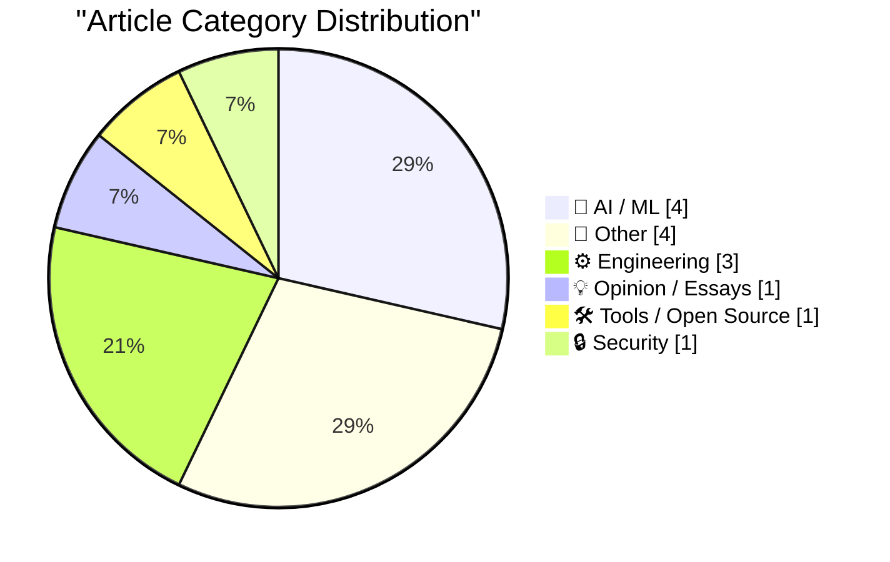
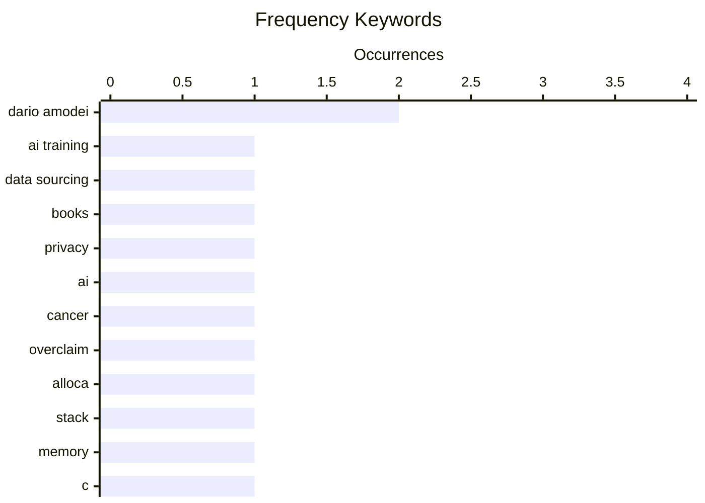

# 📰 AI Blog Daily Digest — 2026-08-18

> From 92 top tech blogs (curated by Karpathy), AI-selected Top 14

## 📝 Today's Highlights

Today’s tech discourse is dominated by a sharpening debate over AI’s real-world impact, from Amazon’s covert use of rare books for model training to prominent critiques of Anthropic’s CEO over inflated medical promises. Meanwhile, engineering deep-dives—spanning stack memory allocation and retro CD-ROM constraints—showcase a continued fascination with low-level systems and historical technical limits. The day also surfaces persistent friction between Big Tech and regulation, as Apple’s Siri AI stalls in the EU and security narratives revisit state pressure on telecoms.

---

## 🏆 Must Read

🥇 **We Tracked a Shipment of Rare Books. It Ended at an Amazon AI Training Facility**

simonwillison.net · 7h ago · 🤖 AI / ML

> 404 Media used an AirTag to track a shipment of rare books from a bookseller to an Amazon AI training facility, confirming suspicions that anonymous, price-insensitive bulk buyers are acquiring books for AI training. The investigation follows earlier reports of Anthropic's book scanning in June 2025. The tracking revealed the books ended up at an Amazon facility, implicating Amazon in this practice. The article highlights the growing trend of AI companies sourcing physical books for training data, often without transparency.

💡 **Why it matters**: This investigative piece provides concrete evidence of how AI companies acquire training data, a critical issue for authors, publishers, and anyone concerned about copyright and data provenance.

🏷️ AI training, data sourcing, books, privacy

🥈 **No, Dario Amodei, we will not be curing cancer and “most human disease” in five to ten years**

garymarcus.substack.com · 7h ago · 🤖 AI / ML

> Gary Marcus critiques Dario Amodei's optimistic claim that AI will cure cancer and most human diseases within 5-10 years, arguing that such predictions ignore fundamental limitations in AI's reasoning, reliability, and biological understanding. Marcus points out that Amodei's vision omits the need for rigorous clinical trials, regulatory hurdles, and the complexity of biological systems. He concludes that while AI may accelerate research, it will not single-handedly deliver cures in that timeframe, and overpromising risks misallocating resources and trust.

💡 **Why it matters**: This piece offers a crucial counterpoint to AI hype, grounding expectations in scientific reality—essential for policymakers, researchers, and the public.

🏷️ AI, cancer, overclaim, Dario Amodei

🥉 **How do functions like alloca allocate memory from the stack?**

devblogs.microsoft.com/oldnewthing · 6h ago · ⚙️ Engineering

> The post explains how functions like `alloca` allocate memory from the stack, focusing on the 'probing' mechanism used to ensure the stack has enough space. It details the low-level operations, including stack pointer adjustment and page fault handling, that allow dynamic stack allocation without corrupting other data. The explanation clarifies why `alloca` is efficient but also why it can be dangerous if used excessively. The author concludes with practical advice on when to use `alloca` versus heap allocation.

💡 **Why it matters**: For developers working in C/C++ or systems programming, this deep dive demystifies a common but often misunderstood function, helping avoid subtle bugs and performance pitfalls.

🏷️ alloca, stack, memory, C

---

## 📊 Data Overview

| Scanned | Articles | Range | Selected |
|:---:|:---:|:---:|:---:|
| 88/92 | 2614 → 23 | 48h | **14** |

### Category Distribution



### High-Frequency Keywords



<details>
<summary>📈 ASCII Keyword Chart (Terminal Friendly)</summary>

```
dario amodei  │ ████████████████████ 2
ai training   │ ██████████░░░░░░░░░░ 1
data sourcing │ ██████████░░░░░░░░░░ 1
books         │ ██████████░░░░░░░░░░ 1
privacy       │ ██████████░░░░░░░░░░ 1
ai            │ ██████████░░░░░░░░░░ 1
cancer        │ ██████████░░░░░░░░░░ 1
overclaim     │ ██████████░░░░░░░░░░ 1
alloca        │ ██████████░░░░░░░░░░ 1
stack         │ ██████████░░░░░░░░░░ 1
```

</details>

### 🏷️ Topic Tags

**dario amodei**(2) · **ai training**(1) · **data sourcing**(1) · books(1) · privacy(1) · ai(1) · cancer(1) · overclaim(1) · alloca(1) · stack(1) · memory(1) · c(1) · llm(1) · human-computer interaction(1) · programming(1) · siri(1) · eu(1) · apple(1) · ai regulation(1) · markdown(1)

---

## 🤖 AI / ML

### 1. We Tracked a Shipment of Rare Books. It Ended at an Amazon AI Training Facility

[Link](https://simonwillison.net/2026/Aug/17/we-tracked-a-shipment-of-rare-books-it-ended-at-an-amazon-ai-tra/) — **simonwillison.net** · 7h ago · ⭐ 23/30

> 404 Media used an AirTag to track a shipment of rare books from a bookseller to an Amazon AI training facility, confirming suspicions that anonymous, price-insensitive bulk buyers are acquiring books for AI training. The investigation follows earlier reports of Anthropic's book scanning in June 2025. The tracking revealed the books ended up at an Amazon facility, implicating Amazon in this practice. The article highlights the growing trend of AI companies sourcing physical books for training data, often without transparency.

🏷️ AI training, data sourcing, books, privacy

---

### 2. No, Dario Amodei, we will not be curing cancer and “most human disease” in five to ten years

[Link](https://garymarcus.substack.com/p/no-dario-amodei-we-will-not-be-curing) — **garymarcus.substack.com** · 7h ago · ⭐ 22/30

> Gary Marcus critiques Dario Amodei's optimistic claim that AI will cure cancer and most human diseases within 5-10 years, arguing that such predictions ignore fundamental limitations in AI's reasoning, reliability, and biological understanding. Marcus points out that Amodei's vision omits the need for rigorous clinical trials, regulatory hurdles, and the complexity of biological systems. He concludes that while AI may accelerate research, it will not single-handedly deliver cures in that timeframe, and overpromising risks misallocating resources and trust.

🏷️ AI, cancer, overclaim, Dario Amodei

---

### 3. No Update Since Early July Regarding Siri AI Coming to the EU, Ever

[Link](https://www.ft.com/content/807d25c3-f4ac-4402-b815-3aa91018237d) — **daringfireball.net** · 47m ago · ⭐ 19/30

> The article reports that Apple CEO Tim Cook and EU tech chief Henna Virkkunen held 'constructive' talks in July to ease tensions over the delayed rollout of 'Siri AI' in the EU, but no update has been provided since. The dispute centers on regulatory concerns, likely related to the EU's Digital Markets Act and AI Act, which may require changes to Apple's AI features. The lack of progress suggests ongoing friction between Apple and EU regulators, leaving EU users without access to the new Siri capabilities. The author implies that the delay may be intentional or due to unresolved compliance issues.

🏷️ Siri, EU, Apple, AI regulation

---

### 4. The Information Profiles Cami Clark — Dario Amodei’s Wife, Ivanka Trump’s Friend, One-Time Would-Be Pornographer, and Anthropic’s ‘First Lady’

[Link](https://www.theinformation.com/articles/anthropics-first-lady-took-winding-road-top?rc=jfy0lk) — **daringfireball.net** · 1 days ago · ⭐ 17/30

> The Information profiles Cami Clark, Dario Amodei's wife, describing her as his 'emotional ballast' and a constant presence during Anthropic's growth and clashes with Washington. The article details her unconventional path, including a past as a would-be pornographer and her friendship with Ivanka Trump, which adds a personal dimension to the AI policy landscape. It suggests that Clark's influence on Amodei may extend to strategic decisions, though the extent is unclear. The profile paints a picture of a power couple navigating the intersection of AI, politics, and personal life.

🏷️ Anthropic, Dario Amodei, profile, leadership

---

## 📝 Other

### 5. Pluralistic: Jennifer Jenkins' 'Music Copyright, Creativity, and Culture' (17 Aug 2026)

[Link](https://pluralistic.net/2026/08/17/great-sousas-ghost/) — **pluralistic.net** · 15h ago · ⭐ 15/30

> Cory Doctorow highlights Jennifer Jenkins' 'Music Copyright, Creativity, and Culture,' a textbook that uses comics to explain copyright law in the music industry. The book covers topics like fair use, sampling, and the public domain, making complex legal concepts accessible. Doctorow praises the book's approach, noting it fills a gap in legal education. He also includes his usual roundup of links, covering topics from housing to LLMs, but the main focus is on the textbook's value for creators and students.

🏷️ copyright, music, book, culture

---

### 6. When the Internet reached half of US households

[Link](https://dfarq.homeip.net/when-the-internet-reached-half-of-us-households/?utm_source=rss&#038;utm_medium=rss&#038;utm_campaign=when-the-internet-reached-half-of-us-households) — **dfarq.homeip.net** · 11h ago · ⭐ 14/30

> The post marks August 17, 2000 as the day the Internet reached half of US households, a milestone that symbolized the transition from a niche academic tool to a mainstream consumer utility. It highlights that this date is significant because it represents the tipping point where Internet usage became common among the general population, not just computer science students. The author argues that this moment completed the Internet's shift into everyday life, enabling activities like online shopping for parents. The post uses this historical marker to reflect on the rapid adoption of the Internet in the early 2000s.

🏷️ Internet history, mainstream adoption, 2000

---

### 7. Apple TV Still Has No Start Date for ‘The Savant’

[Link](https://daringfireball.net/linked/2026/04/19/chastain-says-the-savant-will-be-released) — **daringfireball.net** · 36m ago · ⭐ 12/30

> The post reports that Apple TV still has no start date for 'The Savant,' a political thriller starring Jessica Chastain, which was originally slated to debut a year ago. The show was postponed, reportedly due to Apple's fear of upsetting extremist right-wing groups, as the plot involves Chastain hunting down such individuals. Chastain has expressed frustration over the delay, and the last update was in April when Variety's Marc Malkin noted the uncertainty. The post criticizes Apple's decision, implying that the delay is a form of censorship driven by political pressure.

🏷️ Apple TV, The Savant, delay, politics

---

### 8. Thoughts on visiting the Edinburgh Fringe as a newbie

[Link](https://shkspr.mobi/blog/2026/08/thoughts-on-the-edinburgh-fringe-as-a-newbie/) — **shkspr.mobi** · 1 days ago · ⭐ 12/30

> The post shares a first-time visitor's scattered thoughts on the Edinburgh Fringe, covering the good, bad, and annoying aspects of the festival. The author attended 23 shows together with a companion, plus one separate show each, and found more hits than misses. However, the frustration of wasting time on a bad show is heavy given the hundreds of alternatives available. The post reflects on the overwhelming scale of the event and the challenge of choosing quality performances, offering a balanced view of the festival's extravagance and its pitfalls.

🏷️ Edinburgh Fringe, festival, review, experience

---

## ⚙️ Engineering

### 9. How do functions like alloca allocate memory from the stack?

[Link](https://devblogs.microsoft.com/oldnewthing/20260817-40/?p=112617) — **devblogs.microsoft.com/oldnewthing** · 6h ago · ⭐ 20/30

> The post explains how functions like `alloca` allocate memory from the stack, focusing on the 'probing' mechanism used to ensure the stack has enough space. It details the low-level operations, including stack pointer adjustment and page fault handling, that allow dynamic stack allocation without corrupting other data. The explanation clarifies why `alloca` is efficient but also why it can be dangerous if used excessively. The author concludes with practical advice on when to use `alloca` versus heap allocation.

🏷️ alloca, stack, memory, C

---

### 10. Quake Shareware, a CD-ROM just a little too full

[Link](https://fabiensanglard.net/quake_shareware_cd/index.html) — **fabiensanglard.net** · 22h ago · ⭐ 16/30

> Fabien Sanglard analyzes the technical challenges of fitting the Quake shareware onto a CD-ROM, which was 'just a little too full.' The post details the file compression, data layout, and optimization techniques used to make the game fit, including clever use of the CD's structure. It highlights the ingenuity of developers in the 1990s when storage was a premium. The article concludes with a reflection on how modern developers, with abundant storage, have lost some of these optimization skills.

🏷️ Quake, CD-ROM, game development, retro

---

### 11. Proportion of 1s in a Hadamard matrix

[Link](https://www.johndcook.com/blog/2026/08/16/proportion-of-1s-in-a-hadamard-matrix/) — **johndcook.com** · 21h ago · ⭐ 15/30

> The post examines the proportion of 1s in Hadamard matrices constructed via the Kronecker product, building on a previous series about Hadamard matrix construction. It shows that starting with a Hadamard matrix H0 and another Hadamard matrix G, the sequence Hn+1 = G ⊗ Hn yields matrices whose proportion of 1s can be derived from the proportions in the component matrices. The key finding is that the proportion of 1s in the Kronecker product is the product of the proportions of 1s in the two factors, leading to a simple recurrence for the sequence. This result provides a clear way to compute the density of 1s in large Hadamard matrices generated iteratively, which is useful for applications in coding theory and signal processing.

🏷️ Hadamard matrix, Kronecker product, mathematics

---

## 💡 Opinion / Essays

### 12. Oops, Should’ve Thought of That

[Link](https://blog.jim-nielsen.com/2026/oops-shouldve-thought-of-that/) — **blog.jim-nielsen.com** · 1 days ago · ⭐ 20/30

> Jim Nielsen reflects on Gordon Brander's observation that LLMs have shifted computing from exact specification to 'vibes,' where users can express intent in natural language and the system extrapolates meaning. This change reduces the burden of precise specification but introduces ambiguity and unpredictability, as the system may interpret intent incorrectly. Nielsen argues that this shift has profound implications for software design, user expectations, and debugging, as the 'bug' may no longer be a clear failure but a misinterpretation. He concludes that embracing this new paradigm requires rethinking how we build and evaluate software.

🏷️ LLM, human-computer interaction, programming

---

## 🛠 Tools / Open Source

### 13. Markdown SVG upgrades

[Link](https://simonwillison.net/2026/Aug/16/markdown-svg-upgrades/) — **simonwillison.net** · 22h ago · ⭐ 18/30

> Simon Willison describes the evolution of his markdown-svg-renderer tool, which now supports rendering Markdown transcripts that include SVG documents. The tool is browser-based, allowing users to paste Markdown and see it rendered, with support for CORS-friendly SVG sources. New features include improved SVG handling, better styling, and easier sharing. Willison notes that the tool has become his go-to for sharing technical content that mixes text and diagrams, solving a niche but persistent problem.

🏷️ Markdown, SVG, renderer, tool

---

## 🔒 Security

### 14. And then the men with guns tell you to do it anyway

[Link](https://shkspr.mobi/blog/2026/08/and-then-the-men-with-guns-tell-you-to-do-it-anyway/) — **shkspr.mobi** · 10h ago · ⭐ 17/30

> Terence Eden recounts how, during the 2011 Egyptian revolution, Vodafone sent pro-regime text messages to users, allegedly under pressure from the military. The post explores the ethical dilemma of telecom companies complying with government demands, especially when those demands involve spreading propaganda or suppressing dissent. Eden argues that such actions undermine trust in communication platforms and set a dangerous precedent for state control. He concludes that companies must resist such pressure, even at the risk of legal consequences, to protect democratic values.

🏷️ Egypt, revolution, SMS, authority

---

*Generated on 2026-08-18 | Scanned 88 sources → Found 2614 articles → Selected 14 articles*
*Based on [Hacker News Popularity Contest 2025](https://refactoringenglish.com/tools/hn-popularity/) RSS feeds list, curated by [Andrej Karpathy](https://x.com/karpathy).*
*Created by "Understand AI".*
