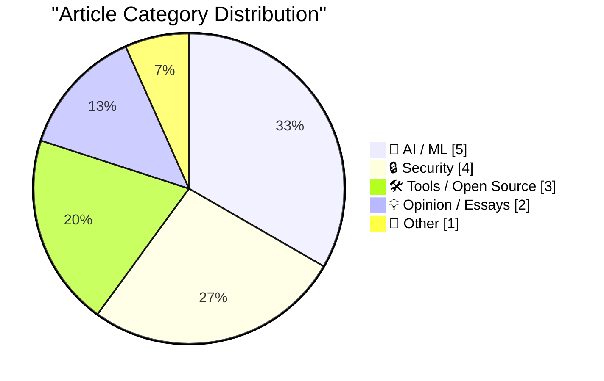
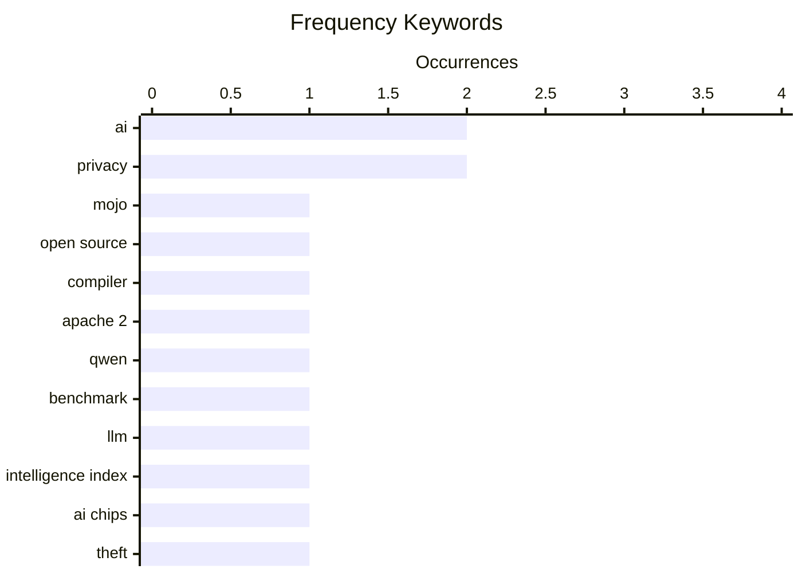

# 📰 AI Blog Daily Digest — 2026-08-19

> From 92 top tech blogs (curated by Karpathy), AI-selected Top 15

## 📝 Today's Highlights

Today’s tech landscape is dominated by AI’s rapid commoditization and its mounting societal friction, as open-source models like Qwen push performance boundaries while public sentiment—especially among U.S. young adults—shifts from excitement to wariness. Concurrently, the physical security of AI infrastructure has become a critical vulnerability, with organized gangs violently targeting server chips, underscoring the high-stakes economics of the GPU supply chain. Meanwhile, foundational debates rage over AI’s long-term viability and control, from critiques of “alignment” as a hollow buzzword to speculative analyses of OpenAI’s potential collapse and the limits of intellectual property against generative models.

---

## 🏆 Must Read

🥇 **Mojo🔥 is now open source**

simonwillison.net · 52m ago · 🛠 Tools / Open Source

> Mojo🔥, a programming language designed as a Python superset for high-performance computing, has finally been open-sourced under the Apache 2 license, fulfilling a promise made in May 2023. The release follows the shipping of version 1.0 and includes the compiler and toolchain. Notably, the original plan to be a strict Python superset was revised around August 2025, indicating a shift in strategy. This move aims to foster community adoption and ecosystem growth, leveraging Python's familiarity while offering C-level performance.

💡 **Why it matters**: Essential reading for developers interested in the future of Python-compatible, high-performance languages and the strategic pivot that could shape Mojo's adoption.

🏷️ Mojo, open source, compiler, Apache 2

🥈 **Qwen 3.8 27B scores 52 on the Artificial Analysis Intelligence Index**

simonwillison.net · 22h ago · 🤖 AI / ML

> Qwen 3.8 27B, a compact 27-billion-parameter model, has achieved a score of 52 on the Artificial Analysis Intelligence Index, matching the performance of GPT-5.6 Luna (max) and trailing only one point behind much larger models like GLM-5.2 (753B) and DeepSeek V4 Pro 0813 (1.7T). This result highlights the remarkable efficiency and capability of smaller models, suggesting that size is not the sole determinant of intelligence. The model's performance is particularly notable given its relatively small parameter count, positioning it as a significant achievement in the AI field.

💡 **Why it matters**: A must-read for AI enthusiasts and researchers to understand the rapid progress in efficient model design and the competitive landscape of open-weight LLMs.

🏷️ Qwen, benchmark, LLM, intelligence index

🥉 **Organized Thieves Are Targeting AI Server Chips With Violent Highway Hijackings**

daringfireball.net · 3h ago · 🔒 Security

> Organized criminal gangs are increasingly targeting AI server chips, such as GPUs, through violent highway hijackings, as reported by Wired. The incidents involved two shipments of high-value technology traveling from Silicon Valley to Southern California, where trucks were followed by private security escorts but still stolen. This highlights the growing black market for AI hardware, driven by the high demand and scarcity of these components. The violence and sophistication of these thefts underscore the extreme value and logistical challenges in securing AI supply chains.

💡 **Why it matters**: Critical for anyone in the tech industry to understand the physical security risks associated with AI hardware and the broader implications for supply chain integrity.

🏷️ AI chips, theft, supply chain, hardware

---

## 📊 Data Overview

| Scanned | Articles | Range | Selected |
|:---:|:---:|:---:|:---:|
| 88/92 | 2615 → 34 | 48h | **15** |

### Category Distribution



### High-Frequency Keywords



<details>
<summary>📈 ASCII Keyword Chart (Terminal Friendly)</summary>

```
ai                 │ ████████████████████ 2
privacy            │ ████████████████████ 2
mojo               │ ██████████░░░░░░░░░░ 1
open source        │ ██████████░░░░░░░░░░ 1
compiler           │ ██████████░░░░░░░░░░ 1
apache 2           │ ██████████░░░░░░░░░░ 1
qwen               │ ██████████░░░░░░░░░░ 1
benchmark          │ ██████████░░░░░░░░░░ 1
llm                │ ██████████░░░░░░░░░░ 1
intelligence index │ ██████████░░░░░░░░░░ 1
```

</details>

### 🏷️ Topic Tags

**ai**(2) · **privacy**(2) · **mojo**(1) · open source(1) · compiler(1) · apache 2(1) · qwen(1) · benchmark(1) · llm(1) · intelligence index(1) · ai chips(1) · theft(1) · supply chain(1) · hardware(1) · google(1) · ai strategy(1) · mistakes(1) · public opinion(1) · young adults(1) · 2fa(1)

---

## 🤖 AI / ML

### 1. Qwen 3.8 27B scores 52 on the Artificial Analysis Intelligence Index

[Link](https://simonwillison.net/2026/Aug/17/qwen-38-27b-scores-52/) — **simonwillison.net** · 22h ago · ⭐ 24/30

> Qwen 3.8 27B, a compact 27-billion-parameter model, has achieved a score of 52 on the Artificial Analysis Intelligence Index, matching the performance of GPT-5.6 Luna (max) and trailing only one point behind much larger models like GLM-5.2 (753B) and DeepSeek V4 Pro 0813 (1.7T). This result highlights the remarkable efficiency and capability of smaller models, suggesting that size is not the sole determinant of intelligence. The model's performance is particularly notable given its relatively small parameter count, positioning it as a significant achievement in the AI field.

🏷️ Qwen, benchmark, LLM, intelligence index

---

### 2. Google’s biggest mistake?

[Link](https://garymarcus.substack.com/p/googles-biggest-mistake) — **garymarcus.substack.com** · 1h ago · ⭐ 23/30

> Gary Marcus theorizes about Google's biggest mistake, likely referring to its AI strategy, and raises open questions about what might happen next. The article suggests that Google's missteps, possibly in the race to commercialize AI, could have significant consequences for the company's future. Marcus, a known AI critic, likely argues that Google's focus on speed over safety or its failure to capitalize on its early AI advantages has put it at a disadvantage. The piece invites readers to consider the implications of these strategic errors.

🏷️ Google, AI strategy, mistakes

---

### 3. Breaking: U.S. young adults are now more concerned about AI than enthusiastic

[Link](https://garymarcus.substack.com/p/breaking-us-young-adults-are-now) — **garymarcus.substack.com** · 4h ago · ⭐ 23/30

> A recent survey indicates that U.S. young adults are now more concerned than enthusiastic about AI, marking a shift in public sentiment. This update to a previous note on growing backlash suggests that the negative perceptions of AI are intensifying among the younger demographic. The article likely discusses the implications of this trend for AI adoption and policy. Marcus uses this data to argue that the public's wariness could hinder AI progress or lead to stricter regulations.

🏷️ AI, public opinion, young adults

---

### 4. AI Alignment as a Thought-Terminating Cliche

[Link](https://borretti.me/article/ai-alignment-as-thought-terminating-cliche) — **borretti.me** · 22h ago · ⭐ 23/30

> The article argues that 'AI alignment' has become a thought-terminating cliché, used as a rhetorical device to shut down nuanced discussion rather than foster it. It suggests that the term is often invoked to imply a monolithic solution to a complex problem, avoiding deeper analysis of the technical and ethical challenges. The author likely calls for more precise language and critical thinking in AI safety debates. The piece is a critique of how the AI community communicates about risks.

🏷️ AI alignment, rhetoric, critique

---

### 5. ★ Follow-Up Thoughts on Watermarking Schemes for AI-Generated Text

[Link](https://daringfireball.net/2026/08/follow-up_thoughts_on_watermarking) — **daringfireball.net** · 21h ago · ⭐ 21/30

> The article offers follow-up thoughts on watermarking schemes for AI-generated text, emphasizing the desire for answers that are cogent, lucid, and accurate. It acknowledges that the 'genie is not going back in the bottle,' meaning AI text is here to stay, so watermarking is a necessary tool for transparency. The piece likely discusses the technical challenges and trade-offs of watermarking, such as robustness and false positives. The author argues for practical solutions that balance detectability with text quality.

🏷️ watermarking, AI text, authenticity, detection

---

## 🔒 Security

### 6. Organized Thieves Are Targeting AI Server Chips With Violent Highway Hijackings

[Link](https://www.wired.com/story/the-worst-ive-ever-seen-cargo-thieves-are-turning-violent-in-pursuit-of-ai-hardware/) — **daringfireball.net** · 3h ago · ⭐ 23/30

> Organized criminal gangs are increasingly targeting AI server chips, such as GPUs, through violent highway hijackings, as reported by Wired. The incidents involved two shipments of high-value technology traveling from Silicon Valley to Southern California, where trucks were followed by private security escorts but still stolen. This highlights the growing black market for AI hardware, driven by the high demand and scarcity of these components. The violence and sophistication of these thefts underscore the extreme value and logistical challenges in securing AI supply chains.

🏷️ AI chips, theft, supply chain, hardware

---

### 7. Two-Factor Authentication Across Package Registries

[Link](https://nesbitt.io/2026/08/18/two-factor-authentication-across-package-registries.html) — **nesbitt.io** · 12h ago · ⭐ 23/30

> The article discusses the challenges and solutions for implementing two-factor authentication (2FA) across package registries, highlighting the use of 'something you have, something you know, and someone else's OAuth.' It likely explores how registries like npm, PyPI, or others are adopting 2FA to enhance security against supply chain attacks. The piece may compare different 2FA methods, such as TOTP vs. WebAuthn, and their trade-offs. The core message is that robust 2FA is essential for protecting software ecosystems.

🏷️ 2FA, package registries, OAuth

---

### 8. Weekly Update 517: Cyber Ransoms

[Link](https://www.troyhunt.com/weekly-update-517/) — **troyhunt.com** · 18h ago · ⭐ 21/30

> Troy Hunt's weekly update dissects the current ransomware landscape, noting that much of it is pure extortion without actual 'ware' (malware). He highlights that many perpetrators are young individuals who make large sums of money but struggle to launder or spend it, creating a chaotic ecosystem. The post also touches on the broader implications for cybersecurity practices and the challenges of combating these attacks. Hunt concludes that the situation is a 'kludge'—a messy, improvised system that requires pragmatic, layered defenses rather than silver-bullet solutions.

🏷️ ransomware, cybercrime, extortion, security

---

### 9. Apple Gives Legal Middle Finger to DOJ Challenge on Apple’s July Discovery Win

[Link](https://9to5mac.com/2026/08/17/apple-dojs-latest-challenge-in-antitrust-case-fails-at-every-level/) — **daringfireball.net** · 7m ago · ⭐ 20/30

> Apple has responded to the DOJ's latest challenge in the antitrust case U.S. v. Apple, which originated under the Biden administration. The DOJ argues that certain Apple platform features are anticompetitive, while Apple counters that they are privacy and security measures. In July, Apple won a discovery ruling allowing it to request documents from 14 federal agencies, including the CIA, FBI, NSA, and State Department, to understand why they purchase iPhones. Apple's legal response is described as a 'legal middle finger,' signaling its aggressive defense against the government's case.

🏷️ Apple, antitrust, DOJ, privacy

---

## 🛠 Tools / Open Source

### 10. Mojo🔥 is now open source

[Link](https://simonwillison.net/2026/Aug/18/mojo-is-now-open-source/) — **simonwillison.net** · 52m ago · ⭐ 26/30

> Mojo🔥, a programming language designed as a Python superset for high-performance computing, has finally been open-sourced under the Apache 2 license, fulfilling a promise made in May 2023. The release follows the shipping of version 1.0 and includes the compiler and toolchain. Notably, the original plan to be a strict Python superset was revised around August 2025, indicating a shift in strategy. This move aims to foster community adoption and ecosystem growth, leveraging Python's familiarity while offering C-level performance.

🏷️ Mojo, open source, compiler, Apache 2

---

### 11. Vim wants you to control, VSCode wants you to consume

[Link](https://buttondown.com/hillelwayne/archive/vim-wants-you-to-control-vscode-wants-you-to/) — **buttondown.com/hillelwayne** · 6h ago · ⭐ 20/30

> Hillel Wayne's newsletter discusses his recent busy period (two weddings, two conferences, and finishing 'Logic for Programmers') and his new role as Developer Educator at Antithesis. He contrasts Vim and VSCode philosophies: Vim is designed for users who want full control over their editing environment, while VSCode is optimized for consumption with a rich ecosystem of extensions. Wayne argues that this fundamental difference shapes how developers interact with their tools, affecting productivity and customization. He also mentions upcoming podcast appearances and a book sale.

🏷️ Vim, VSCode, editor philosophy

---

### 12. Nature Is Healing: MacOS 27 Golden Gate Beta 6 Adds Redesigned Traffic Light Window Controls

[Link](https://9to5mac.com/2026/08/17/macos-27-golden-gate-beta-6-features-redesigned-traffic-light-window-controls/) — **daringfireball.net** · 9h ago · ⭐ 18/30

> macOS 27 Golden Gate beta 6 introduces redesigned traffic light window controls that resemble older Mac OS X systems with more detail in each button. The author praises this change as a step in the right direction, contrasting it with the 'disaster' of macOS 26 Tahoe, which he felt marked a low point in the UI's decline. He expresses impatience for further improvements but acknowledges that Golden Gate is not a mirage—it's a genuine effort to restore quality. The post reflects a broader sentiment among users who miss the polish of earlier macOS versions.

🏷️ macOS, UI, redesign, Golden Gate

---

## 💡 Opinion / Essays

### 13. What Happens If OpenAI Dies?

[Link](https://www.wheresyoured.at/what-happens-if-openai-dies/) — **wheresyoured.at** · 7h ago · ⭐ 22/30

> The article speculates on the potential consequences if OpenAI were to fail or shut down, examining the ripple effects on the AI industry and beyond. It likely discusses the dependency of many startups and products on OpenAI's APIs, and the possible vacuum that could be left. The piece may also consider alternatives and the resilience of the AI ecosystem. The author's analysis suggests that OpenAI's demise would be a significant shock but not necessarily catastrophic for AI progress.

🏷️ OpenAI, AI industry, risk, future

---

### 14. Pluralistic: IP can't save you from AI (18 Aug 2026)

[Link](https://pluralistic.net/2026/08/18/enron-corpus/) — **pluralistic.net** · 7h ago · ⭐ 21/30

> The article argues that intellectual property (IP) rights cannot protect creators from the impacts of AI, asserting that property rights are insufficient substitutes for labor rights and privacy rights. It likely critiques the reliance on copyright and patents to address AI's disruption, suggesting that these mechanisms fail to address the root issues of exploitation and data misuse. The piece may advocate for stronger labor protections and privacy regulations as more effective responses. The author, Cory Doctorow, is known for his views on digital rights and corporate power.

🏷️ IP, AI, labor rights, privacy

---

## 📝 Other

### 15. The imbalance theorem

[Link](https://www.johndcook.com/blog/2026/08/18/the-imbalance-theorem/) — **johndcook.com** · 6h ago · ⭐ 19/30

> The imbalance conjecture, a long-standing open problem in graph theory, has been proven by James Alexander Schreib and Yousof Yavari. The theorem states that for any graph G with no edge connecting two nodes of the same degree, the sum of the absolute differences of degrees across all edges is at least something (specific bound not given in the snippet). This result resolves a significant conjecture and has implications for understanding graph structure and degree distributions. The proof was posted last week, marking a major milestone in the field.

🏷️ graph theory, theorem, degree

---

*Generated on 2026-08-19 | Scanned 88 sources → Found 2615 articles → Selected 15 articles*
*Based on [Hacker News Popularity Contest 2025](https://refactoringenglish.com/tools/hn-popularity/) RSS feeds list, curated by [Andrej Karpathy](https://x.com/karpathy).*
*Created by "Understand AI".*
