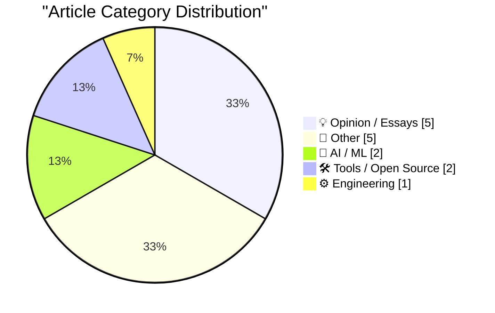
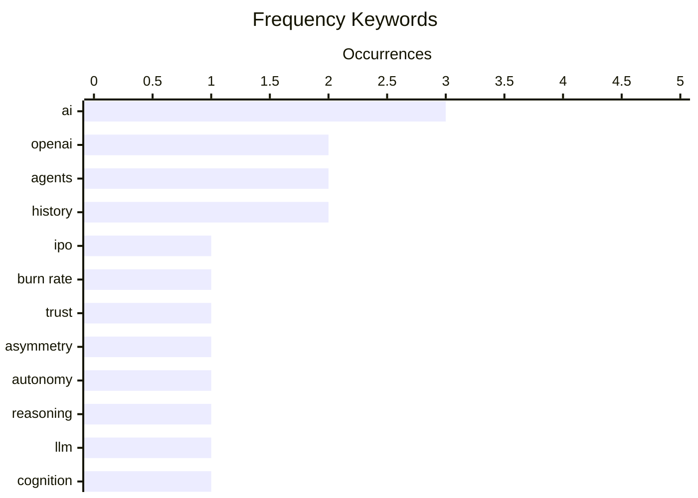

# 📰 AI Blog Daily Digest — 2026-08-20

> From 92 top tech blogs (curated by Karpathy), AI-selected Top 15

## 📝 Today's Highlights

Today’s tech discourse is dominated by a deepening crisis of trust and governance around AI, as OpenAI faces mounting skepticism over its IPO and business practices, while broader critiques frame AI development as a moral and existential challenge rather than a purely technical one. Concurrently, the industry is advancing toward more autonomous and reasoning-capable systems, with discussions on AI agents as personal assistants and the fundamental nature of machine reasoning gaining traction. On the hardware and infrastructure front, practical innovations like camera-equipped AirPods and streamlined development tools for edge computing signal a push toward more integrated, hands-on tech experiences.

---

## 🏆 Must Read

🥇 **BREAKING: OpenAI’s unraveling has begun**

garymarcus.substack.com · 15h ago · 💡 Opinion / Essays

> OpenAI's planned IPO is facing significant headwinds due to evaporated trust and a worsening burn rate. The article argues that the company's financial instability and reputational damage are undermining its market prospects. Key issues include escalating operational costs and a lack of investor confidence, which could delay or derail the IPO. The author concludes that OpenAI's unraveling is not just a financial problem but a systemic failure of governance and strategy.

💡 **Why it matters**: This is a critical read for anyone tracking AI industry dynamics, as it highlights the financial and reputational risks that could reshape the competitive landscape.

🏷️ OpenAI, IPO, burn rate, trust

🥈 **Asymmetric Agents**

shkspr.mobi · 10h ago · 🤖 AI / ML

> The article explores the concept of AI agents as personal assistants, tracing the idea back to 1990s futurism. It highlights the asymmetry in agent capabilities, where some agents are more powerful or better resourced than others, leading to unequal negotiation outcomes. The author uses the example of an agent booking a restaurant to illustrate how these asymmetries could disadvantage users. The core argument is that the promise of autonomous agents may not deliver equitable benefits without careful design and regulation.

💡 **Why it matters**: This piece offers a thought-provoking critique of AI agent utopianism, making it essential for understanding the social implications of autonomous systems.

🏷️ agents, asymmetry, AI, autonomy

🥉 **What Is Reasoning**

lucumr.pocoo.org · 22h ago · 🤖 AI / ML

> The article discusses the nature of reasoning in AI systems, triggered by safety checks on the blog post itself. It argues that current AI reasoning is fundamentally different from human reasoning, often relying on pattern matching rather than true logical inference. The author suggests that this distinction is crucial for evaluating AI capabilities and limitations. The post concludes that we need clearer definitions and benchmarks for what constitutes 'reasoning' in AI.

💡 **Why it matters**: This is a must-read for AI researchers and enthusiasts, as it clarifies a core concept that is often misunderstood in public discourse.

🏷️ reasoning, LLM, cognition

---

## 📊 Data Overview

| Scanned | Articles | Range | Selected |
|:---:|:---:|:---:|:---:|
| 87/92 | 2590 → 32 | 48h | **15** |

### Category Distribution



### High-Frequency Keywords



<details>
<summary>📈 ASCII Keyword Chart (Terminal Friendly)</summary>

```
ai        │ ████████████████████ 3
openai    │ █████████████░░░░░░░ 2
agents    │ █████████████░░░░░░░ 2
history   │ █████████████░░░░░░░ 2
ipo       │ ███████░░░░░░░░░░░░░ 1
burn rate │ ███████░░░░░░░░░░░░░ 1
trust     │ ███████░░░░░░░░░░░░░ 1
asymmetry │ ███████░░░░░░░░░░░░░ 1
autonomy  │ ███████░░░░░░░░░░░░░ 1
reasoning │ ███████░░░░░░░░░░░░░ 1
```

</details>

### 🏷️ Topic Tags

**ai**(3) · **openai**(2) · **agents**(2) · history(2) · ipo(1) · burn rate(1) · trust(1) · asymmetry(1) · autonomy(1) · reasoning(1) · llm(1) · cognition(1) · ethics(1) · surveillance(1) · power(1) · asimov(1) · evolution(1) · macos(1) · airpods(1) · camera(1)

---

## 💡 Opinion / Essays

### 1. BREAKING: OpenAI’s unraveling has begun

[Link](https://garymarcus.substack.com/p/breaking-openais-unraveling-has-begun) — **garymarcus.substack.com** · 15h ago · ⭐ 25/30

> OpenAI's planned IPO is facing significant headwinds due to evaporated trust and a worsening burn rate. The article argues that the company's financial instability and reputational damage are undermining its market prospects. Key issues include escalating operational costs and a lack of investor confidence, which could delay or derail the IPO. The author concludes that OpenAI's unraveling is not just a financial problem but a systemic failure of governance and strategy.

🏷️ OpenAI, IPO, burn rate, trust

---

### 2. Pluralistic: The ordinariness of evil (19 Aug 2026)

[Link](https://pluralistic.net/2026/08/19/banaility/) — **pluralistic.net** · 14h ago · ⭐ 22/30

> The article argues against selling AI, framing it as a moral imperative rather than a technical one. It draws on the concept of the 'banality of evil' to suggest that AI systems can perpetuate harm through mundane, everyday decisions. The author calls for a halt to AI commercialization until ethical safeguards are in place. The piece also includes links to other topics like the Pentagon's $6.5T loss and voter ID suppression, but the central thesis is that AI's ordinariness makes it more dangerous.

🏷️ AI, ethics, surveillance, power

---

### 3. Help peer

[Link](https://seangoedecke.com/help-peer/) — **seangoedecke.com** · 1 days ago · ⭐ 21/30

> The article uses Isaac Asimov's 'The Last Question' as a lens to examine the evolution of AI, from a single datacenter to a universe-spanning mind. It argues that the story's protagonist, Multivac, represents a trajectory that modern AI development is following, albeit at a slower pace. The author suggests that the ultimate goal of AI is not just problem-solving but the resolution of fundamental cosmic questions. The piece concludes that we should consider the long-term implications of AI's growth, not just its immediate utility.

🏷️ AI, Asimov, agents, evolution

---

### 4. OpenAI Pot Complains That Google Kettle Is Black

[Link](https://x.com/thsottiaux/status/2083373529081291076?s=12) — **daringfireball.net** · 1 days ago · ⭐ 18/30

> The article criticizes OpenAI's Codex team for complaining about Gmail's cluttered interface while doing the same in their own products. Thibault Sottiaux, an OpenAI executive, tweeted about Gmail's constant UI changes, but the author points out the irony given Codex's similar approach. The piece argues that both companies suffer from a lack of design restraint. The author concludes that this hypocrisy highlights a broader industry problem of feature bloat.

🏷️ OpenAI, Google, UI, criticism

---

### 5. I like 'em thick

[Link](https://www.experimental-history.com/p/i-like-em-thick) — **experimental-history.com** · 1 days ago · ⭐ 17/30

> The article is a personal apology to English teachers, arguing that 'thick' writing—dense, complex prose—has value in conveying nuance and depth, contrary to the common preference for simplicity. The author defends the use of long sentences, rich vocabulary, and layered arguments as tools for precision and intellectual rigor. They acknowledge that such writing can be less accessible but insist it rewards patient readers with greater insight. The core point is that clarity and brevity are not always superior; sometimes, thickness is necessary for truth.

🏷️ writing, style, education

---

## 📝 Other

### 6. Disney’s ABC Sues Trump’s FCC Over Challenge to Its Broadcast License

[Link](https://www.wsj.com/business/media/disneys-abc-sues-fcc-over-challenge-to-its-broadcast-licenses-64e8f794?st=XTL4tA) — **daringfireball.net** · 23h ago · ⭐ 18/30

> Disney's ABC has sued the FCC over its challenge to broadcast licenses and regulation of 'The View', alleging the agency is illegally suppressing speech. The lawsuit claims the Trump administration is targeting ABC's journalism and talk show content. This legal action highlights the ongoing conflict between the administration and media companies. The article suggests that the outcome could set a precedent for broadcast regulation and free speech.

🏷️ Disney, FCC, broadcast, lawsuit

---

### 7. Big little hexagon

[Link](https://www.johndcook.com/blog/2026/08/18/big-little-hexagon/) — **johndcook.com** · 22h ago · ⭐ 16/30

> The article discusses a new paper solving the Maximum-Area Small Polygon Problem, which seeks the n-gon with diameter 1 and maximum area for each n. For odd n, the solution is the regular n-gon, as expected, but for even n, the solution is not regular and involves a more complex shape. The post highlights the surprising asymmetry between odd and even cases, noting that the even-n solutions are 'big little hexagons' that are not obvious. The author concludes that the problem's solution reveals deep geometric insights, particularly for even n.

🏷️ geometry, polygon, optimization

---

### 8. Mean distance to the sun

[Link](https://www.johndcook.com/blog/2026/08/18/mean-distance-to-the-sun/) — **johndcook.com** · 1 days ago · ⭐ 16/30

> The article explains that the mean distance from a planet to its star in an elliptical orbit is not the average of the perihelion and aphelion distances, but rather the semi-major axis of the ellipse. It clarifies that the time-averaged distance is actually the semi-major axis, while the distance averaged over the orbit's shape is different. The post derives this using Kepler's laws and calculus, showing that the mean distance is equal to the semi-major axis, which is a common misconception. The author concludes that understanding this distinction is crucial for accurate orbital mechanics calculations.

🏷️ orbital mechanics, elliptical orbit, distance

---

### 9. MOS Technology founded August 19, 1974

[Link](https://dfarq.homeip.net/mos-technology-founded-august-19-1974/?utm_source=rss&#038;utm_medium=rss&#038;utm_campaign=mos-technology-founded-august-19-1974) — **dfarq.homeip.net** · 11h ago · ⭐ 15/30

> The article commemorates the founding of MOS Technology on August 19, 1974, by eight engineers who left Motorola, including Chuck Peddle and Bill Mensch. These engineers had worked on the Motorola 6800 processor and went on to create the MOS 6502, a chip that became famous for its low cost and high performance, powering early personal computers like the Apple II and Commodore 64. The post highlights the founders' backgrounds and the significance of their departure from Motorola. The core point is that this small startup had a massive impact on the personal computer revolution.

🏷️ MOS Technology, history, microprocessor

---

### 10. What happened to Egghead Software

[Link](https://dfarq.homeip.net/what-happened-to-egghead-software/?utm_source=rss&#038;utm_medium=rss&#038;utm_campaign=what-happened-to-egghead-software) — **dfarq.homeip.net** · 1 days ago · ⭐ 14/30

> The article recounts the rise and fall of Egghead Software, a US retail chain that sold computer software from 1984 to 2001. It declared bankruptcy on August 18, 2001, after a failed attempt to reinvent itself as an online-only retailer during the dotcom boom. The post explains that Egghead's physical stores were profitable but the company's pivot to online sales, coupled with mismanagement and competition, led to its demise. The author concludes that Egghead's story is a cautionary tale about the dangers of abandoning a successful business model for an unproven one.

🏷️ Egghead Software, retail, history

---

## 🤖 AI / ML

### 11. Asymmetric Agents

[Link](https://shkspr.mobi/blog/2026/08/asymmetric-agents/) — **shkspr.mobi** · 10h ago · ⭐ 23/30

> The article explores the concept of AI agents as personal assistants, tracing the idea back to 1990s futurism. It highlights the asymmetry in agent capabilities, where some agents are more powerful or better resourced than others, leading to unequal negotiation outcomes. The author uses the example of an agent booking a restaurant to illustrate how these asymmetries could disadvantage users. The core argument is that the promise of autonomous agents may not deliver equitable benefits without careful design and regulation.

🏷️ agents, asymmetry, AI, autonomy

---

### 12. What Is Reasoning

[Link](https://lucumr.pocoo.org/2026/8/19/what-is-reasoning/) — **lucumr.pocoo.org** · 22h ago · ⭐ 23/30

> The article discusses the nature of reasoning in AI systems, triggered by safety checks on the blog post itself. It argues that current AI reasoning is fundamentally different from human reasoning, often relying on pattern matching rather than true logical inference. The author suggests that this distinction is crucial for evaluating AI capabilities and limitations. The post concludes that we need clearer definitions and benchmarks for what constitutes 'reasoning' in AI.

🏷️ reasoning, LLM, cognition

---

## 🛠 Tools / Open Source

### 13. MacOS 26.7 Tahoe Release Candidate Contains a Video Demonstrating Camera-Equipped AirPods in Action

[Link](https://www.macrumors.com/2026/08/17/camera-equipped-airpods-macos-26-7/) — **daringfireball.net** · 1 days ago · ⭐ 20/30

> A macOS 26.7 Tahoe release candidate includes a video demonstrating camera-equipped AirPods in action, which was accidentally included in the build. The article notes this as an 'oops' moment, suggesting it was not intended for public release. The video reveals Apple's plans for camera integration in AirPods, potentially for augmented reality or spatial computing features. The author implies that this leak could be a strategic misstep or a deliberate teaser.

🏷️ macOS, AirPods, camera, leak

---

### 14. Hands-on with Raspberry Pi's CM5 Programming Jig

[Link](https://www.jeffgeerling.com/blog/2026/cm5-programming-jig/) — **jeffgeerling.com** · 15h ago · ⭐ 18/30

> The article reviews Raspberry Pi's CM5 Programming Jig, which simplifies flashing OS images to multiple Compute Modules. The author, who previously built Pi clusters, found the manual process tedious and error-prone. The jig automates the flashing process, reducing time and effort, especially for 4+ modules. The author concludes that this tool is a significant improvement for cluster builders and hobbyists.

🏷️ Raspberry Pi, CM5, clusters, flashing

---

## ⚙️ Engineering

### 15. Anubis continues to expose new ways people configure webservers

[Link](https://xeiaso.net/notes/2026/anubis-csp-worker-hell/) — **xeiaso.net** · 22h ago · ⭐ 20/30

> The article discusses how the Anubis tool exposes misconfigurations in webservers, particularly when admins disable browser features. It highlights that such actions lead to confusing and hard-to-debug issues for users. The author provides examples of how these misconfigurations manifest, emphasizing the importance of understanding browser defaults. The core message is that disabling features without proper testing can break functionality in unexpected ways.

🏷️ webservers, browser, configuration, debugging

---

*Generated on 2026-08-20 | Scanned 87 sources → Found 2590 articles → Selected 15 articles*
*Based on [Hacker News Popularity Contest 2025](https://refactoringenglish.com/tools/hn-popularity/) RSS feeds list, curated by [Andrej Karpathy](https://x.com/karpathy).*
*Created by "Understand AI".*
