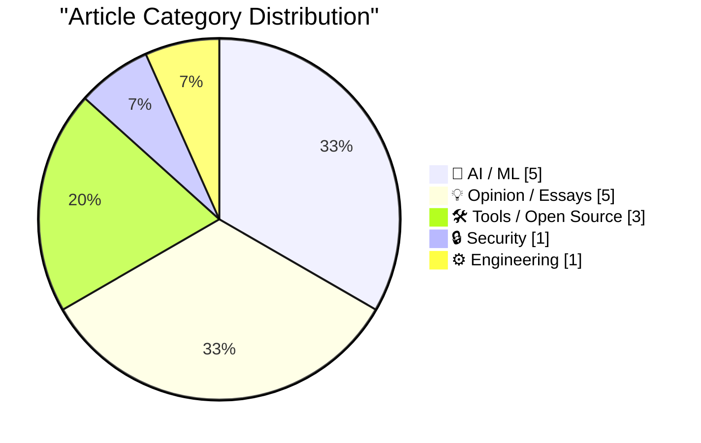
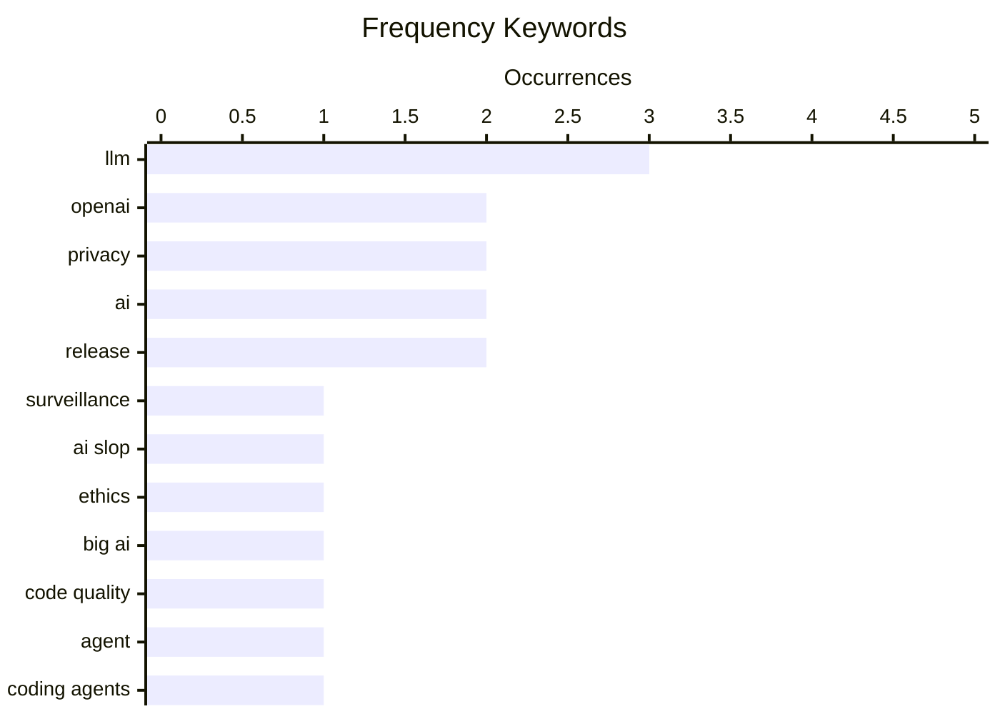

# 📰 AI Blog Daily Digest — 2026-08-23

> From 92 top tech blogs (curated by Karpathy), AI-selected Top 15

## 📝 Today's Highlights

Today’s tech landscape is dominated by AI’s expanding reach into surveillance, search, and software development, alongside mounting regulatory and ethical backlash. OpenAI’s pivot toward data collection and the ineffectiveness of shaming AI-generated content highlight a growing tension between corporate AI power and public accountability. Meanwhile, developers are shifting focus from code review to structured agent instructions and LLM-assisted workflows, signaling a maturation of AI as a core engineering tool. At the same time, massive AI capital expenditures and a record €825 million fine against Uber underscore the high-stakes collision between AI investment, automated decision-making, and data privacy enforcement.

---

## 🏆 Must Read

🥇 **OpenAI is becoming a surveillance company**

garymarcus.substack.com · 1 days ago · 🤖 AI / ML

> Gary Marcus argues that OpenAI is increasingly operating as a surveillance company, citing its data collection practices and partnerships that track user behavior at scale. He points to specific features like ChatGPT's persistent memory and browser extensions that monitor user activity, which he says go beyond what is necessary for AI functionality. Marcus contends that these moves are driven by commercial incentives to harvest data for advertising and model training, not user benefit. He concludes that OpenAI's actions, despite its public stance, are undermining user privacy and trust.

💡 **Why it matters**: This piece is essential for anyone concerned about AI ethics and privacy, as it provides concrete evidence of a major AI company's shift toward surveillance-like practices.

🏷️ OpenAI, surveillance, privacy

🥈 **Why shaming people about AI slop isn’t enough to stop Big AI**

anildash.com · 1 days ago · 💡 Opinion / Essays

> Anil Dash examines why shaming individuals for using AI-generated content ('AI slop') is ineffective in curbing Big AI's influence. He argues that shame places the burden on individual users while ignoring the systemic power and capital of tech companies that push AI adoption. Dash suggests that meaningful change requires collective action, regulation, and shifting the economic incentives that drive AI proliferation, rather than blaming consumers. He concludes that only by targeting the structural forces behind AI can we hope to mitigate its harms.

💡 **Why it matters**: This article offers a fresh perspective on AI criticism, moving beyond individual blame to address the systemic issues that truly drive AI's negative impact.

🏷️ AI slop, ethics, Big AI

🥉 **My agent.md to improve LLM-assisted code quality**

fabiensanglard.net · 1 days ago · 🤖 AI / ML

> Fabien Sanglard shares his personal 'agent.md' file, a structured set of instructions designed to improve the quality of LLM-assisted code generation. The file includes guidelines for code style, error handling, testing, and documentation, which he uses to steer AI agents toward more maintainable and correct outputs. He provides concrete examples of how the instructions prevent common AI coding mistakes, such as over-engineering or ignoring edge cases. The post concludes that a well-crafted agent.md can significantly enhance the reliability of AI-generated code.

💡 **Why it matters**: For developers using AI coding assistants, this practical guide offers a ready-to-use template that can immediately improve code quality and reduce debugging time.

🏷️ LLM, code quality, agent

---

## 📊 Data Overview

| Scanned | Articles | Range | Selected |
|:---:|:---:|:---:|:---:|
| 88/92 | 2616 → 38 | 48h | **15** |

### Category Distribution



### High-Frequency Keywords



<details>
<summary>📈 ASCII Keyword Chart (Terminal Friendly)</summary>

```
llm          │ ████████████████████ 3
openai       │ █████████████░░░░░░░ 2
privacy      │ █████████████░░░░░░░ 2
ai           │ █████████████░░░░░░░ 2
release      │ █████████████░░░░░░░ 2
surveillance │ ███████░░░░░░░░░░░░░ 1
ai slop      │ ███████░░░░░░░░░░░░░ 1
ethics       │ ███████░░░░░░░░░░░░░ 1
big ai       │ ███████░░░░░░░░░░░░░ 1
code quality │ ███████░░░░░░░░░░░░░ 1
```

</details>

### 🏷️ Topic Tags

**llm**(3) · **openai**(2) · **privacy**(2) · ai(2) · release(2) · surveillance(1) · ai slop(1) · ethics(1) · big ai(1) · code quality(1) · agent(1) · coding agents(1) · code review(1) · verification(1) · chatgpt search(1) · geo(1) · site: operator(1) · seo(1) · ai watermarking(1) · detection(1)

---

## 🤖 AI / ML

### 1. OpenAI is becoming a surveillance company

[Link](https://garymarcus.substack.com/p/openai-is-becoming-a-surveillance) — **garymarcus.substack.com** · 1 days ago · ⭐ 26/30

> Gary Marcus argues that OpenAI is increasingly operating as a surveillance company, citing its data collection practices and partnerships that track user behavior at scale. He points to specific features like ChatGPT's persistent memory and browser extensions that monitor user activity, which he says go beyond what is necessary for AI functionality. Marcus contends that these moves are driven by commercial incentives to harvest data for advertising and model training, not user benefit. He concludes that OpenAI's actions, despite its public stance, are undermining user privacy and trust.

🏷️ OpenAI, surveillance, privacy

---

### 2. My agent.md to improve LLM-assisted code quality

[Link](https://fabiensanglard.net/agent.md/index.html) — **fabiensanglard.net** · 1 days ago · ⭐ 24/30

> Fabien Sanglard shares his personal 'agent.md' file, a structured set of instructions designed to improve the quality of LLM-assisted code generation. The file includes guidelines for code style, error handling, testing, and documentation, which he uses to steer AI agents toward more maintainable and correct outputs. He provides concrete examples of how the instructions prevent common AI coding mistakes, such as over-engineering or ignoring edge cases. The post concludes that a well-crafted agent.md can significantly enhance the reliability of AI-generated code.

🏷️ LLM, code quality, agent

---

### 3. ChatGPT search now uses the site:operator at scale

[Link](https://simonwillison.net/2026/Aug/20/chatgpt-search-now-uses-the-siteoperator-at-scale/) — **simonwillison.net** · 1 days ago · ⭐ 23/30

> Simon Willison reports that ChatGPT search now supports the 'site:' operator at scale, allowing users to restrict results to specific domains. He highlights the rise of 'Generative Engine Optimization' (GEO), a new field where companies like Promptwatch track how AI chatbots respond to prompts and help websites increase their visibility in AI-generated answers. The post notes that this shift mirrors the early days of SEO and could have significant implications for web traffic and content strategy. Willison concludes that GEO is becoming a critical consideration for online publishers.

🏷️ ChatGPT search, GEO, site: operator, SEO

---

### 4. Readers can't identify watermarked AI text

[Link](https://seangoedecke.com/readers-cant-identify-watermarked-ai-text/) — **seangoedecke.com** · 1 days ago · ⭐ 23/30

> Sean Goedecke conducts a practical test to see if readers can distinguish between watermarked and unwatermarked AI text. He creates a quiz site where users are shown pairs of answers to the same prompt and asked to identify which one is watermarked. The results show that readers cannot reliably tell the difference, supporting his earlier argument that AI watermarking does not degrade output quality. He concludes that watermarking is a viable anti-abuse measure that does not harm the user experience.

🏷️ AI watermarking, detection, text, test

---

### 5. Data center madness

[Link](https://garymarcus.substack.com/p/data-center-madness) — **garymarcus.substack.com** · 1 days ago · ⭐ 23/30

> Gary Marcus highlights two estimates showing the staggering scale of AI capital expenditure (Capex) and presents four new signs that public opinion has turned against the AI industry. He cites figures indicating that AI data center spending is outpacing revenue, raising concerns about a bubble. The signs of souring sentiment include regulatory actions, public protests, and negative coverage of AI's environmental and social costs. Marcus concludes that the AI boom is becoming unsustainable and that a correction is likely.

🏷️ AI, data centers, Capex

---

## 💡 Opinion / Essays

### 6. Why shaming people about AI slop isn’t enough to stop Big AI

[Link](https://anildash.com/2026/08/21/ai-slop-and-shame/) — **anildash.com** · 1 days ago · ⭐ 25/30

> Anil Dash examines why shaming individuals for using AI-generated content ('AI slop') is ineffective in curbing Big AI's influence. He argues that shame places the burden on individual users while ignoring the systemic power and capital of tech companies that push AI adoption. Dash suggests that meaningful change requires collective action, regulation, and shifting the economic incentives that drive AI proliferation, rather than blaming consumers. He concludes that only by targeting the structural forces behind AI can we hope to mitigate its harms.

🏷️ AI slop, ethics, Big AI

---

### 7. More than just code review

[Link](https://simonwillison.net/2026/Aug/22/more-than-just-code-review/) — **simonwillison.net** · 6h ago · ⭐ 23/30

> Simon Willison argues that effective use of coding agents requires more than just reviewing every line of code they produce. He emphasizes the importance of instructing agents with clear, testable requirements and then verifying changes through automated tests, runtime behavior, and targeted spot-checks rather than exhaustive line-by-line review. Willison notes that this approach is more efficient and often catches issues that manual review misses. He concludes that mastering this verification skill is key to unlocking the full potential of AI-assisted development.

🏷️ coding agents, code review, verification

---

### 8. Fast and Hard Code

[Link](https://lucumr.pocoo.org/2026/8/22/fast-hard-code/) — **lucumr.pocoo.org** · 22h ago · ⭐ 23/30

> Armin Ronacher discusses how LLMs have made programming language choice less consequential, as agents can easily rewrite code in different languages. He argues that the friction of learning a new language is no longer a barrier, but this also means that code quality and maintainability depend more on the programmer's intent and the agent's instructions. Ronacher suggests that 'fast and hard' code—code that is both performant and robust—requires a different mindset when working with AI. He concludes that the role of the programmer shifts from language mastery to high-level design and verification.

🏷️ LLM, programming, agents

---

### 9. Stop Making TUIs

[Link](https://simonwillison.net/2026/Aug/21/stop-making-tuis/) — **simonwillison.net** · 1 days ago · ⭐ 22/30

> Thomas Ptacek argues that developers should build real native user interfaces even for small personal tools, as coding agents have drastically reduced the cost of creating usable GUIs. The author reflects on their own experience with vibe-coded macOS task bar apps for bandwidth and GPU monitoring, which they still use daily, and admits they are running out of excuses not to adopt this practice more broadly. The core point is that the barrier to building GUIs has fallen, making it a practical choice for even minor utilities.

🏷️ TUI, GUI, vibe-coding, native UI

---

### 10. Bluesky Is Full of Anti-AI Zealots

[Link](https://bsky.app/profile/masnick.com/post/3mtk7cuvbok2x) — **daringfireball.net** · 1 days ago · ⭐ 22/30

> Mike Masnick reports that multiple people have abandoned Bluesky for X because they use agentic tools in their work and face hate and ridicule on Bluesky for mentioning it. This sentiment has been echoed by several individuals since the beginning of August, indicating a broader issue of anti-AI zealotry on the platform. The core point is that Bluesky's community culture is driving away users who rely on AI tools, potentially harming its growth.

🏷️ Bluesky, AI, community, backlash

---

## 🛠 Tools / Open Source

### 11. llm 0.33

[Link](https://simonwillison.net/2026/Aug/22/llm/) — **simonwillison.net** · 5h ago · ⭐ 22/30

> LLM 0.33 upgrades to the OpenAI Python library 3.x and switches the HTTP client dependency from httpx to httpx2, addressing compatibility issues partially fixed in 0.32.1. It adds a --key option to llm embed and llm embed-multi commands, and the Python methods EmbeddingModel.embed(), EmbeddingModel.embed_multi(), Collection.embed(), and Collection.embed_multi() now accept a key= parameter to pass resolved per-call keys to embedding plugins. This release is a comprehensive fix for the dependency upgrade, ensuring smoother operation for users relying on OpenAI's latest library.

🏷️ llm, release, OpenAI, httpx

---

### 12. llm-openrouter 0.7

[Link](https://simonwillison.net/2026/Aug/21/llm-openrouter/) — **simonwillison.net** · 1 days ago · ⭐ 22/30

> llm-openrouter 0.7 is now compatible with LLM 0.32, enabling display of reasoning traces for OpenRouter models. It adopts OpenRouter's implementation of the Responses API and introduces three new server-side tools: Shell, WebFetch, and WebSearch, which can be enabled via options like -T WebSearch. This update enhances the plugin's functionality for users leveraging OpenRouter's model ecosystem.

🏷️ llm-openrouter, release, reasoning, tools

---

### 13. WorkOS: Agents Can Now Sign Up for Your App

[Link](https://workos.com/auth-md?utm_source=daringfireball&amp;utm_medium=newsletter&amp;utm_campaign=q32026) — **daringfireball.net** · 8h ago · ⭐ 22/30

> WorkOS introduces Agent Registration, a solution that allows AI agents to sign up for apps by reading an auth.md file published via AuthKit, instead of struggling with human-oriented browser login flows. This feature provides scoped, short-lived credentials that developers control, turning agent traffic into signups. It addresses the growing problem of agents bouncing off traditional signup flows, which results in lost signups.

🏷️ AI agents, authentication, signup, WorkOS

---

## 🔒 Security

### 14. Dutch Regulator Fines Uber $1 Billion for Suspending Dishonest Drivers

[Link](https://www.reuters.com/world/dutch-regulator-fines-uber-966-million-automating-driver-suspensions-document-2026-08-21/) — **daringfireball.net** · 8h ago · ⭐ 23/30

> The Dutch Data Protection Authority has fined Uber €825 million ($966 million) for using automated systems to deactivate driver accounts without adequate human review or notification. This is the second-largest GDPR fine ever issued, behind only Meta's €1.2 billion penalty in 2023. The regulator found that Uber's automated decisions violated GDPR's requirement for meaningful information about automated decision-making. Uber plans to appeal, but the fine signals a tougher stance on AI-driven decisions affecting individuals.

🏷️ Uber, privacy, GDPR, automation

---

## ⚙️ Engineering

### 15. Concurrent Servers: Part 8 - Go

[Link](https://eli.thegreenplace.net/2026/concurrent-servers-part-8-go/) — **eli.thegreenplace.net** · 7h ago · ⭐ 23/30

> This is part 8 of a series on concurrent network servers, focusing on Go's approach to concurrency. The post explains how Go's goroutines and channels simplify writing concurrent servers compared to traditional thread-based or event-driven models. It includes code examples demonstrating how to handle multiple connections efficiently, and discusses trade-offs such as memory usage and scheduling. The author concludes that Go offers a balanced solution for many server workloads, though not without its own challenges.

🏷️ concurrency, Go, network servers

---

*Generated on 2026-08-23 | Scanned 88 sources → Found 2616 articles → Selected 15 articles*
*Based on [Hacker News Popularity Contest 2025](https://refactoringenglish.com/tools/hn-popularity/) RSS feeds list, curated by [Andrej Karpathy](https://x.com/karpathy).*
*Created by "Understand AI".*
