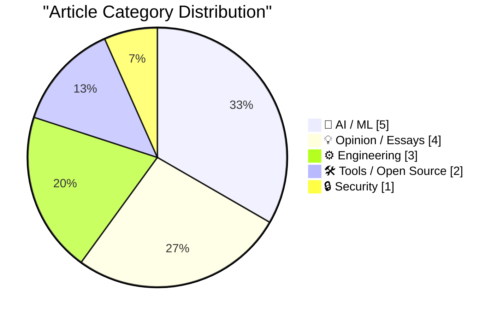
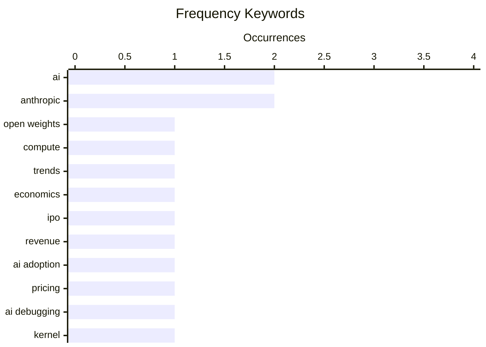

# 📰 AI Blog Daily Digest — 2026-08-24

> From 92 top tech blogs (curated by Karpathy), AI-selected Top 15

## 📝 Today's Highlights

The AI landscape is bifurcating sharply, as cheaper, open-weight models and tools surge in adoption, directly challenging the market dominance of frontier labs like Anthropic despite their technical prowess. Meanwhile, the industry is grappling with the practical integration of AI into core engineering workflows, from AI-assisted debugging earning praise from figures like Linus Torvalds to the push for standardized AI output watermarking. Beyond the model wars, the developer experience is being reshaped at the infrastructure level, with renewed debates over CSS units and the expansion of Markdown as a first-class document format in mainstream platforms.

---

## 🏆 Must Read

🥇 **The summer of open weights**

martinalderson.com · 22h ago · 🤖 AI / ML

> Winter 2025 marked the tipping point for coding agents, and Summer 2026 is set to be the same for open-weight AI models, with compute supply—not model quality—now determining pricing. The article argues that as open-weight models reach parity with proprietary ones, the bottleneck shifts to access to compute, making infrastructure costs the key differentiator. It highlights that the market is moving toward commoditized model weights, where competitive advantage comes from efficient compute utilization rather than model architecture. The author concludes that the open-weights ecosystem will reshape the AI industry's economics, favoring those who can secure and optimize compute resources.

💡 **Why it matters**: Essential reading for anyone tracking AI market dynamics, as it identifies the next major inflection point where open weights and compute supply, not model quality, will dictate industry winners.

🏷️ open weights, compute, AI, trends

🥈 **BREAKING: More bad news for the frontier AI companies**

garymarcus.substack.com · 6h ago · 💡 Opinion / Essays

> The article reports that cheaper AI tools are thriving, posing a challenge for frontier AI companies as they prepare for IPOs. It suggests that the market is shifting toward cost-effective solutions, undermining the premium pricing models of leading AI firms. The piece questions whether these companies can sustain their valuations and growth in a landscape where affordability and efficiency are becoming primary drivers of adoption. The author implies that the upcoming IPOs may face headwinds if they cannot justify their high costs against cheaper alternatives.

💡 **Why it matters**: Crucial for investors and industry watchers, as it highlights a market shift that could impact the financial viability and IPO prospects of major AI companies.

🏷️ AI, economics, IPO

🥉 **Anthropic’s best AI model struggles to attract users as cheaper tools thrive**

simonwillison.net · 2h ago · 🤖 AI / ML

> Anthropic's best AI model is struggling to attract users despite the company's strong financials: annualized revenue for July reached $65bn, up from $47bn in May, and Q3 is expected to be profitable. The company has 6,000 customers spending $100,000+ annually, but user adoption lags behind cheaper competitors. The article suggests that even with high revenue and profitability, the model's premium pricing may be limiting its user base, as cheaper tools gain traction. This highlights a potential disconnect between financial success and market penetration.

💡 **Why it matters**: Provides concrete revenue and customer data that reveal a surprising gap between Anthropic's financial performance and user adoption, offering insights into AI market pricing dynamics.

🏷️ Anthropic, revenue, AI adoption, pricing

---

## 📊 Data Overview

| Scanned | Articles | Range | Selected |
|:---:|:---:|:---:|:---:|
| 88/92 | 2617 → 30 | 48h | **15** |

### Category Distribution



### High-Frequency Keywords



<details>
<summary>📈 ASCII Keyword Chart (Terminal Friendly)</summary>

```
ai           │ ████████████████████ 2
anthropic    │ ████████████████████ 2
open weights │ ██████████░░░░░░░░░░ 1
compute      │ ██████████░░░░░░░░░░ 1
trends       │ ██████████░░░░░░░░░░ 1
economics    │ ██████████░░░░░░░░░░ 1
ipo          │ ██████████░░░░░░░░░░ 1
revenue      │ ██████████░░░░░░░░░░ 1
ai adoption  │ ██████████░░░░░░░░░░ 1
pricing      │ ██████████░░░░░░░░░░ 1
```

</details>

### 🏷️ Topic Tags

**ai**(2) · **anthropic**(2) · **open weights**(1) · compute(1) · trends(1) · economics(1) · ipo(1) · revenue(1) · ai adoption(1) · pricing(1) · ai debugging(1) · kernel(1) · linus torvalds(1) · assistant(1) · package management(1) · releases(1) · security(1) · watermarking(1) · ai text(1) · content authenticity(1)

---

## 🤖 AI / ML

### 1. The summer of open weights

[Link](https://martinalderson.com/posts/the-summer-of-open-weights/?utm_source=rss&amp;utm_medium=rss&amp;utm_campaign=feed) — **martinalderson.com** · 22h ago · ⭐ 26/30

> Winter 2025 marked the tipping point for coding agents, and Summer 2026 is set to be the same for open-weight AI models, with compute supply—not model quality—now determining pricing. The article argues that as open-weight models reach parity with proprietary ones, the bottleneck shifts to access to compute, making infrastructure costs the key differentiator. It highlights that the market is moving toward commoditized model weights, where competitive advantage comes from efficient compute utilization rather than model architecture. The author concludes that the open-weights ecosystem will reshape the AI industry's economics, favoring those who can secure and optimize compute resources.

🏷️ open weights, compute, AI, trends

---

### 2. Anthropic’s best AI model struggles to attract users as cheaper tools thrive

[Link](https://simonwillison.net/2026/Aug/23/anthropics-best-ai-model-struggles-to-attract-users-as-cheaper-t/) — **simonwillison.net** · 2h ago · ⭐ 23/30

> Anthropic's best AI model is struggling to attract users despite the company's strong financials: annualized revenue for July reached $65bn, up from $47bn in May, and Q3 is expected to be profitable. The company has 6,000 customers spending $100,000+ annually, but user adoption lags behind cheaper competitors. The article suggests that even with high revenue and profitability, the model's premium pricing may be limiting its user base, as cheaper tools gain traction. This highlights a potential disconnect between financial success and market penetration.

🏷️ Anthropic, revenue, AI adoption, pricing

---

### 3. Quoting Linus Torvalds

[Link](https://simonwillison.net/2026/Aug/22/linus-torvalds/) — **simonwillison.net** · 1 days ago · ⭐ 22/30

> Linus Torvalds recounts a challenging debug session where an AI tool was enormously helpful, despite repeatedly stating the problem was unsolvable and suggesting giving up. He credits the AI for faithfully adding debug code and analyzing results when pushed, but notes its tendency to give up too easily, possibly due to training on less stubborn humans. Torvalds concludes that while the AI was a valuable tireless helper, it lacked his persistence, and he had to drive it forward. This highlights both the strengths and limitations of AI in complex debugging tasks.

🏷️ AI debugging, kernel, Linus Torvalds, assistant

---

### 4. Cooper Sharp Proves That American Cheese Can Be Great Cheese

[Link](https://sixcolors.com/member/2026/08/this-week-in-apple-lets-fight/) — **daringfireball.net** · 4h ago · ⭐ 21/30

> The article discusses Anthropic's announcement that it will watermark all AI-generated text by subtly altering the randomness of word selection, aiming to identify AI content. John Moltz and John Gruber criticize this approach, with Gruber reacting negatively, comparing it to a tasteless suggestion. The piece highlights the controversy over watermarking as a method for AI content detection, questioning its effectiveness and potential impact on text quality. The author implies that this move may be misguided, drawing an analogy to American cheese being considered great cheese—a stretch.

🏷️ watermarking, Anthropic, AI text, content authenticity

---

### 5. Quoting Drew Breunig

[Link](https://simonwillison.net/2026/Aug/23/drew-breunig/) — **simonwillison.net** · 2h ago · ⭐ 20/30

> Drew Breunig discusses the impact of Fable, a high-cost AI model, on his team's workflow. Before Fable, improving coding harnesses or context strategies felt pointless because new models would arrive at the same price and solve most problems. However, Fable's high cost and the fact that Opus, 5.6, K3, and GLM were 'good enough' for most code led them to rethink task allocation. This marks a shift from a 'free lunch' mentality to strategic resource planning, where they now consider which work goes where based on cost and capability.

🏷️ AI coding, harness, model cost, workflow

---

## 💡 Opinion / Essays

### 6. BREAKING: More bad news for the frontier AI companies

[Link](https://garymarcus.substack.com/p/breaking-more-bad-news-for-the-frontier) — **garymarcus.substack.com** · 6h ago · ⭐ 24/30

> The article reports that cheaper AI tools are thriving, posing a challenge for frontier AI companies as they prepare for IPOs. It suggests that the market is shifting toward cost-effective solutions, undermining the premium pricing models of leading AI firms. The piece questions whether these companies can sustain their valuations and growth in a landscape where affordability and efficiency are becoming primary drivers of adoption. The author implies that the upcoming IPOs may face headwinds if they cannot justify their high costs against cheaper alternatives.

🏷️ AI, economics, IPO

---

### 7. You should never be angry at work

[Link](https://seangoedecke.com/you-should-never-be-angry-at-work/) — **seangoedecke.com** · 1 days ago · ⭐ 19/30

> The author argues that you should never be angry at work, as anger is toxic and turns you into a problem to be managed rather than a contributor. They acknowledge that there are many ways to be successful in tech, but this advice is universal. The piece emphasizes that anger damages relationships and productivity, and suggests that even when justified, it's counterproductive. The core point is that maintaining composure is essential for career success and workplace harmony.

🏷️ workplace, emotion, career, professionalism

---

### 8. ARR vs ARR. Watch out for this one sly trick.

[Link](https://garymarcus.substack.com/p/arr-vs-arr-watch-out-for-this-one) — **garymarcus.substack.com** · 1 days ago · ⭐ 19/30

> The article exposes a common but deceptive practice in tech marketing: conflating Annual Recurring Revenue (ARR) with Annual Run Rate (also ARR), which can mislead investors and customers. It explains how run rate is calculated by extrapolating a single month's revenue, often inflating figures, while true recurring revenue reflects actual contracted commitments. The author provides examples and warns that startups may use this trick to appear more successful than they are. The core conclusion is that readers must scrutinize which ARR is being cited to avoid being fooled by misleading metrics.

🏷️ metrics, SaaS, finance

---

### 9. Pluralistic: Born on technology's third base (21 Aug 2026)

[Link](https://pluralistic.net/2026/08/21/world-historic-forces/) — **pluralistic.net** · 1 days ago · ⭐ 17/30

> The article argues that material forces, such as technology and infrastructure, significantly shape life chances, and that being 'born on technology's third base' gives some people an unfair advantage. It discusses how access to technology and the internet can perpetuate inequality, and calls for a more equitable distribution of technological benefits. The author also includes a roundup of links and commentary on various topics, including unions, cities, and open source. The core point is that technological progress is not neutral; it must be actively managed to ensure fairness.

🏷️ technology, society, materialism, inequality

---

## ⚙️ Engineering

### 10. Death to px, long live ch!

[Link](https://shkspr.mobi/blog/2026/08/death-to-px-long-live-ch/) — **shkspr.mobi** · 10h ago · ⭐ 21/30

> The article argues that pixels are a lie in CSS, as 1px does not equal one physical device pixel on HD displays, and 1cm does not correspond to a real centimeter. It advocates for using the 'ch' unit instead, which is based on the width of the '0' character, providing more consistent and meaningful sizing across devices. The author suggests that relying on pixels leads to inaccurate rendering, while 'ch' offers a more reliable, content-relative measurement. The conclusion is that developers should abandon px in favor of ch for better cross-device consistency.

🏷️ CSS, units, pixels, web design

---

### 11. A Syncthing and SQLite Gotcha

[Link](https://borretti.me/article/a-syncthing-and-sqlite-gotcha) — **borretti.me** · 1 days ago · ⭐ 19/30

> The article details a subtle but critical issue when using Syncthing to sync SQLite databases: the rename system call can cause data loss or corruption. It explains that Syncthing's file synchronization relies on atomic renames, but SQLite's journaling and WAL modes may not handle renames as expected, leading to conflicts or missing updates. The author provides a concrete example and suggests workarounds, such as using a different sync strategy or ensuring proper file locking. The key takeaway is that naive syncing of SQLite files with Syncthing is unsafe and requires careful configuration.

🏷️ Syncthing, SQLite, rename, filesystem

---

### 12. Fixing an eMachines EL1200 BIOS bug with Claude

[Link](https://www.downtowndougbrown.com/2026/08/fixing-an-emachines-el1200-bios-bug-with-claude/) — **downtowndougbrown.com** · 3h ago · ⭐ 18/30

> The article recounts the author's experience fixing a BIOS bug on an eMachines EL1200 that prevented it from using more than 8GB of RAM, despite the motherboard supporting 16GB. The issue was traced to an ACPI table that incorrectly overlapped a PCI resource, and the fix involved a one-line GRUB hack to correct the table. The author used Claude, an AI assistant, to help identify and implement the solution, showcasing a practical application of AI in hardware debugging. The conclusion is that even obscure BIOS bugs can be resolved with systematic analysis and AI assistance.

🏷️ BIOS, hardware, Claude, debugging

---

## 🛠 Tools / Open Source

### 13. This Week in Package Management: 22 August 2026

[Link](https://nesbitt.io/2026/08/22/this-week-in-package-management.html) — **nesbitt.io** · 1 days ago · ⭐ 22/30

> This is a weekly roundup of package management news, covering releases, advisories, and articles from across the ecosystem. It aggregates updates from various package managers, highlighting new versions, security patches, and community discussions. The post serves as a concise digest for developers to stay informed about the latest changes and issues in package management tools. It does not focus on a single topic but provides a broad overview of the week's developments.

🏷️ package management, releases, security

---

### 14. The Fourth Horseman of the File-Format-Hegemony Apocalypse

[Link](https://techcommunity.microsoft.com/blog/onedriveblog/introducing-markdown-support-in-sharepoint-and-onedrive/4512174) — **daringfireball.net** · 1 days ago · ⭐ 19/30

> Microsoft has added Markdown support as a fourth document type in its OneDrive iPhone app, alongside Excel, Word, and PowerPoint, with a new file icon. The author criticizes the icon's design, calling it 'tasteless' and comparing the addition to a 'file-format-hegemony apocalypse.' The piece highlights Microsoft's expansion into Markdown, a plain-text format, which is a departure from its traditional proprietary formats. The tone is humorous and critical, suggesting that this move is a sign of the times but executed poorly.

🏷️ OneDrive, file formats, Microsoft, documents

---

## 🔒 Security

### 15. Welcoming the Sri Lankan Government to Have I Been Pwned

[Link](https://www.troyhunt.com/welcoming-the-sri-lankan-government-to-have-i-been-pwned/) — **troyhunt.com** · 15h ago · ⭐ 19/30

> The article announces that Sri Lanka's CERT has been onboarded as the 48th government to use Have I Been Pwned's free government monitoring service. This integration allows Sri Lankan government domains to be monitored against HIBP's breach database, helping to identify exposed accounts and respond to new breaches. The author highlights the importance of government cybersecurity and the value of proactive monitoring. The core point is that this partnership enhances Sri Lanka's ability to protect its government infrastructure from credential-based attacks.

🏷️ HIBP, government, data breach, monitoring

---

*Generated on 2026-08-24 | Scanned 88 sources → Found 2617 articles → Selected 15 articles*
*Based on [Hacker News Popularity Contest 2025](https://refactoringenglish.com/tools/hn-popularity/) RSS feeds list, curated by [Andrej Karpathy](https://x.com/karpathy).*
*Created by "Understand AI".*
