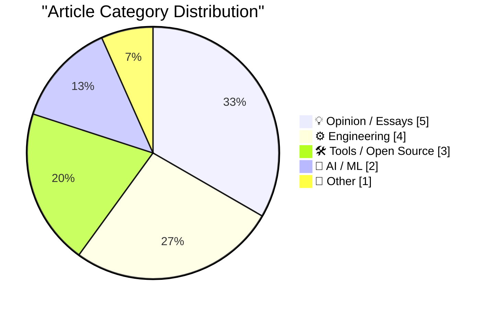
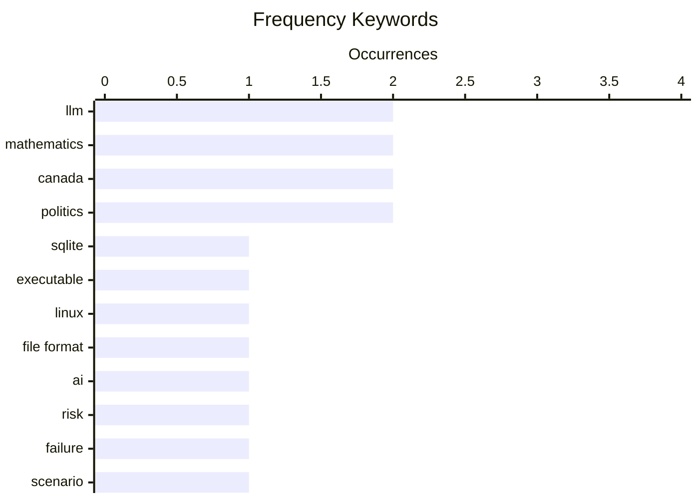

# 📰 AI Blog Daily Digest — 2026-08-25

> From 92 top tech blogs (curated by Karpathy), AI-selected Top 15

## 📝 Today's Highlights

Today’s tech discourse centers on the fragility and resilience of AI systems, with experts outlining plausible collapse scenarios while others harness LLMs for practical, creative tool-building. A parallel thread explores the philosophical and operational edges of software—from treating executable files as databases to the unchangeable nature of identity in Git. Meanwhile, developer experience remains a flashpoint, as frustrations mount over opaque tooling quirks like TestFlight’s sort order and the emotional toll of workplace anger, underscoring a broader tension between technical control and human agency.

---

## 🏆 Must Read

🥇 **Your executable is a SQLite database**

simonwillison.net · 10h ago · ⚙️ Engineering

> A Linux pattern enables a SQLite database file to be directly executable as a binary by setting the file's 4-byte application ID to 'SELF' (Structured Executable & Linkable Format) and arranging ELF components into SQLite tables. The self-exec interpreter, written in C, handles execution. This approach blurs the line between data and code, allowing a database to serve as a runnable program.

💡 **Why it matters**: It showcases a clever, unconventional technique that could inspire new ways to package and distribute software.

🏷️ SQLite, executable, Linux, file format

🥈 **Two ways it might all fall apart**

garymarcus.substack.com · 7h ago · 🤖 AI / ML

> The article outlines two distinct but not mutually exclusive scenarios that could lead to the collapse of AI systems or companies. It argues that these risks are often overlooked in optimistic forecasts. The author emphasizes that both paths are plausible and should be considered seriously.

💡 **Why it matters**: It provides a balanced, cautionary perspective on AI risks that is essential for anyone following the field.

🏷️ AI, risk, failure, scenario

🥉 **llm-anthropic 0.27**

simonwillison.net · 6h ago · 🛠 Tools / Open Source

> llm-anthropic 0.27 is a release of the Anthropic plugin for LLM that ensures compatibility with the anthropic v1.0.0 Python library, which switched from httpx to httpx2. The update was guided by Anthropic's migration guide, and the author used Fable 5 in Claude Code to assist with the upgrade. This release is part of a broader trend, as OpenAI made a similar change in their v3.0.0 release two weeks prior.

💡 **Why it matters**: It highlights a practical example of adapting to breaking changes in SDKs, useful for developers using LLM plugins.

🏷️ LLM, Anthropic, plugin, release

---

## 📊 Data Overview

| Scanned | Articles | Range | Selected |
|:---:|:---:|:---:|:---:|
| 87/92 | 2593 → 27 | 48h | **15** |

### Category Distribution



### High-Frequency Keywords



<details>
<summary>📈 ASCII Keyword Chart (Terminal Friendly)</summary>

```
llm         │ ████████████████████ 2
mathematics │ ████████████████████ 2
canada      │ ████████████████████ 2
politics    │ ████████████████████ 2
sqlite      │ ██████████░░░░░░░░░░ 1
executable  │ ██████████░░░░░░░░░░ 1
linux       │ ██████████░░░░░░░░░░ 1
file format │ ██████████░░░░░░░░░░ 1
ai          │ ██████████░░░░░░░░░░ 1
risk        │ ██████████░░░░░░░░░░ 1
```

</details>

### 🏷️ Topic Tags

**llm**(2) · **mathematics**(2) · **canada**(2) · politics(2) · sqlite(1) · executable(1) · linux(1) · file format(1) · ai(1) · risk(1) · failure(1) · scenario(1) · anthropic(1) · plugin(1) · release(1) · anger(1) · workplace(1) · agency(1) · emotion(1) · metadata(1)

---

## 💡 Opinion / Essays

### 1. Anger, Anxiety and Agency

[Link](https://lucumr.pocoo.org/2026/8/24/anger-anxiety-agency/) — **lucumr.pocoo.org** · 22h ago · ⭐ 20/30

> The author agrees with Sean Goedecke's post that anger at work is rarely productive, though it can be a signal. They learned this lesson over time, noting that anger often harms colleagues who have no more control than you do. The key insight is that in a company, there is a shared vision, and if you disagree, you should address it constructively rather than with anger.

🏷️ anger, workplace, agency, emotion

---

### 2. distributed identity

[Link](https://jyn.dev/distributed-identity/) — **jyn.dev** · 22h ago · ⭐ 18/30

> The article argues that Git makes it extremely difficult to change or hide your identity, which is a significant privacy and security concern. It explores the technical reasons behind this, including how commits are tied to user info and the challenges of rewriting history. The author suggests that this is a fundamental flaw in Git's design.

🏷️ Git, identity, privacy

---

### 3. Know your paradoxes

[Link](https://blog.coredump.cx/p/know-your-paradoxes) — **lcamtuf.substack.com** · 23h ago · ⭐ 17/30

> The article discusses various paradoxes, emphasizing that they are too important to be taken lightly. It explores how paradoxes reveal flaws in our reasoning and can lead to deeper understanding. The author argues that engaging with paradoxes is crucial for intellectual rigor.

🏷️ paradoxes, logic, thinking

---

### 4. Pluralistic: How Canada can help Americans and defeat America (23 Aug 2026)

[Link](https://pluralistic.net/2026/08/24/elbows-really-up/) — **pluralistic.net** · 1h ago · ⭐ 14/30

> The article argues that Canada can both help Americans and defeat America by adopting a progressive economic policy ('True Carneyism') that contrasts with U.S. corporate dominance. It suggests that by implementing stronger social programs, fair trade, and digital rights, Canada can set an example that pressures the U.S. to reform. The post also links to various topics, including Brazil's fight against AIDS drug patents, TSA's issues with gel-bras, and critiques of friction in systems. The core thesis is that Canada's internal strength and moral leadership can serve as a counterweight to American excess.

🏷️ Canada, politics, America, policy

---

### 5. A few words about Canada and the US

[Link](https://garymarcus.substack.com/p/a-few-words-about-canada-and-the) — **garymarcus.substack.com** · 1 days ago · ⭐ 14/30

> Gary Marcus, known for AI commentary, steps away from his usual topic to address the relationship between Canada and the U.S. He expresses concern over political tensions and urges mutual respect and cooperation. The piece is a personal call for civility and understanding, emphasizing shared values and the importance of maintaining a strong alliance. Marcus's brief but pointed message highlights the need for dialogue over division.

🏷️ Canada, US, politics, commentary

---

## ⚙️ Engineering

### 6. Your executable is a SQLite database

[Link](https://simonwillison.net/2026/Aug/24/your-executable-is-a-sqlite-database/) — **simonwillison.net** · 10h ago · ⭐ 22/30

> A Linux pattern enables a SQLite database file to be directly executable as a binary by setting the file's 4-byte application ID to 'SELF' (Structured Executable & Linkable Format) and arranging ELF components into SQLite tables. The self-exec interpreter, written in C, handles execution. This approach blurs the line between data and code, allowing a database to serve as a runnable program.

🏷️ SQLite, executable, Linux, file format

---

### 7. Three-term recurrences

[Link](https://www.johndcook.com/blog/2026/08/24/three-term-recurrences/) — **johndcook.com** · 8h ago · ⭐ 15/30

> The article explains three-term recurrence formulas, where a function is computed as a linear combination of the two previous terms, with coefficients depending on x but not n. It notes that these recurrences appear frequently in mathematics and provides theorems giving conditions for their existence. The post is a concise introduction to this powerful mathematical tool.

🏷️ recurrence, mathematics, special functions

---

### 8. The von Mises-Fisher distribution

[Link](https://www.johndcook.com/blog/2026/08/24/von-mises-fisher/) — **johndcook.com** · 8h ago · ⭐ 14/30

> The post explains the von Mises-Fisher distribution, a probability distribution on the sphere, focusing on its density function and normalizing constant. It emphasizes that when first encountering a density, one should ignore the constant and focus on the x-dependent part, as the constant is determined by the requirement that the density integrates to 1. The article provides insight into the distribution's role in directional statistics, where it models data on unit spheres. It serves as a practical guide for understanding the structure of such distributions.

🏷️ statistics, distribution, probability

---

### 9. What exactly is modified about a modified Bessel function?

[Link](https://www.johndcook.com/blog/2026/08/23/modified-bessel-function/) — **johndcook.com** · 1 days ago · ⭐ 14/30

> The post clarifies what 'modified' means in the context of Bessel functions, expanding on a previous discussion about special function names. It explains that modified Bessel functions are solutions to a modified version of Bessel's differential equation, which arises when the argument is imaginary. The modification changes the oscillatory behavior to exponential growth/decay, making them suitable for problems in heat conduction, diffusion, and signal processing. The article aims to demystify the terminology by linking the name to the mathematical transformation.

🏷️ Bessel functions, mathematics, terminology

---

## 🛠 Tools / Open Source

### 10. llm-anthropic 0.27

[Link](https://simonwillison.net/2026/Aug/24/llm-anthropic/) — **simonwillison.net** · 6h ago · ⭐ 20/30

> llm-anthropic 0.27 is a release of the Anthropic plugin for LLM that ensures compatibility with the anthropic v1.0.0 Python library, which switched from httpx to httpx2. The update was guided by Anthropic's migration guide, and the author used Fable 5 in Claude Code to assist with the upgrade. This release is part of a broader trend, as OpenAI made a similar change in their v3.0.0 release two weeks prior.

🏷️ LLM, Anthropic, plugin, release

---

### 11. Weekly Update 518: IoT Doorlock Nirvana with UniFi

[Link](https://www.troyhunt.com/weekly-update-518/) — **troyhunt.com** · 18h ago · ⭐ 18/30

> The author shares their experience with Ubiquiti's IoT door lock solution, which they believe is the best approach for residential use. They outline key principles, such as relying on main power to avoid battery issues, and explain how they integrated it into their home. The update is part of a weekly series covering tech and security topics.

🏷️ IoT, door lock, UniFi, smart home

---

### 12. More on TestFlight’s Screwy Sort Order

[Link](https://daringfireball.net/2026/08/apple_testflight_list_sort_order) — **daringfireball.net** · 7h ago · ⭐ 15/30

> The author reports that Apple's TestFlight app has changed its app list sort order from recency to alphabetical, but this change is inconsistent across users. John Siracusa and others have the alphabetical order, while Ryan Booker and others still see recency. The author notes that even the iPhone version reverted to recency on August 13, adding to the confusion.

🏷️ TestFlight, sort order, Apple, bug

---

## 🤖 AI / ML

### 13. Two ways it might all fall apart

[Link](https://garymarcus.substack.com/p/two-ways-it-might-all-fall-apart) — **garymarcus.substack.com** · 7h ago · ⭐ 22/30

> The article outlines two distinct but not mutually exclusive scenarios that could lead to the collapse of AI systems or companies. It argues that these risks are often overlooked in optimistic forecasts. The author emphasizes that both paths are plausible and should be considered seriously.

🏷️ AI, risk, failure, scenario

---

### 14. Getting an LLM to Make Me a Tool for Enriching the Color Metadata in My Icon Collection

[Link](https://blog.jim-nielsen.com/2026/use-llm-to-add-color-metadata/) — **blog.jim-nielsen.com** · 1 days ago · ⭐ 20/30

> The author used an LLM to build a tool that enriches color metadata in their icon collection, which had many untagged icons. The tool automates the process of identifying and tagging icons by dominant color, saving significant manual effort. The result is a more complete and browsable color-based icon gallery.

🏷️ LLM, metadata, icons, tooling

---

## 📝 Other

### 15. BitCam: The 1-Bit Camera App Turns 2.0

[Link](https://bitcam-app.com/) — **daringfireball.net** · 5h ago · ⭐ 14/30

> BitCam, the 1-bit camera app for iPhone, has released version 2.0, now maintained by Héliographe after originally being created by The Iconfactory. The app emulates the classic Mac's dithering algorithm by Bill Atkinson, producing monochrome images with a retro aesthetic. Version 2.0 includes all previous features and enhancements, continuing to appeal to old-school Mac enthusiasts and fans of minimalist photography. The update maintains the app's reputation for faithful 1-bit rendering, as praised by John Siracusa and used by Chris Espinosa.

🏷️ BitCam, iPhone, dithering, retro

---

*Generated on 2026-08-25 | Scanned 87 sources → Found 2593 articles → Selected 15 articles*
*Based on [Hacker News Popularity Contest 2025](https://refactoringenglish.com/tools/hn-popularity/) RSS feeds list, curated by [Andrej Karpathy](https://x.com/karpathy).*
*Created by "Understand AI".*
