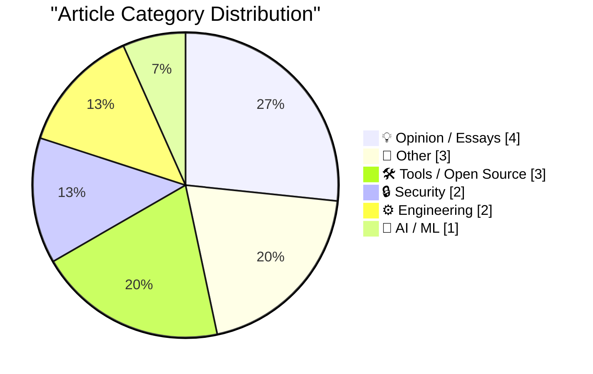
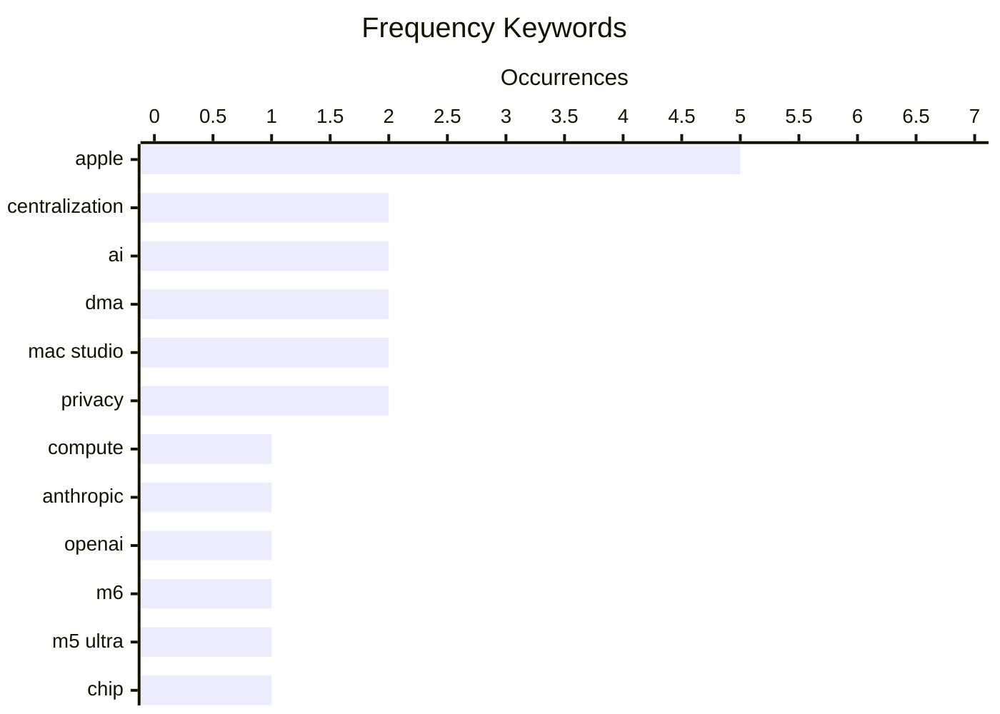

# 📰 AI Blog Daily Digest — 2026-08-26

> From 92 top tech blogs (curated by Karpathy), AI-selected Top 15

## 📝 Today's Highlights

Today’s tech discourse is split between a looming concentration of AI compute in the hands of a few giants and a counter-narrative questioning that centralization, while Apple’s hardware refresh—headlined by the M6 and M5 Ultra chips—anchors the day’s product news. Meanwhile, critical scrutiny extends beyond AI to regulatory frameworks like the DMA and data-breach verification, signaling a broader pushback against unchecked tech power and unverified claims.

---

## 🏆 Must Read

🥇 **Dylan Patel – Anthropic & OpenAI will have most of the world’s compute by 2028**

dwarkesh.com · 6h ago · 🤖 AI / ML

> Dylan Patel predicts that by 2028, Anthropic and OpenAI will control the majority of the world's compute, driven by massive capital investments and the centralizing forces of AI infrastructure. He argues that the high cost of building and operating data centers will consolidate power into a few hands, making it nearly impossible for smaller players to compete. Patel highlights the strategic importance of securing energy and chip supply chains, and warns that this centralization could lead to a future where AI development is controlled by a few corporations. The core point is that the AI industry is heading toward extreme centralization, with profound implications for competition and innovation.

💡 **Why it matters**: This article offers a data-driven forecast on the future of AI compute, essential for anyone tracking industry power dynamics.

🏷️ compute, centralization, Anthropic, OpenAI

🥈 **Apple Introduces M6 and M5 Ultra Chips, in New Mac Mini and Mac Studio**

daringfireball.net · 9h ago · 📝 Other

> Apple introduces the M6 chip in the Mac mini and the M5 Ultra in the Mac Studio, marking a significant leap in performance and AI capabilities. The M6, Apple's first 2-nanometer chip, features a 12-core CPU with the world's fastest core, a 12-core GPU with Neural Accelerators, a Dual 16-core Neural Engine, and up to 170GB/s of unified memory bandwidth. The M5 Ultra is positioned for high-end AI compute, offering substantial gains over previous generations. The announcement emphasizes the chips' ability to handle demanding AI workloads locally, reducing reliance on cloud services.

💡 **Why it matters**: This is a key hardware announcement that sets the benchmark for consumer AI compute, relevant for developers and tech enthusiasts.

🏷️ Apple, M6, M5 Ultra, chip

🥉 **Foot Guns for Sale**

idiallo.com · 15h ago · 💡 Opinion / Essays

> The article challenges the prevailing narrative that AI will be centralized under companies like Anthropic and OpenAI, arguing that developers will not become mere prompt-engineers. The author contends that the 'shovel sellers' are pushing this story to maintain control, but the reality is that AI will be decentralized, with open-source models and local compute playing a major role. The piece highlights the risks of becoming 'tenants' to API-driven fiefdoms, paying per token, and argues that the future will see a diversity of AI approaches. The core point is that the centralization narrative is a self-serving myth, and the true potential of AI lies in open, distributed systems.

💡 **Why it matters**: This contrarian perspective is crucial for understanding the counterarguments to AI centralization, offering a fresh take on the industry's trajectory.

🏷️ AI, centralization, developers, future

---

## 📊 Data Overview

| Scanned | Articles | Range | Selected |
|:---:|:---:|:---:|:---:|
| 88/92 | 2618 → 39 | 48h | **15** |

### Category Distribution



### High-Frequency Keywords



<details>
<summary>📈 ASCII Keyword Chart (Terminal Friendly)</summary>

```
apple          │ ████████████████████ 5
centralization │ ████████░░░░░░░░░░░░ 2
ai             │ ████████░░░░░░░░░░░░ 2
dma            │ ████████░░░░░░░░░░░░ 2
mac studio     │ ████████░░░░░░░░░░░░ 2
privacy        │ ████████░░░░░░░░░░░░ 2
compute        │ ████░░░░░░░░░░░░░░░░ 1
anthropic      │ ████░░░░░░░░░░░░░░░░ 1
openai         │ ████░░░░░░░░░░░░░░░░ 1
m6             │ ████░░░░░░░░░░░░░░░░ 1
```

</details>

### 🏷️ Topic Tags

**apple**(5) · **centralization**(2) · **ai**(2) · dma(2) · mac studio(2) · privacy(2) · compute(1) · anthropic(1) · openai(1) · m6(1) · m5 ultra(1) · chip(1) · developers(1) · future(1) · app store(1) · regulation(1) · data breach(1) · verification(1) · carhartt(1) · critique(1)

---

## 💡 Opinion / Essays

### 1. Foot Guns for Sale

[Link](https://idiallo.com/blog/foot-gun-for-sale) — **idiallo.com** · 15h ago · ⭐ 24/30

> The article challenges the prevailing narrative that AI will be centralized under companies like Anthropic and OpenAI, arguing that developers will not become mere prompt-engineers. The author contends that the 'shovel sellers' are pushing this story to maintain control, but the reality is that AI will be decentralized, with open-source models and local compute playing a major role. The piece highlights the risks of becoming 'tenants' to API-driven fiefdoms, paying per token, and argues that the future will see a diversity of AI approaches. The core point is that the centralization narrative is a self-serving myth, and the true potential of AI lies in open, distributed systems.

🏷️ AI, centralization, developers, future

---

### 2. ★ What Is the Point of the DMA?

[Link](https://daringfireball.net/2026/08/what_is_the_point_of_the_dma) — **daringfireball.net** · 23h ago · ⭐ 23/30

> The article questions the effectiveness of the Digital Markets Act (DMA) in achieving its stated goals of opening up competition and choice for developers. It points out that the European Commission has approved Apple's compliance, which includes a 15% commission on web links from apps and a 5% Core Technology Commission even for apps distributed via third-party marketplaces. The author argues that these fees undermine the DMA's intent, as they still impose significant costs on developers and may not actually foster a more competitive ecosystem. The core point is that the DMA's enforcement may be more about optics than genuine market liberalization.

🏷️ DMA, Apple, App Store, regulation

---

### 3. The AI Hater's Manifesto

[Link](https://www.wheresyoured.at/the-ai-haters-manifesto/) — **wheresyoured.at** · 5h ago · ⭐ 22/30

> The AI Hater's Manifesto is a critical essay that argues against the current trajectory of AI development, which it sees as harmful and overhyped. The author contends that AI is being used to automate away human creativity and labor, leading to a devaluation of human work and a concentration of power. The piece calls for a rejection of AI's corporate-driven narrative and a return to human-centric values. The core point is that AI, as currently pursued, is a threat to human dignity and should be resisted.

🏷️ AI, critique, manifesto

---

### 4. Footnote Regarding the GDPR and Cookie Permission Prompts

[Link](https://daringfireball.net/2026/08/what_is_the_point_of_the_dma#fn1-2026-08-24) — **daringfireball.net** · 6h ago · ⭐ 18/30

> This is a footnote added to a longer piece about the DMA, focusing on the GDPR's cookie permission prompts. The author argues that the GDPR, now 10 years old, has led to ubiquitous cookie banners that are widely ignored by users, and regulators have done nothing to enforce or improve the situation. The author suggests that European regulators are content with the status quo because these prompts serve as a constant reminder of EU regulation, even if they are ineffective. The core point is that the GDPR's cookie consent mechanism is a failure in practice, yet it persists because it symbolically asserts regulatory power.

🏷️ GDPR, DMA, cookie, privacy

---

## 📝 Other

### 5. Apple Introduces M6 and M5 Ultra Chips, in New Mac Mini and Mac Studio

[Link](https://www.apple.com/newsroom/2026/08/apple-introduces-m6-and-m5-ultra-for-a-big-leap-in-performance-and-ai-compute/) — **daringfireball.net** · 9h ago · ⭐ 24/30

> Apple introduces the M6 chip in the Mac mini and the M5 Ultra in the Mac Studio, marking a significant leap in performance and AI capabilities. The M6, Apple's first 2-nanometer chip, features a 12-core CPU with the world's fastest core, a 12-core GPU with Neural Accelerators, a Dual 16-core Neural Engine, and up to 170GB/s of unified memory bandwidth. The M5 Ultra is positioned for high-end AI compute, offering substantial gains over previous generations. The announcement emphasizes the chips' ability to handle demanding AI workloads locally, reducing reliance on cloud services.

🏷️ Apple, M6, M5 Ultra, chip

---

### 6. Update Regarding the Base Prices of the M5 Max Mac Studio

[Link](https://daringfireball.net/2026/08/configurations_and_pricing_for_new_mac_minis_and_mac_studios) — **daringfireball.net** · 13m ago · ⭐ 21/30

> The article corrects a pricing mistake in a previous table regarding the M5 Max Mac Studio, explaining that Apple's web interface is misleading. The entry model starts at $2,500 with an 18-core CPU and 32-core GPU, while the upgraded chip with a 40-core GPU is labeled '+ $300', making it appear as if the base price is $2,800. The author clarifies that the $2,800 price is for the upgraded chip, not the base model. The core point is to highlight a sneaky design in Apple's purchasing flow that can confuse buyers.

🏷️ Apple, M5 Max, Mac Studio, pricing

---

### 7. ★ Memory and Storage Configurations and Pricing for the New Mac Minis (M6/M5 Pro) and Mac Studios (M5 Max/M5 Ultra)

[Link](https://daringfireball.net/2026/08/configurations_and_pricing_for_new_mac_minis_and_mac_studios) — **daringfireball.net** · 7h ago · ⭐ 21/30

> The article provides a comprehensive table of RAM and SSD configuration options and pricing for the new Mac mini (M6/M5 Pro) and Mac Studio (M5 Max/M5 Ultra). It breaks down the available memory and storage tiers for each chip, along with their respective costs. The tables allow users to quickly compare configurations and understand the price differences. The core point is to offer a clear, at-a-glance reference for potential buyers.

🏷️ Apple, Mac mini, Mac Studio, configurations

---

## 🛠 Tools / Open Source

### 8. A curmudgeon tries a language server

[Link](https://entropicthoughts.com/curmudgeon-tries-language-server) — **entropicthoughts.com** · 1 days ago · ⭐ 19/30

> A self-described curmudgeon who still codes with a text editor and terminal explores the benefits of a language server, contrasting his workflow with Lisp programmers' interactive development. He details how the language server provides real-time feedback, type information, and error detection, reducing the need for manual compile-run-debug cycles. The article likely covers his initial skepticism and eventual appreciation for the tool, possibly including specific examples of how it improved his productivity. The author concludes that despite his old habits, a language server offers significant advantages that make it worth adopting.

🏷️ language server, editor, workflow

---

### 9. Adding diagrams to my static site generator with D2

[Link](https://www.gilesthomas.com/2026/08/adding-d2) — **gilesthomas.com** · -29m ago · ⭐ 18/30

> The author describes adding D2, a diagramming language, to their static site generator to easily create diagrams for blog posts. Previously, they avoided diagrams due to the effort of drawing them manually in LibreOffice or using AI, which often produced poor results. D2 allows them to define diagrams in a simple text format, which is then rendered to SVG, integrating seamlessly into their workflow. The author finds the results effective and encourages others to consider D2 for technical writing. The post likely includes examples of D2 syntax and the resulting diagrams.

🏷️ D2, diagrams, static site generator

---

### 10. Have You Heard the Good News About Microlighter?

[Link](https://blog.jim-nielsen.com/2026/shipping-microlighter/) — **blog.jim-nielsen.com** · 3h ago · ⭐ 17/30

> The author discusses their experience with 'microlighter', a tool by Dave Rupert for syntax highlighting using the CSS Custom Highlights API. They immediately implemented it on their blog but then let the change sit for a period of reflection before merging. The post explores the author's internal deliberation about the tool's benefits and potential drawbacks, such as performance and accessibility. Ultimately, they decide to merge it, suggesting that the tool works well and aligns with their blog's needs. The article is a personal reflection on adopting new web technologies.

🏷️ syntax highlighting, CSS Custom Highlights, microlighter

---

## 🔒 Security

### 11. A Cautionary Tale About Data Breach Claims, Verification and Carhartt

[Link](https://www.troyhunt.com/a-cautionary-tale-about-data-breach-claims-verification-and-carhartt/) — **troyhunt.com** · 40m ago · ⭐ 23/30

> Troy Hunt recounts a cautionary tale about data breach claims, focusing on a case involving Carhartt where criminals' claims of a breach were not immediately verifiable. He emphasizes the importance of rigorous verification before accepting breach data, as attackers may fabricate or exaggerate incidents for notoriety or financial gain. The article details the process of cross-referencing data with known sources and the challenges of confirming authenticity. The core point is that not all breach claims are legitimate, and verification is a critical step in incident response.

🏷️ data breach, verification, Carhartt

---

### 12. Apple Rethinks Plan to Merge ‘Hide My Email’ Domain Name With ‘Sign In With Apple’

[Link](https://developer.apple.com/news/?id=1ptvdtcm) — **daringfireball.net** · 22h ago · ⭐ 20/30

> Apple has reversed its plan to merge the 'Hide My Email' domain with 'Sign in with Apple', following community feedback. New Sign in with Apple addresses will now be issued on private.icloud.com, while existing privaterelay.appleid.com addresses will continue to work. Hide My Email addresses will remain on icloud.com, as originally planned. The core point is that Apple listened to user concerns and adjusted its strategy to minimize disruption.

🏷️ Apple, Hide My Email, Sign in with Apple, privacy

---

## ⚙️ Engineering

### 13. Numerical (in)stability of recurrence relations

[Link](https://www.johndcook.com/blog/2026/08/24/numerical-instability-recurrece/) — **johndcook.com** · 20h ago · ⭐ 20/30

> The article discusses the numerical instability of recurrence relations, using examples from special functions like Bessel functions. It explains that while three-term recurrences are computationally useful, they can be unstable when applied in the forward direction, leading to significant errors. The author references a previous post on stable and unstable recurrences, and provides guidance on how to use them correctly, such as using backward recurrence for certain cases. The core point is that numerical stability is a critical consideration when implementing recurrence relations.

🏷️ recurrence, stability, numerical analysis

---

### 14. Forgejo hack: How to set a starting issue and pull request number

[Link](https://blog.miguelgrinberg.com/post/forgejo-hack-how-to-set-a-starting-issue-and-pull-request-number) — **miguelgrinberg.com** · 8h ago · ⭐ 19/30

> The author, while migrating open source projects from GitHub to a self-hosted Forgejo instance, discovered a hack to set the starting issue and pull request numbers. This involves directly editing the Forgejo database, specifically the `sequence` table, to update the counter for the `issue` table. The post provides step-by-step instructions, including SQL commands to update the sequence to the desired starting number. This workaround is necessary because the Forgejo admin UI does not expose this setting. The author shares this discovery to help others facing similar migration challenges.

🏷️ Forgejo, self-hosted, issue number, configuration

---

## 🤖 AI / ML

### 15. Dylan Patel – Anthropic & OpenAI will have most of the world’s compute by 2028

[Link](https://www.dwarkesh.com/p/dylan-patel-3) — **dwarkesh.com** · 6h ago · ⭐ 25/30

> Dylan Patel predicts that by 2028, Anthropic and OpenAI will control the majority of the world's compute, driven by massive capital investments and the centralizing forces of AI infrastructure. He argues that the high cost of building and operating data centers will consolidate power into a few hands, making it nearly impossible for smaller players to compete. Patel highlights the strategic importance of securing energy and chip supply chains, and warns that this centralization could lead to a future where AI development is controlled by a few corporations. The core point is that the AI industry is heading toward extreme centralization, with profound implications for competition and innovation.

🏷️ compute, centralization, Anthropic, OpenAI

---

*Generated on 2026-08-26 | Scanned 88 sources → Found 2618 articles → Selected 15 articles*
*Based on [Hacker News Popularity Contest 2025](https://refactoringenglish.com/tools/hn-popularity/) RSS feeds list, curated by [Andrej Karpathy](https://x.com/karpathy).*
*Created by "Understand AI".*
