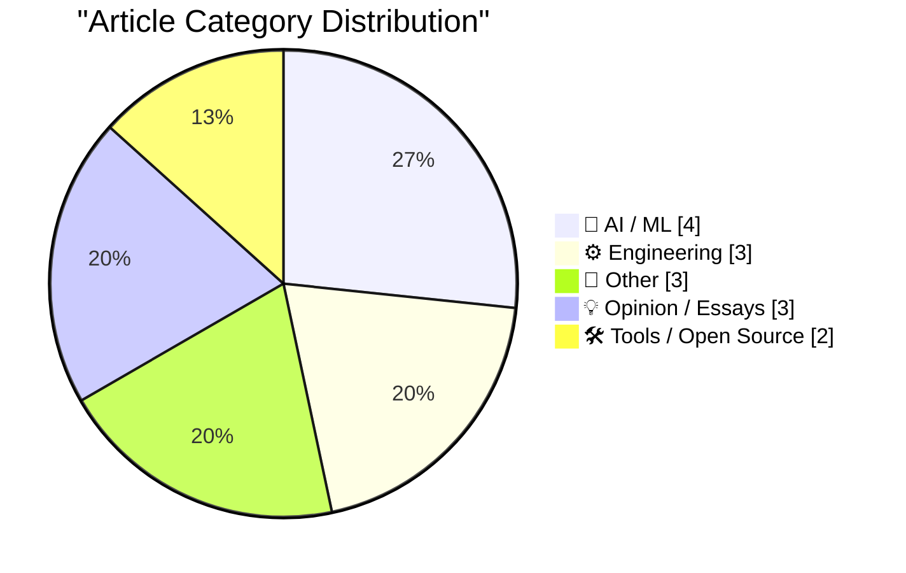
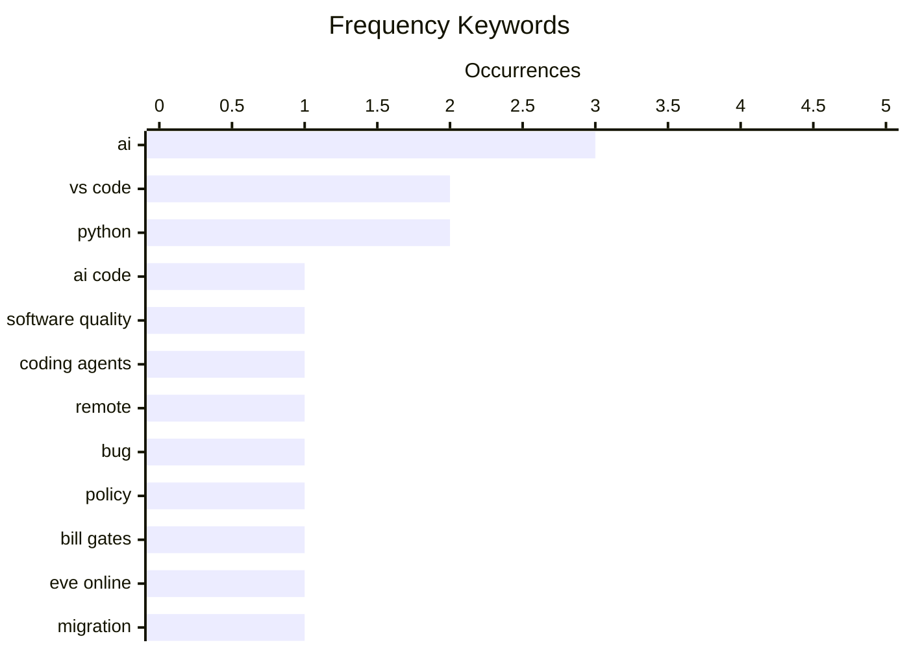

# 📰 AI Blog Daily Digest — 2026-08-27

> From 92 top tech blogs (curated by Karpathy), AI-selected Top 15

## 📝 Today's Highlights

AI’s expanding role in software development is dominating the discourse, with debates over code quality and strategic planning—from Bill Gates’ call for a coherent national AI agenda to skepticism over Anthropic’s valuation—highlighting both promise and peril. Meanwhile, developer tooling friction is in the spotlight, as VS Code remote and UI regressions force users to seek workarounds, underscoring the fragility of essential workflows. Finally, the tech world is marking milestones and shakeups, from Linux’s 34th anniversary and EVE Online’s long-awaited Python 3 migration to Apple’s upcoming September event and the shutdown of XCancel under legal pressure.

---

## 🏆 Must Read

🥇 **What is the quality of software that AI writes?**

johndcook.com · 3h ago · 🤖 AI / ML

> The article examines the quality of AI-generated code, a topic of debate as AI coding agents boost developer productivity. Some argue that source code will become obsolete, envisioning 'dark software factories' where code is never inspected, while others insist humans still need to review and understand code. The author highlights the tension between these views, noting that AI-written code may lack the clarity and maintainability required for long-term projects. The post concludes that while AI can accelerate development, the question of code quality remains unresolved, with implications for software engineering practices.

💡 **Why it matters**: Essential reading for developers and tech leaders weighing the trade-offs of AI-assisted coding in production environments.

🏷️ AI code, software quality, coding agents

🥈 **If your VS Code remotes stopped working, downgrade to v1.124.x**

xeiaso.net · 22h ago · 🛠 Tools / Open Source

> The article reports that VS Code remote development features have stopped working for some users, and the recommended fix is to downgrade to version 1.124.x. The issue appears to be a regression in the latest update, causing connectivity problems with remote servers. The author, a software engineer, provides a clear, actionable solution for affected users, emphasizing that the downgrade restores functionality. The post is brief but serves as a practical troubleshooting guide for the community.

💡 **Why it matters**: Immediate, practical advice for developers experiencing VS Code remote issues, saving time and frustration.

🏷️ VS Code, remote, bug

🥉 **Excellent new Bill Gates essay on the urgency of having a coherent AI plan**

garymarcus.substack.com · 7h ago · 🤖 AI / ML

> The article praises a new essay by Bill Gates that argues for a coherent national AI plan, emphasizing the urgency of regulating AI development. Gates reportedly calls for proactive government intervention to manage AI risks, including potential job displacement and security threats. The author, Gary Marcus, agrees with Gates' stance, highlighting the need for 'taming Silicon Valley' through policy. The essay is seen as a significant endorsement from a tech leader, potentially influencing public discourse and policy debates.

💡 **Why it matters**: A key perspective from a major tech figure that could shape AI policy discussions; valuable for anyone following AI governance.

🏷️ AI, policy, Bill Gates

---

## 📊 Data Overview

| Scanned | Articles | Range | Selected |
|:---:|:---:|:---:|:---:|
| 87/92 | 2593 → 42 | 48h | **15** |

### Category Distribution



### High-Frequency Keywords



<details>
<summary>📈 ASCII Keyword Chart (Terminal Friendly)</summary>

```
ai               │ ████████████████████ 3
vs code          │ █████████████░░░░░░░ 2
python           │ █████████████░░░░░░░ 2
ai code          │ ███████░░░░░░░░░░░░░ 1
software quality │ ███████░░░░░░░░░░░░░ 1
coding agents    │ ███████░░░░░░░░░░░░░ 1
remote           │ ███████░░░░░░░░░░░░░ 1
bug              │ ███████░░░░░░░░░░░░░ 1
policy           │ ███████░░░░░░░░░░░░░ 1
bill gates       │ ███████░░░░░░░░░░░░░ 1
```

</details>

### 🏷️ Topic Tags

**ai**(3) · **vs code**(2) · **python**(2) · ai code(1) · software quality(1) · coding agents(1) · remote(1) · bug(1) · policy(1) · bill gates(1) · eve online(1) · migration(1) · stackless(1) · anthropic(1) · valuation(1) · linux(1) · history(1) · anniversary(1) · code generation(1) · software engineering(1)

---

## 🤖 AI / ML

### 1. What is the quality of software that AI writes?

[Link](https://www.johndcook.com/blog/2026/08/26/what-is-the-quality-of-software-that-ai-writes/) — **johndcook.com** · 3h ago · ⭐ 25/30

> The article examines the quality of AI-generated code, a topic of debate as AI coding agents boost developer productivity. Some argue that source code will become obsolete, envisioning 'dark software factories' where code is never inspected, while others insist humans still need to review and understand code. The author highlights the tension between these views, noting that AI-written code may lack the clarity and maintainability required for long-term projects. The post concludes that while AI can accelerate development, the question of code quality remains unresolved, with implications for software engineering practices.

🏷️ AI code, software quality, coding agents

---

### 2. Excellent new Bill Gates essay on the urgency of having a coherent AI plan

[Link](https://garymarcus.substack.com/p/excellent-new-bill-gates-essay-on) — **garymarcus.substack.com** · 7h ago · ⭐ 23/30

> The article praises a new essay by Bill Gates that argues for a coherent national AI plan, emphasizing the urgency of regulating AI development. Gates reportedly calls for proactive government intervention to manage AI risks, including potential job displacement and security threats. The author, Gary Marcus, agrees with Gates' stance, highlighting the need for 'taming Silicon Valley' through policy. The essay is seen as a significant endorsement from a tech leader, potentially influencing public discourse and policy debates.

🏷️ AI, policy, Bill Gates

---

### 3. Anthropic’s $30 trillion fantasy

[Link](https://garymarcus.substack.com/p/anthropics-30-trillion-fantasy) — **garymarcus.substack.com** · 22h ago · ⭐ 22/30

> The article critiques Anthropic's recent valuation claims, calling them a '$30 trillion fantasy.' The author argues that the company's projected worth is wildly unrealistic, comparing it to the 'ridiculous' SpaceX S-1 filing. The piece likely examines the hype around AI valuations, questioning the sustainability of such high numbers without concrete revenue or product differentiation. It concludes that such valuations are detached from reality, potentially misleading investors and the market.

🏷️ Anthropic, valuation, AI

---

### 4. Quoting Paul Dix

[Link](https://simonwillison.net/2026/Aug/26/paul-dix/) — **simonwillison.net** · 14h ago · ⭐ 21/30

> The article quotes Paul Dix, who marvels at AI's ability to write 1 million lines of code and refine it over months to produce reliable software running on millions of devices. He acknowledges that having an 'oracle' (likely a reference to a test suite or specification) made the task easier, but argues this doesn't diminish the achievement. Dix suggests that with proper verification systems and direction, AI can produce production-quality code, hinting at a future where AI-driven development becomes standard.

🏷️ AI, code generation, software engineering

---

## ⚙️ Engineering

### 5. EVE Online: The Move to Python 3 Begins!

[Link](https://simonwillison.net/2026/Aug/25/eve-online-move-to-python-3/) — **simonwillison.net** · 23h ago · ⭐ 22/30

> EVE Online, a long-running MMO, has announced the start of its migration from Stackless Python 2.7 (in use since 2010) to Python 3. The upgrade will involve running the 'futurize' script on 2.4 million lines of code, followed by manual review of approximately 20,000 places where Python 2 and 3 behavior differ. This is a significant technical challenge due to the game's scale and the age of its codebase. The article highlights the project's complexity and the careful planning required for such a large-scale migration.

🏷️ Python, EVE Online, migration, Stackless

---

### 6. Debugging Ubiquiti's 5G Backup on AT&T

[Link](https://www.jeffgeerling.com/blog/2026/unifi-u5g-backup-debugging/) — **jeffgeerling.com** · 1 days ago · ⭐ 18/30

> The article details the author's debugging process for using Ubiquiti's UniFi 5G backup (U5G) as a primary internet connection on AT&T's network for a mobile homelab. The author encountered issues with the device's performance and connectivity, leading to a deep dive into its configuration and AT&T's network behavior. The post covers specific technical troubleshooting steps, including examining signal metrics and failover settings. The author's goal is to determine if the Ubiquiti solution is viable for a portable rack setup that also needs to switch to a fixed wired connection.

🏷️ 5G, homelab, Ubiquiti, networking

---

### 7. Hardening the Override Flag

[Link](https://nesbitt.io/2026/08/25/hardening-the-override-flag.html) — **nesbitt.io** · 1 days ago · ⭐ 18/30

> The article discusses the security implications of the `PIP_BREAK_SYSTEM_PACKAGES` environment variable in Python's package manager. It explains that this flag is used to override pip's safety mechanism that prevents it from modifying system-managed packages. The author argues that while this flag is necessary for certain workflows, its use can lead to system instability and security vulnerabilities. The post likely provides recommendations for hardening this override, such as using virtual environments or containerization to isolate dependencies.

🏷️ Python, pip, system packages

---

## 📝 Other

### 8. Linux first announced August 25, 1991

[Link](https://dfarq.homeip.net/linux-kernel-announced-august-25-1991/?utm_source=rss&#038;utm_medium=rss&#038;utm_campaign=linux-kernel-announced-august-25-1991) — **dfarq.homeip.net** · 1 days ago · ⭐ 22/30

> On August 25, 1991, Linus Torvalds announced the Linux kernel in a Usenet post, a message that would change computing history. The article reflects on the humble beginnings of Linux, noting that Torvalds did not anticipate the impact, as evidenced by the casual tone of the message and replies. It traces how this initial announcement led to the development of the open-source operating system that now powers much of the world's infrastructure. The post serves as a historical retrospective on Linux's 35th anniversary.

🏷️ Linux, history, anniversary

---

### 9. ‘Surprise and Shine’ Apple Event: Wednesday 9 September

[Link](https://9to5mac.com/2026/08/26/apple-officially-announces-iphone-18-pro-foldable-event/) — **daringfireball.net** · 3h ago · ⭐ 20/30

> Apple has announced its next product event, 'Surprise and Shine,' scheduled for September 9 at 10 am PT, where it will unveil the iPhone 18 Pro lineup and its first foldable iPhone. The invitation features a glowing Apple logo with a sun, and the event is moved to Wednesday due to Labor Day falling in the second week of September. This marks a significant product launch for Apple, entering the foldable market.

🏷️ Apple, iPhone, event, foldable

---

### 10. XCancel, the Twitter/X Mirror, Shuts Down After Cease and Desist From the Fine Folks at X Corp

[Link](https://xcancel.com/) — **daringfireball.net** · 23h ago · ⭐ 20/30

> XCancel, a mirror service for Twitter/X, has shut down after receiving a cease and desist letter from X Corp on August 24. The service, which provided an alternative way to view tweets, is stopped until further notice while seeking legal advice. The author expresses disappointment, noting they avoided linking directly to XCancel due to the threat of legal action. The shutdown highlights the legal risks faced by third-party services that interact with major platforms.

🏷️ XCancel, Twitter, cease and desist

---

## 💡 Opinion / Essays

### 11. POSIWID: The Purpose of a System Is What It Does

[Link](https://en.wikipedia.org/wiki/The_purpose_of_a_system_is_what_it_does) — **daringfireball.net** · 2h ago · ⭐ 19/30

> The article explains the systems thinking heuristic POSIWID (The Purpose of a System Is What It Does), coined by Stafford Beer. It argues that a system's actual purpose is determined by its observable behavior and outcomes, not by the stated intentions of its designers or operators. The heuristic is used to counter claims that a system's purpose can be read from its design goals, especially when the system consistently fails to achieve them. It is a foundational concept in systems theory for evaluating real-world system performance.

🏷️ systems thinking, POSIWID, design

---

### 12. Futurism Is Always Extreme

[Link](https://borretti.me/article/futurism-is-always-extreme) — **borretti.me** · 1 days ago · ⭐ 19/30

> The article argues that rigorous, logical thinking about the future necessarily leads to extreme predictions, not moderate ones. It posits that if you follow the implications of current trends and technologies to their logical conclusions, the outcomes are either dramatically positive or catastrophically negative. Moderate futurism is seen as a failure of intellectual rigor, as it avoids the uncomfortable but likely extreme endpoints. The author concludes that embracing this extremity is essential for honest and useful futurism.

🏷️ futurism, prediction, extremes

---

### 13. Pluralistic: The age of disinvention (25 Aug 2026)

[Link](https://pluralistic.net/2026/08/25/gammamax/) — **pluralistic.net** · 19h ago · ⭐ 18/30

> The article, titled 'The age of disinvention,' explores the concept of a future where technological and social progress is reversed or lost. It argues that we are entering an era where previously invented systems, rights, and technologies are being deliberately dismantled or forgotten. The piece links this to broader political and economic trends, suggesting that this 'disinvention' is a deliberate strategy by those in power. The author uses this framing to critique contemporary policy and cultural shifts.

🏷️ disinvention, technology, society

---

## 🛠 Tools / Open Source

### 14. If your VS Code remotes stopped working, downgrade to v1.124.x

[Link](https://xeiaso.net/notes/2026/vscode-remotes-not-working-downgrade/) — **xeiaso.net** · 22h ago · ⭐ 23/30

> The article reports that VS Code remote development features have stopped working for some users, and the recommended fix is to downgrade to version 1.124.x. The issue appears to be a regression in the latest update, causing connectivity problems with remote servers. The author, a software engineer, provides a clear, actionable solution for affected users, emphasizing that the downgrade restores functionality. The post is brief but serves as a practical troubleshooting guide for the community.

🏷️ VS Code, remote, bug

---

### 15. How to make VS Code go back to the old UI

[Link](https://xeiaso.net/notes/2026/vscode-ui-revert/) — **xeiaso.net** · 22h ago · ⭐ 21/30

> The article provides instructions on how to revert VS Code to its old user interface, addressing user dissatisfaction with the new UI. It likely includes steps to disable the new layout or use a setting to restore the previous design. The author adds a sarcastic comment about someone getting promoted for removing the workaround, criticizing the UI change. The post is a practical guide for users who prefer the classic look.

🏷️ VS Code, UI, workaround

---

*Generated on 2026-08-27 | Scanned 87 sources → Found 2593 articles → Selected 15 articles*
*Based on [Hacker News Popularity Contest 2025](https://refactoringenglish.com/tools/hn-popularity/) RSS feeds list, curated by [Andrej Karpathy](https://x.com/karpathy).*
*Created by "Understand AI".*
