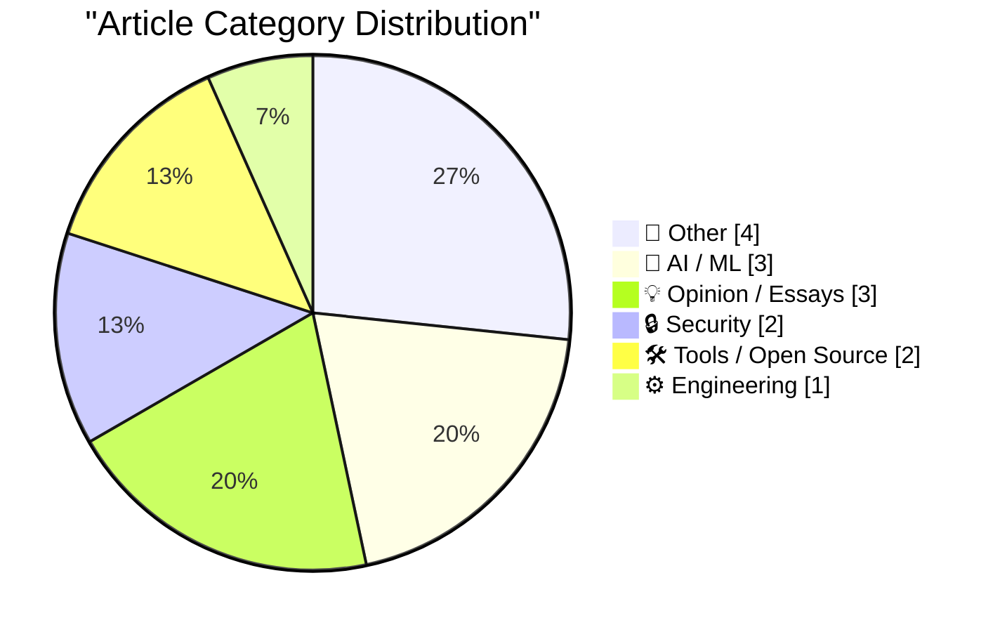
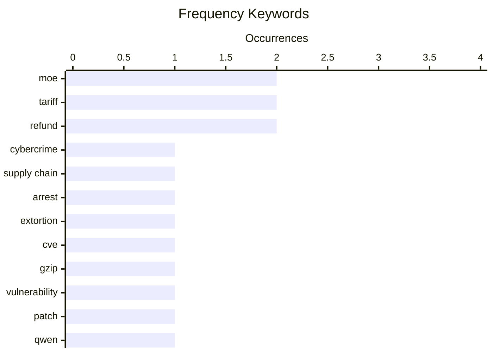

# 📰 AI Blog Daily Digest — 2026-08-28

> From 92 top tech blogs (curated by Karpathy), AI-selected Top 15

## 📝 Today's Highlights

Today’s tech landscape is dominated by escalating security threats, with arrests of alleged hackers and critical vulnerabilities in core tools like GNU gzip underscoring systemic fragility. Simultaneously, the AI sector is advancing rapidly through open-weight multimodal models and deep-dive analyses into model training and behavior, signaling a push for both capability and interpretability. Meanwhile, a wave of economic and regulatory friction—from Apple’s new Maps ads to tariff-related refunds and critiques of European rules—highlights growing tension between tech giants, governments, and independent creators.

---

## 🏆 Must Read

🥇 **Two Alleged ‘TeamPCP’ Hackers Arrested in Australia**

krebsonsecurity.com · 11h ago · 🔒 Security

> Australian Federal Police arrested two men, aged 21 and 23, from Western Australia for allegedly being members of TeamPCP, a cybercrime group blamed for the longest-running software supply chain attack spree. The group created malicious open-source software to steal from thousands of victims globally. The arrests highlight the growing threat of supply chain attacks via open-source ecosystems.

💡 **Why it matters**: Reveals a major law enforcement action against a prolific supply chain attack group, relevant for anyone concerned about open-source security.

🏷️ cybercrime, supply chain, arrest, extortion

🥈 **"No way to prevent this" say users of only language where this regularly happens**

xeiaso.net · 22h ago · 🔒 Security

> CVE-2026-41992 in GNU gzip allows out-of-bounds reads in the LZH decoder when decompressing two files in the same invocation, due to a shared global buffer not reset between calls. The vulnerability stems from the code being written in C, a memory-unsafe language. This incident underscores the ongoing memory safety crisis in critical infrastructure software.

💡 **Why it matters**: A concrete example of a memory safety vulnerability in a ubiquitous tool, reinforcing the argument for adopting memory-safe languages.

🏷️ CVE, gzip, vulnerability, patch

🥉 **Qwen3.8-Flash-Next**

simonwillison.net · 23h ago · 🤖 AI / ML

> Qwen3.8-Flash-Next is a new open-weights multimodal MoE model from Qwen, serving as an early preview of Qwen4 architecture. It has 125B total parameters but only 6B active, offering significant performance efficiency. The author tested quantized versions (UD-IQ1_S and UD-Q2_K_XL) on a DGX Spark, noting impressive results in generating images like pelicans.

💡 **Why it matters**: Provides early hands-on insights into a cutting-edge open-weights model, valuable for AI practitioners evaluating new architectures.

🏷️ Qwen, MoE, multimodal, open weights

---

## 📊 Data Overview

| Scanned | Articles | Range | Selected |
|:---:|:---:|:---:|:---:|
| 79/92 | 2445 → 32 | 48h | **15** |

### Category Distribution



### High-Frequency Keywords



<details>
<summary>📈 ASCII Keyword Chart (Terminal Friendly)</summary>

```
moe           │ ████████████████████ 2
tariff        │ ████████████████████ 2
refund        │ ████████████████████ 2
cybercrime    │ ██████████░░░░░░░░░░ 1
supply chain  │ ██████████░░░░░░░░░░ 1
arrest        │ ██████████░░░░░░░░░░ 1
extortion     │ ██████████░░░░░░░░░░ 1
cve           │ ██████████░░░░░░░░░░ 1
gzip          │ ██████████░░░░░░░░░░ 1
vulnerability │ ██████████░░░░░░░░░░ 1
```

</details>

### 🏷️ Topic Tags

**moe**(2) · **tariff**(2) · **refund**(2) · cybercrime(1) · supply chain(1) · arrest(1) · extortion(1) · cve(1) · gzip(1) · vulnerability(1) · patch(1) · qwen(1) · multimodal(1) · open weights(1) · gpt-2(1) · dropout(1) · model training(1) · claude(1) · vocabulary(1) · github(1)

---

## 📝 Other

### 1. Ads in Apple Maps Have Now Launched

[Link](https://9to5mac.com/2026/08/25/apple-maps-launches-ads-on-iphone-heres-whats-new/) — **daringfireball.net** · 2h ago · ⭐ 20/30

> Apple has launched ads in Apple Maps, starting with suggested places on the search screen and in search results. The rollout began in the last few days and will ramp up to all users. The author saw an ad for an HVAC contractor 12 miles away, indicating ads are location-based and contextually placed.

🏷️ Apple Maps, ads, rollout, search

---

### 2. Panic Is Refunding Tariff Fees to Playdate Buyers

[Link](https://www.gamedeveloper.com/business/playdate-maker-is-refunding-tariff-fees-to-customers) — **daringfireball.net** · 2h ago · ⭐ 18/30

> Panic, the maker of Playdate, is refunding tariff fees to customers who were charged during a specific window this year. The company initially absorbed costs but found it financially difficult, so they added a clearly labeled tariff line item at checkout. They have set up a website to explain the refund process.

🏷️ Panic, tariff, refund, Playdate

---

### 3. Nieuwe wet Inlichtingen- en veiligheidsdiensten: wat mogen ze nu al en waar zijn ze voor

[Link](https://berthub.eu/articles/posts/geheime-veiligheids-en-inlichtingendiensten/) — **berthub.eu** · 12h ago · ⭐ 18/30

> The Dutch cabinet is set to introduce a new intelligence and security services law (AIVD/MIVD) this Friday, but the article argues it demands critical scrutiny given recent failures. The services have caused wrongful arrests, provided incorrect information about the Ukraine invasion, mishandled massive datasets on citizens, and run a mass surveillance program that intercepts many people but yields little useful intelligence. The author emphasizes that the law's contents are unknown but the track record justifies a skeptical, careful review. The core point is that without strict oversight, the new law risks expanding powers that have already been misused.

🏷️ surveillance, intelligence, law, privacy

---

### 4. A Calendar View For My Blog

[Link](https://blog.jim-nielsen.com/2026/blog-calendar-view/) — **blog.jim-nielsen.com** · 3h ago · ⭐ 17/30

> The author reflects on having published 807 blog posts over 14 years and seeks a more engaging way to visualize this volume than a reverse-chronological list. They propose a calendar view as an alternative navigation method, though the post appears to be an introduction to that concept. The article explores how different presentation formats can aid in digesting long-form personal archives. The author's conclusion is that a calendar view offers a unique, time-based perspective that complements the existing list view.

🏷️ blog, calendar view, data visualization

---

## 🤖 AI / ML

### 5. Qwen3.8-Flash-Next

[Link](https://simonwillison.net/2026/Aug/26/qwen38-flash-next/) — **simonwillison.net** · 23h ago · ⭐ 23/30

> Qwen3.8-Flash-Next is a new open-weights multimodal MoE model from Qwen, serving as an early preview of Qwen4 architecture. It has 125B total parameters but only 6B active, offering significant performance efficiency. The author tested quantized versions (UD-IQ1_S and UD-Q2_K_XL) on a DGX Spark, noting impressive results in generating images like pelicans.

🏷️ Qwen, MoE, multimodal, open weights

---

### 6. Why do OpenAI's GPT-2 weights beat mine? Part four: digging into dropout

[Link](https://www.gilesthomas.com/2026/08/why-do-openai-gpt2-weights-beat-mine-4-ift-dropout) — **gilesthomas.com** · 3h ago · ⭐ 23/30

> The author investigates why their models, despite achieving lower test loss than OpenAI's GPT-2 small, perform worse on instruction-fine-tuning. Reading the Switch Transformers paper, they hypothesize that dropout during pre-training may affect downstream fine-tuning performance. This is part four of a series digging into this training mystery.

🏷️ GPT-2, dropout, model training, MoE

---

### 7. The Load-Bearing Vocabulary of Claude

[Link](https://louisabraham.github.io/load-bearing/) — **daringfireball.net** · 1h ago · ⭐ 21/30

> A data analysis project by Louis Abraham reveals that Claude's GitHub pull request descriptions are highly repetitive, clustering into eight distinct writing styles. One style grew from 1.0% of the corpus in early 2025 to 45% by mid-2026. This highlights a lack of linguistic diversity in AI-generated text, with implications for authenticity and detection.

🏷️ Claude, vocabulary, GitHub, data analysis

---

## 💡 Opinion / Essays

### 8. ‘How Europe Is Killing Makers and Micro-Entrepreneurs’

[Link](https://lectronz.com/u/lectronz/articles/how-europe-is-killing-makers-and-micro-entrepreneurs) — **daringfireball.net** · 3h ago · ⭐ 20/30

> Lectronz founder Alain Pannetrat argues that European regulations are harming makers and micro-entrepreneurs in open-source hardware. The marketplace's sellers are mostly hobbyists and small designers, not large companies, and new compliance burdens (likely CE marking, battery regulations, etc.) are making it unviable for them to sell. This threatens the open-source hardware ecosystem.

🏷️ EU, makers, regulation, hardware

---

### 9. Elizabeth Warren’s Incoherent Outrage Regarding Apple’s Tariff Refund

[Link](https://www.warren.senate.gov/newsroom/press-releases/warren-pushes-giant-corporations-to-give-billions-in-tariff-refunds-back-to-consumers/) — **daringfireball.net** · 2h ago · ⭐ 18/30

> Senator Elizabeth Warren is urging large corporations like Apple, Target, and Amazon to pass along tariff refunds to consumers who paid higher prices. She argues that these companies received massive rebates from the Trump administration for tariffs paid last year. The article criticizes her stance as incoherent, given the complexities of tariff pass-through and corporate pricing.

🏷️ Apple, tariff, politics, refund

---

### 10. Digg v4 and lessons not learned

[Link](https://dfarq.homeip.net/digg-v4-and-lessons-not-learned/?utm_source=rss&#038;utm_medium=rss&#038;utm_campaign=digg-v4-and-lessons-not-learned) — **dfarq.homeip.net** · 1 days ago · ⭐ 18/30

> The article reflects on Digg v4's failure as a cautionary tale for high-profile websites making major changes. Digg, once a leading news aggregation site, lost its user base after a drastic redesign. The lesson is that radical changes can alienate users and lead to decline.

🏷️ Digg, redesign, lessons learned

---

## 🔒 Security

### 11. Two Alleged ‘TeamPCP’ Hackers Arrested in Australia

[Link](https://krebsonsecurity.com/2026/08/two-alleged-teampcp-hackers-arrested-in-australia/) — **krebsonsecurity.com** · 11h ago · ⭐ 26/30

> Australian Federal Police arrested two men, aged 21 and 23, from Western Australia for allegedly being members of TeamPCP, a cybercrime group blamed for the longest-running software supply chain attack spree. The group created malicious open-source software to steal from thousands of victims globally. The arrests highlight the growing threat of supply chain attacks via open-source ecosystems.

🏷️ cybercrime, supply chain, arrest, extortion

---

### 12. "No way to prevent this" say users of only language where this regularly happens

[Link](https://xeiaso.net/shitposts/no-way-to-prevent-this/memory-safety/CVE-2026-41992/) — **xeiaso.net** · 22h ago · ⭐ 26/30

> CVE-2026-41992 in GNU gzip allows out-of-bounds reads in the LZH decoder when decompressing two files in the same invocation, due to a shared global buffer not reset between calls. The vulnerability stems from the code being written in C, a memory-unsafe language. This incident underscores the ongoing memory safety crisis in critical infrastructure software.

🏷️ CVE, gzip, vulnerability, patch

---

## 🛠 Tools / Open Source

### 13. Afterglow — Classic After Dark Screen Savers on Today’s MacOS

[Link](https://morphing.cloud/afterglow/) — **daringfireball.net** · 1h ago · ⭐ 15/30

> Jeff Halter has released Afterglow, an emulator built specifically for running classic After Dark screen saver modules on modern macOS. This follows his previous work bringing back the Lunatic Fringe game via a runtime called Lunacy. The article notes that running After Dark modules previously required fussy configuration of Mac OS emulators or vintage hardware, and no single emulator could faithfully run all modules due to speed variations. Afterglow solves this by being purpose-built for After Dark modules, offering a seamless way to relive these nostalgic screen savers.

🏷️ After Dark, screensaver, macOS, retro

---

### 14. Gadget Review: Thermal Master P3 Macro Lens ★★★★⯪

[Link](https://shkspr.mobi/blog/2026/08/gadget-review-thermal-master-p3-macro-lens/) — **shkspr.mobi** · 1 days ago · ⭐ 15/30

> The Thermal Master P3 is a thermal camera with a manual macro lens, specifically designed for close-up electronics inspection, unlike previous models aimed at bird watching or leak detection. The review highlights its ability to measure CPU temperatures and other component heat directly, making it a unique tool for tech enthusiasts and repair technicians. The camera earns a 4-star rating (out of 5) in this review. The author concludes that the P3 fills a niche for detailed thermal analysis of electronics, though it may not be ideal for general-purpose use.

🏷️ thermal camera, macro lens, gadget review

---

## ⚙️ Engineering

### 15. In the product end game, every change carries significant risk, episode 2

[Link](https://devblogs.microsoft.com/oldnewthing/20260826-00/?p=112649) — **devblogs.microsoft.com/oldnewthing** · 1 days ago · ⭐ 16/30

> This post continues a series on the risks of making changes during the final stages of a product's development cycle. It emphasizes that even the smallest perturbation can introduce significant risk, potentially destabilizing a product that is otherwise ready for release. The author illustrates how seemingly trivial modifications can have outsized consequences in the end game. The core message is that caution and minimal change are critical when a product is near completion.

🏷️ software release, risk management, product development

---

*Generated on 2026-08-28 | Scanned 79 sources → Found 2445 articles → Selected 15 articles*
*Based on [Hacker News Popularity Contest 2025](https://refactoringenglish.com/tools/hn-popularity/) RSS feeds list, curated by [Andrej Karpathy](https://x.com/karpathy).*
*Created by "Understand AI".*
