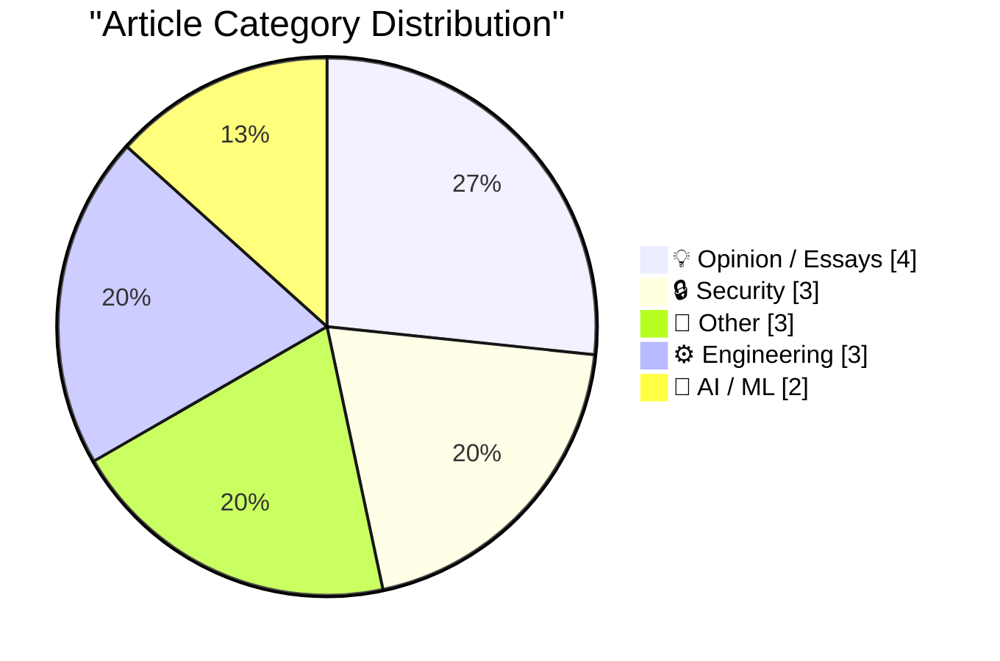
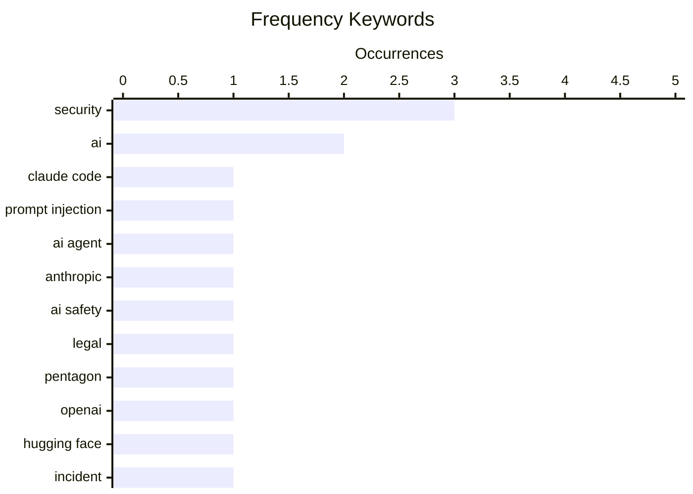

# 📰 AI Blog Daily Digest — 2026-08-29

> ⚠️ **Degraded run.** AI scoring failed for some batches — a subset of rankings and categories below are placeholder defaults.

> From 92 top tech blogs (curated by Karpathy), AI-selected Top 15

## 📝 Today's Highlights

Today’s tech landscape is sharply defined by the escalating security arms race around AI coding agents, with major players like Anthropic pushing autonomous modes while experts advocate for stricter sandboxing and warn that even rumored vulnerabilities can trigger exploits. Simultaneously, the intersection of AI and geopolitics is making headlines, as a federal judge blocks the Pentagon’s blacklisting of Anthropic, signaling legal pushback against national security actions targeting AI firms. Beyond these flashpoints, the industry is also grappling with practical infrastructure shifts—from Apple’s subscription price hikes to engineers building portable homelabs—while a deeper cultural debate emerges over what it means to “sell out” in an era where technical mastery is now a prerequisite for commercial compromise.

---

## 🏆 Must Read

🥇 **Breaking Claude Code Opus 5 Auto Mode**

simonwillison.net · 23h ago · 🔒 Security

> Anthropic has made Claude Code's auto mode the default for coding agents, claiming strong protection against prompt injection attacks, but researcher Johann Rehberger found an attack that succeeds 80% of the time by tricking the agent into downloading and uncompressing a malicious zip file. The exploit bypasses the auto mode's safeguards, highlighting a critical vulnerability in the trust model. This raises serious questions about the safety of relying on auto mode for security-critical tasks. The author concludes that Anthropic's bold claims about auto mode's effectiveness are premature and that the attack demonstrates a fundamental weakness in current defenses.

💡 **Why it matters**: This is a must-read for anyone using or building AI coding agents, as it exposes a practical, high-success-rate attack that undermines the default security mode of a widely adopted tool.

🏷️ Claude Code, prompt injection, AI agent, security

🥈 **U.S. Judge Blocks Trump Defense Department’s Anthropic Blacklisting**

daringfireball.net · 19h ago · 🤖 AI / ML

> A U.S. federal judge has blocked the Pentagon's blacklisting of Anthropic, which was designated a national security supply-chain risk by Defense Secretary Pete Hegseth. Anthropic's lawsuit alleges that Hegseth overstepped his authority in applying this label, which is used for companies that could expose military systems to infiltration or sabotage. The ruling is a temporary setback for the Defense Department and a win for Anthropic in its ongoing dispute with the military over AI safety on the battlefield. The case highlights the tension between national security concerns and the AI industry's push for ethical deployment.

💡 **Why it matters**: This article is essential for understanding the legal and policy battles shaping the future of AI in military applications, with direct implications for Anthropic's operations and industry norms.

🏷️ Anthropic, AI safety, legal, Pentagon

🥉 **5 lessons from the OpenAI / Hugging Face incident**

garymarcus.substack.com · 4h ago · 🤖 AI / ML

> Gary Marcus analyzes the OpenAI/Hugging Face incident, questioning whether OpenAI truly did its best in handling the situation. He draws five lessons from the event, likely focusing on issues of transparency, accountability, and the risks of AI deployment. The article critiques OpenAI's decision-making and suggests that the incident reveals systemic problems in how AI companies manage crises. Marcus concludes that the incident serves as a cautionary tale about the need for better governance in AI development.

💡 **Why it matters**: This piece offers a critical perspective on a major AI controversy, providing actionable insights for anyone interested in AI ethics and corporate responsibility.

🏷️ OpenAI, Hugging Face, incident, lessons

---

## 📊 Data Overview

| Scanned | Articles | Range | Selected |
|:---:|:---:|:---:|:---:|
| 88/92 | 2619 → 41 | 48h | **15** |

### Category Distribution



### High-Frequency Keywords



<details>
<summary>📈 ASCII Keyword Chart (Terminal Friendly)</summary>

```
security         │ ████████████████████ 3
ai               │ █████████████░░░░░░░ 2
claude code      │ ███████░░░░░░░░░░░░░ 1
prompt injection │ ███████░░░░░░░░░░░░░ 1
ai agent         │ ███████░░░░░░░░░░░░░ 1
anthropic        │ ███████░░░░░░░░░░░░░ 1
ai safety        │ ███████░░░░░░░░░░░░░ 1
legal            │ ███████░░░░░░░░░░░░░ 1
pentagon         │ ███████░░░░░░░░░░░░░ 1
openai           │ ███████░░░░░░░░░░░░░ 1
```

</details>

### 🏷️ Topic Tags

**security**(3) · **ai**(2) · **claude code**(1) · prompt injection(1) · ai agent(1) · anthropic(1) · ai safety(1) · legal(1) · pentagon(1) · openai(1) · hugging face(1) · incident(1) · lessons(1) · coding agents(1) · sandboxing(1) · github(1) · ocaml(1) · exploit(1) · rumor(1) · career(1)

---

## 💡 Opinion / Essays

### 1. Selling out

[Link](https://seangoedecke.com/selling-out/) — **seangoedecke.com** · 22h ago · ⭐ 21/30

> Sean Goedecke argues that 'selling out' today requires technical skill and a deep understanding of how large organizations work, contrary to Tom Lehrer's 1973 claim that it's easy. He suggests that maintaining uncompromised integrity is simple but leads to repeated punishment, while selling out strategically can be a career move. The post aims to teach readers how to navigate corporate environments without losing their values, offering a nuanced take on compromise and ambition. Goedecke concludes that selling out is a skill that can be learned and used deliberately.

🏷️ career, corporate, engineering, selling out

---

### 2. Making the unnecessary easier

[Link](https://www.johndcook.com/blog/2026/08/28/making-the-unnecessary-easier/) — **johndcook.com** · 8h ago · ⭐ 17/30

> The post critiques the trend of using AI agents to automate tasks that are fundamentally unnecessary, using the example of an agent monitoring tech news every 30 minutes. The author argues that while such automation reduces effort, it amplifies the underlying problem of information overload and compulsive checking. The core issue is that making an unnecessary task easier does not make it valuable; it simply optimizes a waste of time. The author concludes that the real solution is to question the necessity of the task itself, not to build tools to perform it more efficiently.

🏷️ AI, automation, efficiency, monitoring

---

### 3. ‘I’m the Guy Who Destroys Antique Books After We Scan Them Into Our Company’s Insatiable AI Platform’

[Link](https://www.mcsweeneys.net/articles/im-the-guy-who-destroys-antique-books-after-we-scan-them-into-our-companys-insatiable-ai-platform) — **daringfireball.net** · 1h ago · ⭐ 16/30

> This satirical piece from McSweeney's, shared by Daring Fireball, is written from the perspective of an employee whose job is to destroy antique books after they are scanned into a company's AI platform. The humor highlights the absurd and destructive reality behind the AI training process, contrasting the noble goal of preserving knowledge with the physical destruction of original artifacts. The narrative emphasizes the 'human touch' of operating industrial shredders on irreplaceable historical documents. The author's core point is a darkly comedic critique of the careless, destructive cost of the AI data gold rush.

🏷️ AI, books, scanning, satire

---

### 4. "iT woRKs BeTter in THe aPp!!"

[Link](https://shkspr.mobi/blog/2026/08/it-works-better-in-the-app/) — **shkspr.mobi** · 11h ago · ⭐ 15/30

> The author details a frustrating experience trying to subscribe to an events calendar on a Google Pixel phone running Android 17, only to be repeatedly pushed toward using an app instead of the web URL. This serves as a prime example of Google's pattern of shipping unfinished apps with critical bugs and poor web integration. The author argues that the constant push to use a dedicated app for a simple task is a user-hostile design choice that degrades the open web experience. The core conclusion is that Google's strategy of 'it works better in the app' is a broken and frustrating experience for users who expect basic functionality to work everywhere.

🏷️ Google, app quality, UX, frustration

---

## 🔒 Security

### 5. Breaking Claude Code Opus 5 Auto Mode

[Link](https://simonwillison.net/2026/Aug/27/breaking-claude-code-opus-5-auto-mode/) — **simonwillison.net** · 23h ago · ⭐ 26/30

> Anthropic has made Claude Code's auto mode the default for coding agents, claiming strong protection against prompt injection attacks, but researcher Johann Rehberger found an attack that succeeds 80% of the time by tricking the agent into downloading and uncompressing a malicious zip file. The exploit bypasses the auto mode's safeguards, highlighting a critical vulnerability in the trust model. This raises serious questions about the safety of relying on auto mode for security-critical tasks. The author concludes that Anthropic's bold claims about auto mode's effectiveness are premature and that the attack demonstrates a fundamental weakness in current defenses.

🏷️ Claude Code, prompt injection, AI agent, security

---

### 6. Sandboxing coding agents

[Link](https://micahflee.com/sandboxing-coding-agents/) — **micahflee.com** · 1 days ago · ⭐ 24/30

> Micah Lee details how to set up isolated sandboxes for coding agents, allowing them to access only a single isolated GitHub repo. The post follows up on his earlier work on using coding agents securely, providing step-by-step instructions for creating a secure environment. The sandboxing approach limits the agent's access to the rest of the system, reducing the risk of malicious actions. Lee's method is practical and aimed at developers who want to leverage AI coding assistants without compromising security.

🏷️ coding agents, sandboxing, security, GitHub

---

### 7. Just a rumour of a bug is enough to find a security exploit these days

[Link](https://simonwillison.net/2026/Aug/28/just-a-rumour-of-a-bug/) — **simonwillison.net** · 29m ago · ⭐ 23/30

> Anil Madhavapeddy, a Cambridge professor and OCaml core maintainer, reports that security issues in OCaml projects are being exploited within minutes of patches being shared for discussion, a process that used to take days. This alarming trend indicates that attackers are actively monitoring development discussions and moving quickly to exploit vulnerabilities before fixes are widely deployed. The post highlights the increasing speed of exploit development and the challenges this poses for open-source maintainers. Madhavapeddy's observations underscore the need for faster patch distribution and more secure communication channels.

🏷️ security, OCaml, exploit, rumor

---

## 📝 Other

### 8. Apple Announces Price Increase for Apple TV and Apple One Subscriptions

[Link](https://9to5mac.com/2026/08/28/apple-announces-price-increase-for-apple-tv-and-apple-one-subscriptions/) — **daringfireball.net** · 48m ago · ⭐ 20/30

> Apple has announced price increases for Apple TV and Apple One subscriptions, effective today for new subscribers. Apple TV monthly rises from $12.99 to $14.99, and annual from $99 to $119, while Apple One Individual goes from $19.95 to $21.95. Other Apple One plans remain unchanged, following last month's increase to Family and Premier plans. Existing subscribers will see the new prices on their next billing cycle, as per Apple's standard practice.

🏷️ Apple TV, price increase, subscription

---

### 9. Now Hiring: Senior Open Source Maintainer

[Link](https://nesbitt.io/2026/08/28/now-hiring-senior-open-source-maintainer.html) — **nesbitt.io** · 12h ago · ⭐ 18/30

> A job posting for a Senior Open Source Maintainer describes a rare opportunity to make a real impact in a fast-paced, high-visibility role. The position likely involves maintaining a popular open-source project, requiring deep technical expertise and community management skills. The post emphasizes the significance of the role in shaping the project's direction and ensuring its sustainability. It appeals to experienced maintainers looking for a challenging and rewarding position.

🏷️ open source, job posting, maintainer

---

### 10. Bazel Module Versions Aren’t SemVer

[Link](https://nesbitt.io/2026/08/27/bazel-module-versions-arent-semver.html) — **nesbitt.io** · 1 days ago · ⭐ 15/30

> The article argues that Bazel module versions, as used in the Bazel Central Registry, do not follow strict Semantic Versioning (SemVer) rules. It points out that according to strict SemVer, the latest Bazel release of protobuf would be considered from 2022, despite having newer releases. This discrepancy arises because Bazel's versioning scheme for modules does not always align with the upstream project's versioning or the strict SemVer specification. The author's core point is that developers should not assume Bazel module versions adhere to SemVer, as this can lead to incorrect dependency resolution and compatibility assumptions.

---

## ⚙️ Engineering

### 11. On forcing all derived classes to implement a specific non-virtual method, part 1

[Link](https://devblogs.microsoft.com/oldnewthing/20260827-00/?p=112651) — **devblogs.microsoft.com/oldnewthing** · 1 days ago · ⭐ 18/30

> Raymond Chen discusses a technique for forcing all derived classes to implement a specific non-virtual method, advising against implementing a stub and instead not implementing it at all. The post is part of a series on this topic, likely exploring design patterns in C++ or similar languages. Chen's advice aims to prevent silent failures and ensure that derived classes explicitly handle required functionality. The approach emphasizes clarity and correctness in class hierarchies.

🏷️ C++, inheritance, design, non-virtual

---

### 12. Building a mini Homelab that fits in my carry-on

[Link](https://www.jeffgeerling.com/blog/2026/mini-homelab-network-fits-in-carry-on/) — **jeffgeerling.com** · 7h ago · ⭐ 17/30

> Jeff Geerling built a portable homelab that fits in a carry-on, supporting 1-10 Gbps networking, running off a small battery for at least an hour, and switching between multiple WANs including 5G. He plans to use it at VCF Midwest to demo NTP time history on vintage Macs, with his own GPS-derived NTP service hosted on an Xserve G5. The setup includes 12 wired Ethernet ports, making it a versatile and compact networking solution for travel. Geerling's build is a practical example of miniaturizing a homelab for on-the-go use.

🏷️ homelab, NTP, vintage Mac, portable

---

### 13. Second solutions

[Link](https://www.johndcook.com/blog/2026/08/27/second-solutions/) — **johndcook.com** · 1 days ago · ⭐ 15/30

> This post provides concrete examples to illustrate a mathematical pattern concerning families of polynomials pn(x) that satisfy both a differential equation and a three-term recurrence. The pattern focuses on the 'second solution' qn(x) to the differential equation, which is the larger solution with respect to the variable x but the smaller solution with respect to the index n. The post serves as a follow-up to two earlier posts, offering specific instances to clarify this abstract relationship. The author's goal is to solidify the reader's understanding of this mathematical phenomenon through illustrative examples.

🏷️ polynomials, differential equations, recurrence

---

## 🤖 AI / ML

### 14. U.S. Judge Blocks Trump Defense Department’s Anthropic Blacklisting

[Link](https://www.reuters.com/legal/government/us-judge-blocks-pentagons-anthropic-blacklisting-2026-08-28/) — **daringfireball.net** · 19h ago · ⭐ 24/30

> A U.S. federal judge has blocked the Pentagon's blacklisting of Anthropic, which was designated a national security supply-chain risk by Defense Secretary Pete Hegseth. Anthropic's lawsuit alleges that Hegseth overstepped his authority in applying this label, which is used for companies that could expose military systems to infiltration or sabotage. The ruling is a temporary setback for the Defense Department and a win for Anthropic in its ongoing dispute with the military over AI safety on the battlefield. The case highlights the tension between national security concerns and the AI industry's push for ethical deployment.

🏷️ Anthropic, AI safety, legal, Pentagon

---

### 15. 5 lessons from the OpenAI / Hugging Face incident

[Link](https://garymarcus.substack.com/p/5-lessons-from-the-openai-hugging) — **garymarcus.substack.com** · 4h ago · ⭐ 24/30

> Gary Marcus analyzes the OpenAI/Hugging Face incident, questioning whether OpenAI truly did its best in handling the situation. He draws five lessons from the event, likely focusing on issues of transparency, accountability, and the risks of AI deployment. The article critiques OpenAI's decision-making and suggests that the incident reveals systemic problems in how AI companies manage crises. Marcus concludes that the incident serves as a cautionary tale about the need for better governance in AI development.

🏷️ OpenAI, Hugging Face, incident, lessons

---

*Generated on 2026-08-29 | Scanned 88 sources → Found 2619 articles → Selected 15 articles*
*Based on [Hacker News Popularity Contest 2025](https://refactoringenglish.com/tools/hn-popularity/) RSS feeds list, curated by [Andrej Karpathy](https://x.com/karpathy).*
*Created by "Understand AI".*
