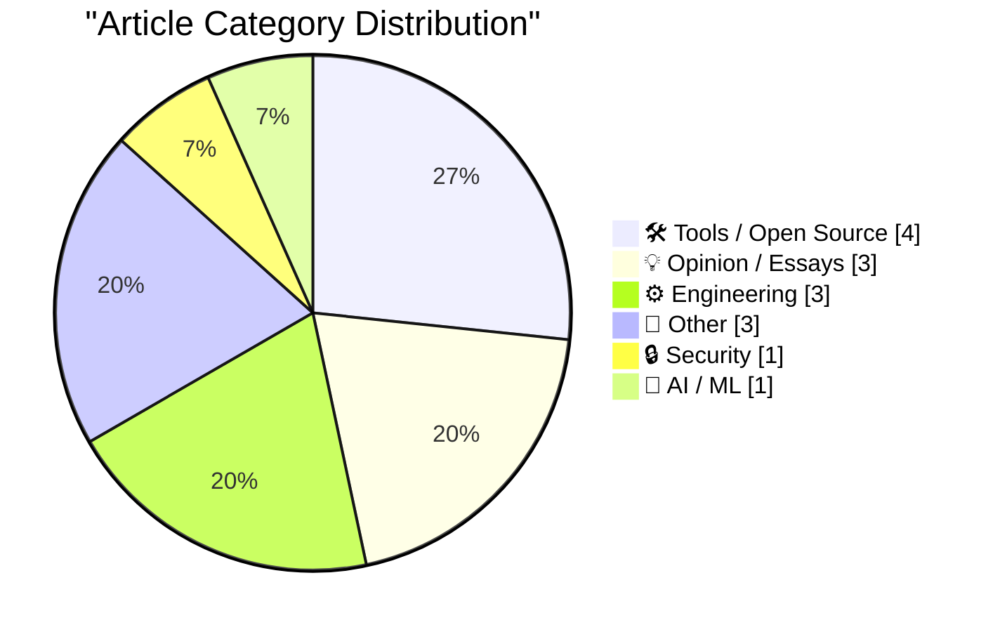
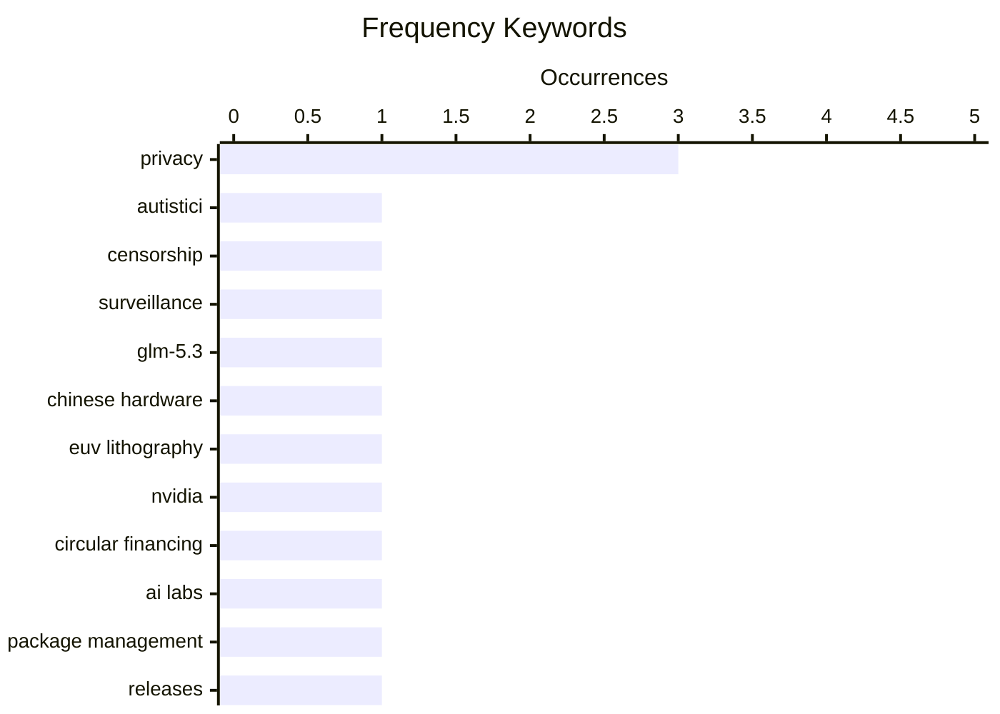

# 📰 AI Blog Daily Digest — 2026-08-30

> From 92 top tech blogs (curated by Karpathy), AI-selected Top 15

## 📝 Today's Highlights

Today’s tech landscape is defined by a sharpening geopolitical and regulatory edge, as U.S. actions against hacker collectives and the pushback against GDPR from big tech signal a growing clash between state power, privacy law, and corporate interests. Meanwhile, the AI sector is pivoting toward hardware sovereignty, with a major model like GLM-5.3 Flash now running on domestic Chinese chips, underscoring a global race for self-reliant compute. Beneath these macro shifts, the developer community remains focused on practical engineering—from package management security to low-level file transfer tricks—while satirical critiques of AI’s circular financing reveal mounting skepticism about the industry’s economic foundations.

---

## 🏆 Must Read

🥇 **The Server Called Paranoia: Defend Autistici/Inventati**

micahflee.com · 3h ago · 🔒 Security

> The U.S. State Department designated the Italian hacker collective Autistici/Inventati (A/I) as a terrorist organization on August 26, with a wind-down period ending September 25, threatening 25 years of privacy-focused communications infrastructure. A/I provides encrypted email and other tools to activists and journalists, designed to survive censorship, surveillance, and police raids. The article argues that this designation is a politically motivated attack on digital rights and free expression, not a genuine counterterrorism measure. It calls on the community to defend A/I and resist the chilling effect on privacy tools.

💡 **Why it matters**: This is a critical, timely piece on a major threat to privacy infrastructure, essential for anyone concerned about government overreach and the future of secure communications.

🏷️ Autistici, censorship, surveillance, privacy

🥈 **What GLM-5.3 Flash running on Chinese hardware actually means**

martinalderson.com · 22h ago · 🤖 AI / ML

> Z.AI successfully ran a full model release of GLM-5.3 Flash on domestically manufactured Chinese chips, a milestone for China's AI hardware independence. However, the article argues that EUV lithography remains a hard wall, and the performance gap with Western inference hardware (e.g., NVIDIA) is more likely to widen than close. The author suggests that while the achievement is impressive, it does not signal a fundamental shift in the global AI hardware race.

💡 **Why it matters**: This analysis provides a balanced, technical perspective on China's AI hardware progress, crucial for understanding the real state of the US-China tech competition.

🏷️ GLM-5.3, Chinese hardware, EUV lithography

🥉 **Premium: The Hater's Guide To Circular Financing (Part One)**

wheresyoured.at · 1 days ago · 💡 Opinion / Essays

> This satirical piece critiques the circular financing ecosystem in AI, where NVIDIA, OpenAI (Clammy Sammy), and Anthropic (Wario Amodei) inflate each other's valuations through mutual investments and hype. It uses a fictional NVIDIA company meeting to mock the lack of real profitability and the reliance on a bubble. The author argues that this self-referential financial loop is unsustainable and will eventually collapse.

💡 **Why it matters**: This is a sharp, entertaining take on the AI bubble, offering a critical perspective that is often missing from mainstream tech coverage.

🏷️ NVIDIA, circular financing, AI labs

---

## 📊 Data Overview

| Scanned | Articles | Range | Selected |
|:---:|:---:|:---:|:---:|
| 87/92 | 2595 → 31 | 48h | **15** |

### Category Distribution



### High-Frequency Keywords



<details>
<summary>📈 ASCII Keyword Chart (Terminal Friendly)</summary>

```
privacy            │ ████████████████████ 3
autistici          │ ███████░░░░░░░░░░░░░ 1
censorship         │ ███████░░░░░░░░░░░░░ 1
surveillance       │ ███████░░░░░░░░░░░░░ 1
glm-5.3            │ ███████░░░░░░░░░░░░░ 1
chinese hardware   │ ███████░░░░░░░░░░░░░ 1
euv lithography    │ ███████░░░░░░░░░░░░░ 1
nvidia             │ ███████░░░░░░░░░░░░░ 1
circular financing │ ███████░░░░░░░░░░░░░ 1
ai labs            │ ███████░░░░░░░░░░░░░ 1
```

</details>

### 🏷️ Topic Tags

**privacy**(3) · **autistici**(1) · **censorship**(1) · surveillance(1) · glm-5.3(1) · chinese hardware(1) · euv lithography(1) · nvidia(1) · circular financing(1) · ai labs(1) · package management(1) · releases(1) · advisories(1) · gdpr(1) · regulation(1) · ethernet(1) · file transfer(1) · ip configuration(1) · ipv6(1) · factorials(1)

---

## 🛠 Tools / Open Source

### 1. This Week in Package Management: 29 August 2026

[Link](https://nesbitt.io/2026/08/29/this-week-in-package-management.html) — **nesbitt.io** · 12h ago · ⭐ 22/30

> This is a weekly roundup of package management news, covering releases, security advisories, and articles from across the ecosystem. It aggregates updates from various tools and communities, providing a concise overview for developers. The post is a curated list, likely including items like new versions, vulnerabilities, and best practices.

🏷️ package management, releases, advisories

---

### 2. A simple "copy this code" button in JavaScript

[Link](https://shkspr.mobi/blog/2026/08/a-simple-copy-this-code-button-in-javascript/) — **shkspr.mobi** · 11h ago · ⭐ 18/30

> This post shares a simple JavaScript implementation for a 'copy this code' button, using `navigator.clipboard.writeText` with a user interaction trigger. The code is minimal and easy to integrate into any blog or documentation site. The author emphasizes the simplicity and the need for user interaction for clipboard access.

🏷️ JavaScript, copy button, clipboard, code snippet

---

### 3. A Roku alternative streaming device

[Link](https://dfarq.homeip.net/a-roku-alternative-streaming-device/?utm_source=rss&#038;utm_medium=rss&#038;utm_campaign=a-roku-alternative-streaming-device) — **dfarq.homeip.net** · 6h ago · ⭐ 18/30

> The author, concerned about privacy issues with streaming media, explores alternatives to Roku. The post discusses the lack of privacy in current streaming devices and suggests a replacement, likely a more open or privacy-focused device. It reflects on the trade-offs and provides a personal recommendation.

🏷️ streaming, privacy, Roku alternative

---

### 4. Dell Optiplex 3040 and 3050 micro

[Link](https://dfarq.homeip.net/dell-optiplex-3040-and-3050-micro/?utm_source=rss&#038;utm_medium=rss&#038;utm_campaign=dell-optiplex-3040-and-3050-micro) — **dfarq.homeip.net** · 11h ago · ⭐ 16/30

> The Dell Optiplex 3040 and 3050 Micro are compact desktops that offer a balance of small form factor, versatility, and affordability. Compared to a Raspberry Pi, they are less trendy but provide greater expandability and are now likely cheaper on the used market. These machines are suitable for users needing a reliable, low-cost desktop for basic tasks or as a home server. The article highlights their practical advantages over more popular single-board computers.

🏷️ Dell Optiplex, small form factor, affordable

---

## 💡 Opinion / Essays

### 5. Premium: The Hater's Guide To Circular Financing (Part One)

[Link](https://www.wheresyoured.at/premium-the-haters-guide-to-circular-financing-part-one/) — **wheresyoured.at** · 1 days ago · ⭐ 25/30

> This satirical piece critiques the circular financing ecosystem in AI, where NVIDIA, OpenAI (Clammy Sammy), and Anthropic (Wario Amodei) inflate each other's valuations through mutual investments and hype. It uses a fictional NVIDIA company meeting to mock the lack of real profitability and the reliance on a bubble. The author argues that this self-referential financial loop is unsustainable and will eventually collapse.

🏷️ NVIDIA, circular financing, AI labs

---

### 6. You Know GDPR Is Good Based on Who Hates It

[Link](https://matduggan.com/you-know-gdpr-is-good-based-on-who-hates-it/) — **matduggan.com** · 1 days ago · ⭐ 22/30

> The article argues that GDPR is a good regulation because its strongest opponents are large tech companies and data brokers who profit from surveillance capitalism. Drawing a parallel to FDR and Lincoln, the author suggests that when the establishment hates a policy, it is often because it threatens their power. The piece defends GDPR's privacy protections, despite criticisms about compliance costs, and frames it as a necessary check on corporate data exploitation.

🏷️ GDPR, privacy, regulation

---

### 7. Anandtech shut down abruptly, August 30, 2024

[Link](https://dfarq.homeip.net/anandtech-shut-down-abruptly-august-30-2024/?utm_source=rss&#038;utm_medium=rss&#038;utm_campaign=anandtech-shut-down-abruptly-august-30-2024) — **dfarq.homeip.net** · 1 days ago · ⭐ 18/30

> Anandtech, a pioneering hardware review site founded on April 3, 1997, shut down abruptly on August 30, 2024, ending a 27-year run. The author delayed commentary to process the news, reflecting on the site's significance in tech journalism. The shutdown was sudden and unexpected, leaving readers and contributors without prior notice. The post serves as a retrospective on Anandtech's legacy and the void its closure creates in the tech community.

🏷️ Anandtech, shutdown, tech journalism

---

## ⚙️ Engineering

### 8. Technical note: transfer files over an ethernet patch cable

[Link](https://maurycyz.com/misc/etherfiles/) — **maurycyz.com** · 22h ago · ⭐ 21/30

> This technical note explains how to transfer files between two computers using a direct Ethernet patch cable, without a switch or router. It provides simple IP configuration commands (e.g., `ip address add dev eth0 fd42:dead:beef::1/48`) and shows that pings work within milliseconds. The method is lightweight and useful for quick, isolated data transfers.

🏷️ Ethernet, file transfer, IP configuration, IPv6

---

### 9. How big are factorials?

[Link](https://eli.thegreenplace.net/2026/how-big-are-factorials/) — **eli.thegreenplace.net** · 1 days ago · ⭐ 19/30

> The article explores how to estimate the size of factorials, like 52!, without a calculator. It discusses mathematical techniques, likely including Stirling's approximation, to compute the number of digits. The author finds the underlying math interesting and provides a method for quick mental estimates.

🏷️ factorials, estimation, math

---

### 10. On forcing all derived classes to implement a specific non-virtual method, part 2

[Link](https://devblogs.microsoft.com/oldnewthing/20260828-00/?p=112654) — **devblogs.microsoft.com/oldnewthing** · 1 days ago · ⭐ 18/30

> This is part 2 of a series on forcing derived classes to implement a specific non-virtual method. The post discusses a technique that explicitly denies that a method is implemented, likely using a pattern like `= delete` or a private base class. It continues the exploration of C++ design patterns for enforcing interface contracts.

🏷️ C++, inheritance, non-virtual, design

---

## 📝 Other

### 11. Trump Declares That Lake Ontario Is Now ‘Lake America’

[Link](https://www.notus.org/trump-white-house/lake-america-ontario-canada-trade-war-trump-executive-order-rename) — **daringfireball.net** · 1 days ago · ⭐ 17/30

> President Donald Trump signed an executive order to rename Lake Ontario to 'Lake America,' effective immediately, as a provocative move amid escalating trade tensions with Canada. The order directs Interior Secretary Doug Burgum to update the Geographic Names Information Service accordingly. This action is seen as a symbolic jab at Canada, intensifying the ongoing trade war between the two countries. The renaming is part of a broader pattern of using geographic names as political leverage.

🏷️ Lake Ontario, rename, executive order, politics

---

### 12. Reading List 08/29/26

[Link](https://www.construction-physics.com/p/reading-list-082926) — **construction-physics.com** · 10h ago · ⭐ 17/30

> This reading list covers a range of topics including sinking homes in London, US magnesium manufacturing, the World Humanoid Robot games, and catastrophic flooding in Nepal. Each item highlights current events and technological or environmental challenges. The list serves as a curated digest for readers interested in infrastructure, robotics, and climate-related disasters. It provides a quick overview of diverse global issues, from urban subsidence to industrial supply chains.

🏷️ reading list, humanoid robots, flooding

---

### 13. ★ Thoughts and Observations on Apple’s First Immersive MLB Broadcast, a Yankees 1-0 Win Over the Red Sox

[Link](https://daringfireball.net/2026/08/thoughts_and_observations_apple_immersive_mlb_broadcast) — **daringfireball.net** · 4h ago · ⭐ 15/30

> Apple's first immersive MLB broadcast, a Yankees 1-0 win over the Red Sox, felt like a profound departure from traditional viewing. The author describes it as being as different from TV as TV is from radio, emphasizing a new level of immersion. The experience is characterized as something new and different, suggesting a significant leap in sports broadcasting technology. The piece offers personal observations on the potential of immersive media in sports.

🏷️ Apple, MLB, immersive, broadcast

---

## 🔒 Security

### 14. The Server Called Paranoia: Defend Autistici/Inventati

[Link](https://micahflee.com/the-server-called-paranoia-defend-autistici-inventati/) — **micahflee.com** · 3h ago · ⭐ 26/30

> The U.S. State Department designated the Italian hacker collective Autistici/Inventati (A/I) as a terrorist organization on August 26, with a wind-down period ending September 25, threatening 25 years of privacy-focused communications infrastructure. A/I provides encrypted email and other tools to activists and journalists, designed to survive censorship, surveillance, and police raids. The article argues that this designation is a politically motivated attack on digital rights and free expression, not a genuine counterterrorism measure. It calls on the community to defend A/I and resist the chilling effect on privacy tools.

🏷️ Autistici, censorship, surveillance, privacy

---

## 🤖 AI / ML

### 15. What GLM-5.3 Flash running on Chinese hardware actually means

[Link](https://martinalderson.com/posts/glm-5-3-flash-chinese-hardware/?utm_source=rss&amp;utm_medium=rss&amp;utm_campaign=feed) — **martinalderson.com** · 22h ago · ⭐ 26/30

> Z.AI successfully ran a full model release of GLM-5.3 Flash on domestically manufactured Chinese chips, a milestone for China's AI hardware independence. However, the article argues that EUV lithography remains a hard wall, and the performance gap with Western inference hardware (e.g., NVIDIA) is more likely to widen than close. The author suggests that while the achievement is impressive, it does not signal a fundamental shift in the global AI hardware race.

🏷️ GLM-5.3, Chinese hardware, EUV lithography

---

*Generated on 2026-08-30 | Scanned 87 sources → Found 2595 articles → Selected 15 articles*
*Based on [Hacker News Popularity Contest 2025](https://refactoringenglish.com/tools/hn-popularity/) RSS feeds list, curated by [Andrej Karpathy](https://x.com/karpathy).*
*Created by "Understand AI".*
