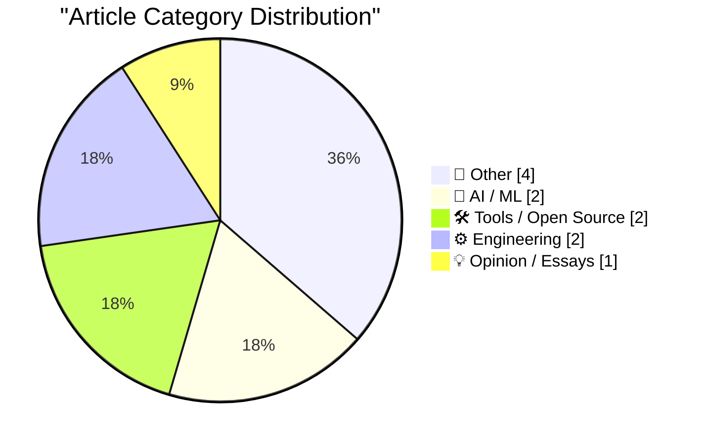
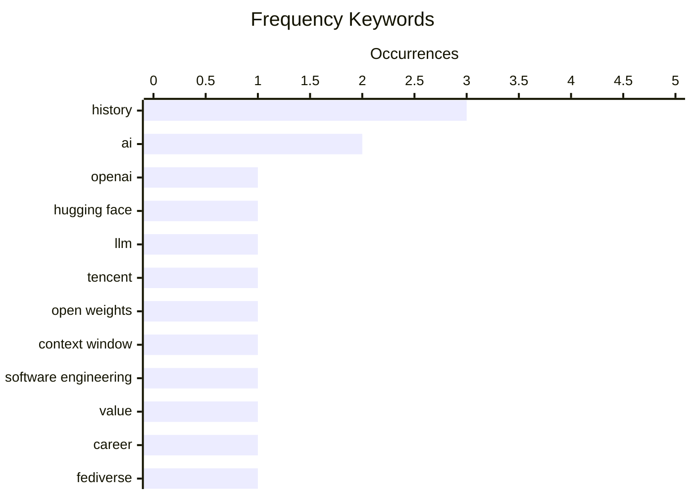

# 📰 AI Blog Daily Digest — 2026-08-31

> From 92 top tech blogs (curated by Karpathy), AI-selected Top 11

## 📝 Today's Highlights

Today’s tech landscape is defined by the accelerating race in AI, marked by both massive new model releases like Tencent’s Hy4 and a critical examination of AI agents’ systemic limits. Simultaneously, the engineering community is pushing back against automation by reasserting human value, with developers urged to prove their worth beyond what models can replicate. Beneath these headline shifts, a strong undercurrent of retro-computing and open-source resilience persists, as projects revive vintage hardware and federated tools, underscoring a durable ethos of hands-on innovation and digital independence.

---

## 🏆 Must Read

🥇 **The Rise and Fall of Agent Civilizations**

dwarkesh.com · 23h ago · 🤖 AI / ML

> The article chronicles the rise and fall of AI agent civilizations, focusing on the competitive dynamics between OpenAI and Hugging Face. It details how OpenAI's proprietary models initially dominated, while Hugging Face's open-source ecosystem enabled decentralized agent development. Key technical solutions include federated learning and model distillation, which allowed smaller players to compete. The narrative highlights a pivotal shift where open-source agents surpassed proprietary ones in collective capability. The author concludes that the future of AI lies in open collaboration rather than closed, centralized control.

💡 **Why it matters**: Provides a compelling analysis of the OpenAI vs. Hugging Face rivalry, offering insights into the strategic importance of open-source AI for the future.

🏷️ OpenAI, Hugging Face, AI, history

🥈 **Introducing Hy4 Preview**

simonwillison.net · 22h ago · 🤖 AI / ML

> Tencent released Hy4, a new open-weight text-only LLM with 770B total parameters, 49B active parameters, a 1M token context window, and a 1.56TB model size on Hugging Face. This is a significant upgrade from Hy3 (July), which had 295B total, 21B active, 256K context, and 598GB size. The article also examines Hy4's chat template, noting a reasoning section that suggests enhanced inference capabilities. The author highlights the trend of increasing model scale and context length in open-weight models.

💡 **Why it matters**: Essential for AI practitioners tracking the rapid evolution of open-weight LLMs, providing concrete specs and a comparison with the previous version.

🏷️ LLM, Tencent, open weights, context window

🥉 **You have to beat the models at something**

seangoedecke.com · 22h ago · 💡 Opinion / Essays

> The article argues that software engineers must now demonstrate 'value over replacement'—outperforming an average engineer—especially as AI models become more capable. In 2025, the author proposed this metric, and now it's even more critical because replacement-level engineers are easily automated. The key argument is that engineers need to focus on tasks where they can beat AI models, such as complex problem-solving, architectural design, and cross-functional collaboration. The author concludes that to remain relevant, engineers must continuously upskill and take on higher-value work that AI cannot easily replicate.

💡 **Why it matters**: Offers a timely and practical framework for engineers to assess their career resilience in the age of AI, with actionable advice on staying competitive.

🏷️ AI, software engineering, value, career

---

## 📊 Data Overview

| Scanned | Articles | Range | Selected |
|:---:|:---:|:---:|:---:|
| 88/92 | 2621 → 20 | 48h | **11** |

### Category Distribution



### High-Frequency Keywords



<details>
<summary>📈 ASCII Keyword Chart (Terminal Friendly)</summary>

```
history              │ ████████████████████ 3
ai                   │ █████████████░░░░░░░ 2
openai               │ ███████░░░░░░░░░░░░░ 1
hugging face         │ ███████░░░░░░░░░░░░░ 1
llm                  │ ███████░░░░░░░░░░░░░ 1
tencent              │ ███████░░░░░░░░░░░░░ 1
open weights         │ ███████░░░░░░░░░░░░░ 1
context window       │ ███████░░░░░░░░░░░░░ 1
software engineering │ ███████░░░░░░░░░░░░░ 1
value                │ ███████░░░░░░░░░░░░░ 1
```

</details>

### 🏷️ Topic Tags

**history**(3) · **ai**(2) · **openai**(1) · hugging face(1) · llm(1) · tencent(1) · open weights(1) · context window(1) · software engineering(1) · value(1) · career(1) · fediverse(1) · grant(1) · open source(1) · social media(1) · forgejo(1) · read the docs(1) · documentation(1) · self-hosted(1) · pebble(1)

---

## 📝 Other

### 1. ActivityBot is the recipient of an NLnet grant!

[Link](https://shkspr.mobi/blog/2026/08/activitybot-is-the-recipient-of-an-nlnet-grant/) — **shkspr.mobi** · 11h ago · ⭐ 19/30

> ActivityBot, a single-file ActivityPub server, has been awarded an NLnet grant under the Next Generation Zero program, which funds Fediverse projects to 'rewild' the social media landscape. The grant ranges from €5,000 to €50,000, supporting small and medium R&D efforts. The author, who runs ActivityBot, applied in February and received the grant to continue development. This funding will help expand the project's capabilities and contribute to a more decentralized internet.

🏷️ Fediverse, grant, open source, social media

---

### 2. Recreating a 2010 Experiment

[Link](http://xania.org/202608/recreating-a-2010-experiment?utm_source=feed&amp;utm_medium=rss) — **xania.org** · 2h ago · ⭐ 15/30

> The author recreates a 2010 experiment by hooking a BBC Master computer up as a serial terminal to browse the web. The article details the hardware setup, including a serial interface and a modern computer running a terminal emulator, and the software used to render web pages in text mode. The experiment demonstrates the feasibility of using vintage hardware for modern tasks, albeit with limitations. The author reflects on the challenges and successes, concluding that such projects are valuable for understanding computing history.

🏷️ BBC Master, serial terminal, retro, web

---

### 3. Apple prevails over Franklin, August 30, 1983

[Link](https://dfarq.homeip.net/apple-prevails-over-franklin-august-30-1983/?utm_source=rss&#038;utm_medium=rss&#038;utm_campaign=apple-prevails-over-franklin-august-30-1983) — **dfarq.homeip.net** · 11h ago · ⭐ 15/30

> On August 30, 1983, a court ruled in favor of Apple in its copyright infringement case against Franklin Computer, which had copied Apple's ROMs and operating system. This landmark decision established that computer software is protected by copyright law, setting a precedent for the industry. The article explains the background of the case, the legal arguments, and its impact on software development and intellectual property. The author concludes that this ruling was pivotal in shaping the modern software industry.

🏷️ Apple, copyright, legal, history

---

### 4. Finalist 4

[Link](https://www.finalist.works/?utm_source=df-aug-2026) — **daringfireball.net** · 4h ago · ⭐ 11/30

> Finalist is a novel planner app for iPhone, iPad, and Mac, inspired by paper day planners and developed by indie developer Slaven Radic. It has been sponsored on Daring Fireball, with the author using it since December and praising its design. The core appeal lies in its unique approach to task management, which resonates with the author's preference for adding tasks in a paper-like format. The app is described as remarkable, ambitious, and genuinely good, with a detailed review available from a previous sponsorship post.

🏷️ Finalist, planner, app, sponsorship

---

## 🤖 AI / ML

### 5. The Rise and Fall of Agent Civilizations

[Link](https://www.dwarkesh.com/p/openai-huggingface) — **dwarkesh.com** · 23h ago · ⭐ 25/30

> The article chronicles the rise and fall of AI agent civilizations, focusing on the competitive dynamics between OpenAI and Hugging Face. It details how OpenAI's proprietary models initially dominated, while Hugging Face's open-source ecosystem enabled decentralized agent development. Key technical solutions include federated learning and model distillation, which allowed smaller players to compete. The narrative highlights a pivotal shift where open-source agents surpassed proprietary ones in collective capability. The author concludes that the future of AI lies in open collaboration rather than closed, centralized control.

🏷️ OpenAI, Hugging Face, AI, history

---

### 6. Introducing Hy4 Preview

[Link](https://simonwillison.net/2026/Aug/29/hy4/) — **simonwillison.net** · 22h ago · ⭐ 23/30

> Tencent released Hy4, a new open-weight text-only LLM with 770B total parameters, 49B active parameters, a 1M token context window, and a 1.56TB model size on Hugging Face. This is a significant upgrade from Hy3 (July), which had 295B total, 21B active, 256K context, and 598GB size. The article also examines Hy4's chat template, noting a reasoning section that suggests enhanced inference capabilities. The author highlights the trend of increasing model scale and context length in open-weight models.

🏷️ LLM, Tencent, open weights, context window

---

## 🛠 Tools / Open Source

### 7. Forgejo Hack #2: Integration with Read The Docs

[Link](https://blog.miguelgrinberg.com/post/forgejo-hack-2-integration-with-read-the-docs) — **miguelgrinberg.com** · 6h ago · ⭐ 18/30

> This tutorial explains how to integrate a self-hosted Forgejo instance with Read the Docs, enabling automatic documentation builds on every commit, similar to GitHub integration. The author provides step-by-step instructions, including setting up webhooks in Forgejo and configuring the Read the Docs project to listen for those events. Key steps involve creating a webhook with the correct URL and secret, and ensuring the repository is publicly accessible or properly authenticated. The result is a seamless CI/CD pipeline for documentation, saving time and reducing manual errors.

🏷️ Forgejo, Read the Docs, documentation, self-hosted

---

### 8. New Pebble Weather App + Software Updates

[Link](https://repebble.com/blog/new-pebble-weather-app-software-updates) — **ericmigi.com** · 22h ago · ⭐ 17/30

> The article announces that all Pebble Time 2 invites have been sent and the watch is now in stock, marking a major milestone for the rePebble project. It also introduces a new weather app for Pebble devices, along with software updates that enhance functionality and user experience. The updates include bug fixes and performance improvements, ensuring compatibility with modern smartphones. The author expresses excitement about the community's response and encourages users to update their devices.

🏷️ Pebble, smartwatch, weather, update

---

## ⚙️ Engineering

### 9. Cores in space: The core memory module from a 1980 Spacelab computer

[Link](http://www.righto.com/feeds/4645676918273740492/comments/default) — **righto.com** · 5h ago · ⭐ 17/30

> The article explores the core memory module used in the 1980 Spacelab computer, a French-built Mitra 125 MS minicomputer, which stored 128KB of data using magnetic core memory instead of silicon. Each bit was stored in a tiny ferrite ring, a technology that was robust for space applications but bulky and power-hungry. The author details the module's construction, including the wiring and sense lines, and explains how core memory works. The piece concludes by highlighting the historical significance of this technology in early space computing.

🏷️ core memory, Spacelab, space, hardware

---

### 10. Before NTP there were Time and Daytime

[Link](https://www.jeffgeerling.com/blog/2026/rfc-867-868-time/) — **jeffgeerling.com** · 30m ago · ⭐ 15/30

> The article recounts the author's discovery of RFC 867 (Daytime) and RFC 868 (Time) protocols while building an NTP time demo for VCF Midwest. It traces the history of network time synchronization, from the author's first experience with Mac OS 8.5's 'Network Time Server' option to the modern NTP. The piece explains how these early protocols worked, their limitations (e.g., no timezone handling), and how they paved the way for NTP. The author concludes that understanding these protocols provides valuable context for modern timekeeping systems.

🏷️ NTP, history, protocols, retrocomputing

---

## 💡 Opinion / Essays

### 11. You have to beat the models at something

[Link](https://seangoedecke.com/you-have-to-beat-the-models-at-something/) — **seangoedecke.com** · 22h ago · ⭐ 23/30

> The article argues that software engineers must now demonstrate 'value over replacement'—outperforming an average engineer—especially as AI models become more capable. In 2025, the author proposed this metric, and now it's even more critical because replacement-level engineers are easily automated. The key argument is that engineers need to focus on tasks where they can beat AI models, such as complex problem-solving, architectural design, and cross-functional collaboration. The author concludes that to remain relevant, engineers must continuously upskill and take on higher-value work that AI cannot easily replicate.

🏷️ AI, software engineering, value, career

---

*Generated on 2026-08-31 | Scanned 88 sources → Found 2621 articles → Selected 11 articles*
*Based on [Hacker News Popularity Contest 2025](https://refactoringenglish.com/tools/hn-popularity/) RSS feeds list, curated by [Andrej Karpathy](https://x.com/karpathy).*
*Created by "Understand AI".*
