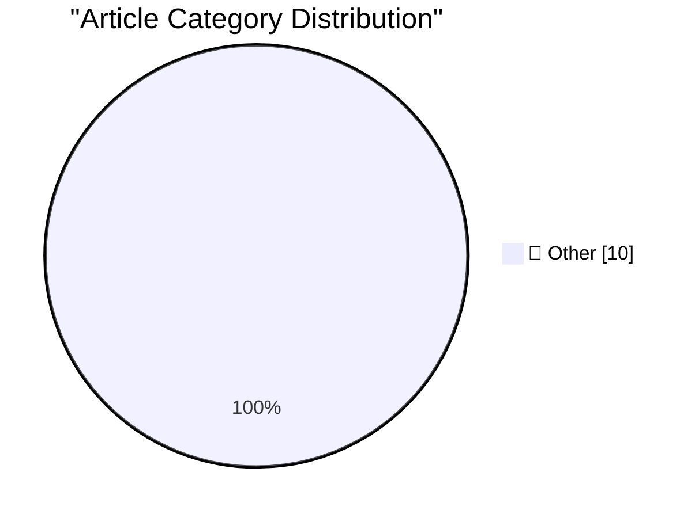

# 📰 AI Blog Daily Digest — 2026-09-01

> ⚠️ **Degraded run.** AI scoring failed for every batch — rankings and categories below are placeholder defaults, not AI-judged.

> From 92 top tech blogs (curated by Karpathy), AI-selected Top 10

## 🏆 Must Read

🥇 **Understanding ChatGPT Work**

simonwillison.net · 22h ago · 📝 Other

> OpenAI announced ChatGPT Work on July 9th, and have been furiously iterating on it ever since. It is an extraordinarily confusing and very powerful product. Here's what I've figured out about it so fa

🥈 **Here's a good way to present AI videos**

idiallo.com · 15h ago · 📝 Other

> The YouTube tag marking a video as AI-generated is as insignificant as the little "Sponsored" text in search ads. I've taught my mother and her friends to check for that tag, but most, if not all, of 

🥉 **Review: Ruined Theatre's A Midsummer Night's Dream ★★★★☆**

shkspr.mobi · 10h ago · 📝 Other

> The whole point about Shakespeare is that you can set the play on an intergalactic space station or an American high school and keep virtually the rest unchanged. What happens when you transpose Dream

---

## 📊 Data Overview

| Scanned | Articles | Range | Selected |
|:---:|:---:|:---:|:---:|
| 87/92 | 2597 → 21 | 48h | **10** |

### Category Distribution

---

## 📝 Other

### 1. Understanding ChatGPT Work

[Link](https://simonwillison.net/2026/Aug/30/understanding-chatgpt-work/) — **simonwillison.net** · 22h ago · ⭐ 15/30

> OpenAI announced ChatGPT Work on July 9th, and have been furiously iterating on it ever since. It is an extraordinarily confusing and very powerful product. Here's what I've figured out about it so fa

---

### 2. Here's a good way to present AI videos

[Link](https://idiallo.com/blog/a-good-way-to-present-ai-videos-on-youtube) — **idiallo.com** · 15h ago · ⭐ 15/30

> The YouTube tag marking a video as AI-generated is as insignificant as the little "Sponsored" text in search ads. I've taught my mother and her friends to check for that tag, but most, if not all, of 

---

### 3. Review: Ruined Theatre's A Midsummer Night's Dream ★★★★☆

[Link](https://shkspr.mobi/blog/2026/08/review-ruined-theatres-a-midsummer-nights-dream/) — **shkspr.mobi** · 10h ago · ⭐ 15/30

> The whole point about Shakespeare is that you can set the play on an intergalactic space station or an American high school and keep virtually the rest unchanged. What happens when you transpose Dream

---

### 4. Dwarkesh Patels’s wildly popular but dangerously misleading account of the OpenAI Hugging Face incident

[Link](https://garymarcus.substack.com/p/dwarkesh-patelss-wildly-popular-but) — **garymarcus.substack.com** · 7h ago · ⭐ 15/30

> When “plain English” isn’t a good thing.

---

### 5. Cancelation Terminology

[Link](https://matklad.github.io/2026/08/31/cancelation-terminology.html) — **matklad.github.io** · 22h ago · ⭐ 15/30

> A short note explaining the difference between synchronous cancelation, asynchronous cancelation, and graceful shutdown. I am not too attached to these specific three terms, but I want to call your at

---

### 6. The rise and fall of agent civilizations

[Link](https://www.dwarkesh.com/p/openai-huggingface-narration) — **dwarkesh.com** · 1h ago · ⭐ 15/30

> The OpenAI/Hugging Face attack, clearly explained

---

### 7. On Inevitability

[Link](https://borretti.me/article/on-inevitability) — **borretti.me** · 1 days ago · ⭐ 15/30

> Why superintelligent AI is not inevitable.

---

### 8. My Experience Has Nuance, Yours Is a Data Point

[Link](https://blog.jim-nielsen.com/2026/nuance-for-me-none-for-you/) — **blog.jim-nielsen.com** · 3h ago · ⭐ 15/30

> Eric Bailey has a fun little post about how we need more than a few icons to express the nuance of our shared human experience. For example, he suggests Netflix provide some feedback buttons to indica

---

### 9. Adobe’s August 1994 acquisition of Aldus

[Link](https://dfarq.homeip.net/adobes-august-1994-acquisition-of-aldus/?utm_source=rss&#038;utm_medium=rss&#038;utm_campaign=adobes-august-1994-acquisition-of-aldus) — **dfarq.homeip.net** · 11h ago · ⭐ 15/30

> On August 31, 1994, software publisher Adobe bought Aldus for $446 million. Both companies were known for graphics products. Aldus’ most popular product was Pagemaker, a page layout program. Adobe’s m

---

### 10. Reducing codebase cognitive debt through... quizzes?

[Link](https://martinalderson.com/posts/codebase-cognitive-debt-quizzes/?utm_source=rss&amp;utm_medium=rss&amp;utm_campaign=feed) — **martinalderson.com** · 22h ago · ⭐ 15/30

> A simple technique for keeping up with a codebase that coding agents are changing faster than you can read: ask the agent to quiz you on it.

---

*Generated on 2026-09-01 | Scanned 87 sources → Found 2597 articles → Selected 10 articles*
*Based on [Hacker News Popularity Contest 2025](https://refactoringenglish.com/tools/hn-popularity/) RSS feeds list, curated by [Andrej Karpathy](https://x.com/karpathy).*
*Created by "Understand AI".*
