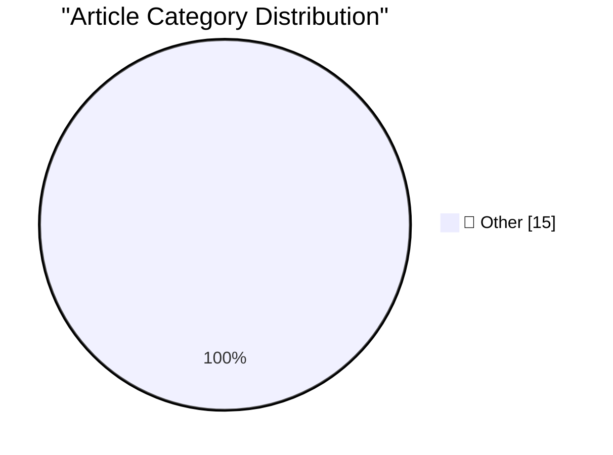

# 📰 AI Blog Daily Digest — 2026-09-02

> ⚠️ **Degraded run.** AI scoring failed for every batch — rankings and categories below are placeholder defaults, not AI-judged.

> From 92 top tech blogs (curated by Karpathy), AI-selected Top 15

## 🏆 Must Read

🥇 **Codex bundles LibreOffice**

simonwillison.net · 3h ago · 📝 Other

> I was poking around in my ~/.cache/ folder using OmniDiskSweeper when I spotted something interesting. The OpenAI Codex desktop app (since rebranded to just ChatGPT) has 1.7GB of stuff in there in a f

🥈 **Quoting Tarn Adams**

simonwillison.net · 5h ago · 📝 Other

> They took the letters from me! I have to talk about dwarf behavior now. I can't even talk about dwarf AI. It doesn't exist. It's dwarf behavior , and they misbehave sometimes &mdash; Tarn Adams , co-c

🥉 **Python 3.15.0 candidate 2 is here!**

simonwillison.net · 7h ago · 📝 Other

> Python 3.15.0 candidate 2 is here! Hugo van Kemenade (release manager for Python 3.14 and 3.15) announces the final release candidate for Python 3.15, scheduled for release in October: Entering the re

---

## 📊 Data Overview

| Scanned | Articles | Range | Selected |
|:---:|:---:|:---:|:---:|
| 88/92 | 2622 → 29 | 48h | **15** |

### Category Distribution

---

## 📝 Other

### 1. Codex bundles LibreOffice

[Link](https://simonwillison.net/2026/Sep/1/codex-libreoffice/) — **simonwillison.net** · 3h ago · ⭐ 15/30

> I was poking around in my ~/.cache/ folder using OmniDiskSweeper when I spotted something interesting. The OpenAI Codex desktop app (since rebranded to just ChatGPT) has 1.7GB of stuff in there in a f

---

### 2. Quoting Tarn Adams

[Link](https://simonwillison.net/2026/Sep/1/tarn-adams/) — **simonwillison.net** · 5h ago · ⭐ 15/30

> They took the letters from me! I have to talk about dwarf behavior now. I can't even talk about dwarf AI. It doesn't exist. It's dwarf behavior , and they misbehave sometimes &mdash; Tarn Adams , co-c

---

### 3. Python 3.15.0 candidate 2 is here!

[Link](https://simonwillison.net/2026/Sep/1/python-315-rc-2/) — **simonwillison.net** · 7h ago · ⭐ 15/30

> Python 3.15.0 candidate 2 is here! Hugo van Kemenade (release manager for Python 3.14 and 3.15) announces the final release candidate for Python 3.15, scheduled for release in October: Entering the re

---

### 4. Introducing wrapture

[Link](https://simonwillison.net/2026/Aug/31/introducing-wrapture/) — **simonwillison.net** · 22h ago · ⭐ 15/30

> Introducing wrapture New from Graham Dumpleton (of wrapt , mod_wsgi, and New Relic's Python agent fame), who describes Wrapture as taking the monkeypatching ideas from wrapt and extending them to appl

---

### 5. Quoting Andrew Digby

[Link](https://simonwillison.net/2026/Aug/31/andrew-digby/) — **simonwillison.net** · 1 days ago · ⭐ 15/30

> 325 #kakapo! The chicks from this year's record breeding season are now juveniles and so have been added to the population. In 1995 there were just 51 kākāpō left. Recovery of critically endangered sp

---

### 6. Tim Cook’s Departure Memo on His Last Day as CEO

[Link](https://9to5mac.com/2026/08/31/read-tim-cooks-full-memo-to-apple-employees-on-his-last-day-as-ceo/) — **daringfireball.net** · 4h ago · ⭐ 15/30

> Tim Cook: There is something truly special about Apple. I am most proud of what an annual report could never capture. This place is proof that culture triumphs over everything. We share a belief that 

---

### 7. Apple Reveals Forensic Evidence From Chang Liu’s MacBook in OpenAI Lawsuit

[Link](https://9to5mac.com/2026/08/31/apple-openai-forensic-macbook-evidence/) — **daringfireball.net** · 4h ago · ⭐ 15/30

> Chance Miller, 9to5Mac: In today’s filing, Apple says that Liu’s lawyers recently handed over his MacBook that he used after leaving Apple. According to Apple, an “initial forensic analysis” of that M

---

### 8. [Sponsor] WorkOS: How to Give an Agent a Task Instead of a Token

[Link](https://workos.com/blog/delegated-access-for-ai-agents?utm_source=daringfireball&amp;utm_medium=newsletter&amp;utm_campaign=q32026) — **daringfireball.net** · 14h ago · ⭐ 15/30

> Give an agent an access token and it spreads: into the context window, into tool call logs, into notes it keeps between steps. Each copy works from anywhere, long after the fact. Relay keeps the crede

---

### 9. Book Review: ActivityPub by Evan Prodromou ★★★★⯪

[Link](https://shkspr.mobi/blog/2026/09/book-review-activitypub-by-evan-prodromou/) — **shkspr.mobi** · 10h ago · ⭐ 15/30

> As part of my grant from NLnet to improve my Fediverse bot project, I'm spending time making sure I understand all the fundamentals of ActivityPub. The problem with Internet standards is they're scatt

---

### 10. Fluorescent lamps (don’t) have ears

[Link](https://blog.coredump.cx/p/fluorescent-lamps-dont-have-ears) — **lcamtuf.substack.com** · 15h ago · ⭐ 15/30

> Welcome to this week’s edition of the Journal of Negative Results

---

### 11. AWE does not require PAE, though PAE makes it much more useful

[Link](https://devblogs.microsoft.com/oldnewthing/20260831-00/?p=112660) — **devblogs.microsoft.com/oldnewthing** · 1 days ago · ⭐ 15/30

> All dressed up with nowhere to go. The post AWE does not require PAE, though PAE makes it much more useful appeared first on The Old New Thing .

---

### 12. Patented application of linear algebra

[Link](https://www.johndcook.com/blog/2026/08/31/patented-application-of-linear-algebra/) — **johndcook.com** · 23h ago · ⭐ 15/30

> I just found out Brian Beckman and I got a patent on work we did for GSI Technology [1]. Nearly all the work I do is under an NDA, so I don’t often get a chance to talk about my projects. This work is

---

### 13. Notes from August 2026

[Link](https://evanhahn.com/notes-from-august-2026/) — **evanhahn.com** · 1 days ago · ⭐ 15/30

> Since last month , I released some new stuff at work, clicked a bunch of links, and wrote a little bit. Things I did this August At Ghost, we added analytics for automated email sequences . This helps

---

### 14. Git Submodules as a Package Manager

[Link](https://nesbitt.io/2026/09/01/git-submodules-as-a-package-manager.html) — **nesbitt.io** · 13h ago · ⭐ 15/30

> .gitmodules is a manifest and the gitlink is a lockfile entry.

---

### 15. Claude comment detection

[Link](https://entropicthoughts.com/ai-comment-classifier) — **entropicthoughts.com** · 1 days ago · ⭐ 15/30

> Here&rsquo;s a comment I read in the code I was working on. Walk the entire collection to locate flagged clusters. Skip it altogether when the cached, dirty-tracked flag count says there are none (the

---

*Generated on 2026-09-02 | Scanned 88 sources → Found 2622 articles → Selected 15 articles*
*Based on [Hacker News Popularity Contest 2025](https://refactoringenglish.com/tools/hn-popularity/) RSS feeds list, curated by [Andrej Karpathy](https://x.com/karpathy).*
*Created by "Understand AI".*
