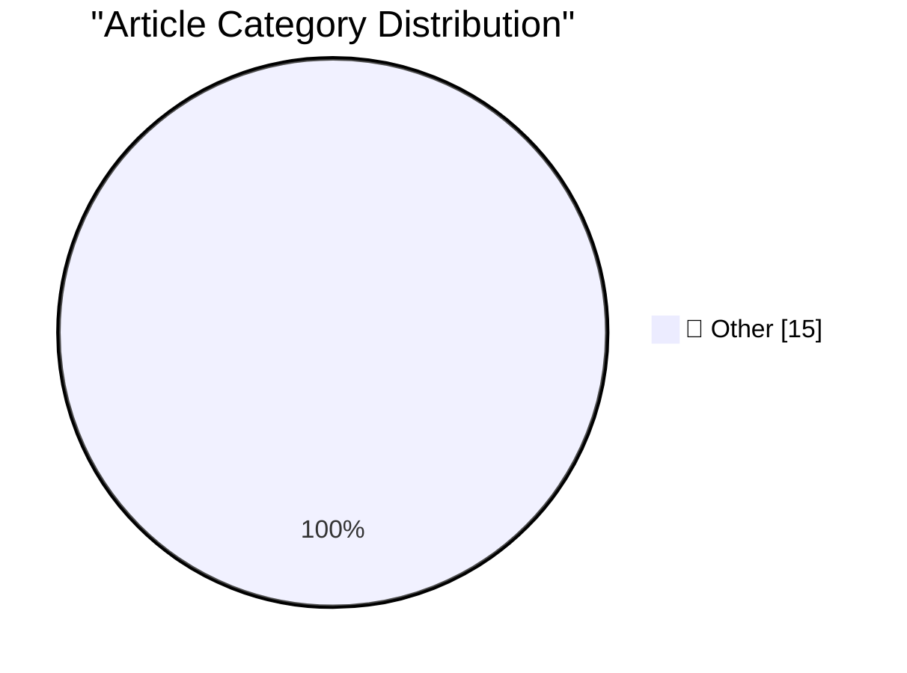

# 📰 AI Blog Daily Digest — 2026-09-03

> ⚠️ **Degraded run.** AI scoring failed for every batch — rankings and categories below are placeholder defaults, not AI-judged.

> From 92 top tech blogs (curated by Karpathy), AI-selected Top 15

## 🏆 Must Read

🥇 **llm-gemini 0.34**

simonwillison.net · 5h ago · 📝 Other

> Release: llm-gemini 0.34 New model gemini-3.8-flash for Gemini 3.8 Flash , with low, medium and high thinking levels. #146 Fixed async responses failing to record the resolved model version. Thanks, C

🥈 **Claude's new system prompt really doesn't want to reproduce song lyrics**

simonwillison.net · 8h ago · 📝 Other

> Anthropic publish the system prompts for their Claude consumer applications ( Claude.ai and the Claude mobile apps - sadly not for Claude Cowork or Claude Code). I love that they do this, and that the

🥉 **Quoting Rick Brewster**

simonwillison.net · 16h ago · 📝 Other

> Direct2D has always been the biggest hurdle for Paint.NET on WINE, and it's clear that it will never be completed enough for Paint.NET's use. And I can't just "disable" the use of Direct2D. So, instea

---

## 📊 Data Overview

| Scanned | Articles | Range | Selected |
|:---:|:---:|:---:|:---:|
| 88/92 | 2622 → 33 | 48h | **15** |

### Category Distribution

---

## 📝 Other

### 1. llm-gemini 0.34

[Link](https://simonwillison.net/2026/Sep/2/llm-gemini/) — **simonwillison.net** · 5h ago · ⭐ 15/30

> Release: llm-gemini 0.34 New model gemini-3.8-flash for Gemini 3.8 Flash , with low, medium and high thinking levels. #146 Fixed async responses failing to record the resolved model version. Thanks, C

---

### 2. Claude's new system prompt really doesn't want to reproduce song lyrics

[Link](https://simonwillison.net/2026/Sep/2/claudes-new-system-prompt/) — **simonwillison.net** · 8h ago · ⭐ 15/30

> Anthropic publish the system prompts for their Claude consumer applications ( Claude.ai and the Claude mobile apps - sadly not for Claude Cowork or Claude Code). I love that they do this, and that the

---

### 3. Quoting Rick Brewster

[Link](https://simonwillison.net/2026/Sep/2/rick-brewster/) — **simonwillison.net** · 16h ago · ⭐ 15/30

> Direct2D has always been the biggest hurdle for Paint.NET on WINE, and it's clear that it will never be completed enough for Paint.NET's use. And I can't just "disable" the use of Direct2D. So, instea

---

### 4. Claude Fable 5.1 made me a really nice animated pelican

[Link](https://simonwillison.net/2026/Sep/1/claude-fable-5-1/) — **simonwillison.net** · 22h ago · ⭐ 15/30

> Today is Claude Fable (and Mythos) 5.1 day . Anthropic say that Fable 5.1 "sets a new standard for coding, knowledge work, and long-running problem-solving tasks". Their announcement spends a notable 

---

### 5. GeoJSON Map Viewer

[Link](https://simonwillison.net/2026/Sep/1/geojson/) — **simonwillison.net** · 1 days ago · ⭐ 15/30

> Tool: GeoJSON Map Viewer I was helping Natalie gather some maps of local political boundaries (for the Granada Community Services District and the Midcoast Community Council ) and found a need to disp

---

### 6. datasette-mcp 0.2

[Link](https://simonwillison.net/2026/Sep/1/datasette-mcp/) — **simonwillison.net** · 1 days ago · ⭐ 15/30

> Release: datasette-mcp 0.2 "rows" from execute_sql is now an array of objects. Previously it was an array of arrays. This should help weaker models avoid losing track of which positional array element

---

### 7. How to protect yourself from workslop

[Link](https://seangoedecke.com/how-to-protect-yourself-from-workslop/) — **seangoedecke.com** · 22h ago · ⭐ 15/30

> “Workslop” is when your colleagues or bosses communicate with you by pasting big chunks of AI-generated text. The core problem with workslop is that the effort involved is asymmetrical , like a denial

---

### 8. FBI Probes Service Selling 153M+ Drivers Licenses

[Link](https://krebsonsecurity.com/2026/09/fbi-probes-service-selling-153m-drivers-licenses/) — **krebsonsecurity.com** · 23h ago · ⭐ 15/30

> A new identity theft service launched on the dark web this week is selling digital scans of more than 153 million drivers licenses from people in the United States and Canada. Based on interviews with

---

### 9. iOS 27 Introduces New ‘iPhone Handoff’ Feature

[Link](https://www.macrumors.com/2026/09/02/ios-27-iphone-handoff-feature/) — **daringfireball.net** · 1h ago · ⭐ 15/30

> Joe Rossignol, MacRumors: “iPhone Handoff” can be set up from the Settings app, under the Cellular menu. During the setup process, you can choose which iPhone you want to be the main device that you u

---

### 10. Pluralistic: Unpermissioned research (02 Sep 2026)

[Link](https://pluralistic.net/2026/09/02/scrape-scrope-scrap/) — **pluralistic.net** · 12h ago · ⭐ 15/30

> Today's links Unpermissioned research: Fighting Trump means preserving the internet, which means scraping. Hey look at this: Delights to delectate. Object permanence: Leaked advanced PalmOS device spe

---

### 11. Microspeak: Funded / unfunded

[Link](https://devblogs.microsoft.com/oldnewthing/20260901-00/?p=112662) — **devblogs.microsoft.com/oldnewthing** · 1 days ago · ⭐ 15/30

> People are our most valuable asset. The post Microspeak: Funded / unfunded appeared first on The Old New Thing .

---

### 12. Elon Musk is on a prediction rampage, and most of the media can’t seem to figure out what to do about it.

[Link](https://garymarcus.substack.com/p/elon-musk-is-on-a-prediction-rampage) — **garymarcus.substack.com** · 2h ago · ⭐ 15/30

> The bad news is that he’s not alone

---

### 13. Red Alert: OpenAI is poised to cross an AI safety redline.

[Link](https://garymarcus.substack.com/p/red-alert-openai-is-poised-to-cross) — **garymarcus.substack.com** · 19h ago · ⭐ 15/30

> Making models harder to monitor is not what we need

---

### 14. Static Allocation, Constant Work

[Link](https://matklad.github.io/2026/09/02/static-allocation-constant-work.html) — **matklad.github.io** · 22h ago · ⭐ 15/30

> In reply to this email:

---

### 15. New Post: A Crash Course in Predicate Logic

[Link](https://buttondown.com/hillelwayne/archive/new-post-a-crash-course-in-predicate-logic/) — **buttondown.com/hillelwayne** · 1 days ago · ⭐ 15/30

> Logic for Programmers has now been out for a month! To celebrate, I'm releasing the entire second chapter, "A Crash Course in Logic", for free on my blog. Read it here!

---

*Generated on 2026-09-03 | Scanned 88 sources → Found 2622 articles → Selected 15 articles*
*Based on [Hacker News Popularity Contest 2025](https://refactoringenglish.com/tools/hn-popularity/) RSS feeds list, curated by [Andrej Karpathy](https://x.com/karpathy).*
*Created by "Understand AI".*
