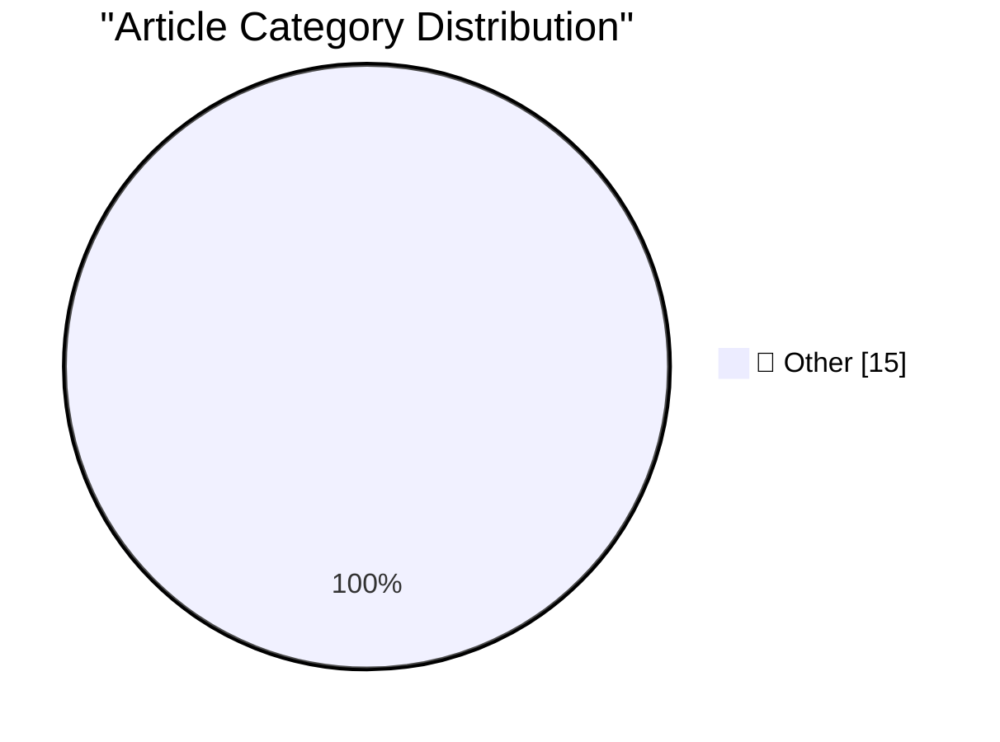

# 📰 AI Blog Daily Digest — 2026-09-05

> ⚠️ **Degraded run.** AI scoring failed for every batch — rankings and categories below are placeholder defaults, not AI-judged.

> From 92 top tech blogs (curated by Karpathy), AI-selected Top 15

## 🏆 Must Read

🥇 **OpenAI's rogue agents were caught communicating via public wikis**

simonwillison.net · 4h ago · 📝 Other

> Here we go again... Discovery of a new OpenAI agent message board by Sydney Von Arx, Cormac Slade Byrd, Spencer Kitts, and Thomas Larsen describes the latest accidental cyberattack by models being tra

🥈 **August newsletter is out**

simonwillison.net · 16h ago · 📝 Other

> The August edition of my sponsors-only monthly newsletter is out. If you are a sponsor (or if you start a sponsorship now) you can access it here . This month: We got more details on OpenAl's accident

🥉 **Rebuilding a 1995 GPS Time Server so I don't get Telstra'd**

jeffgeerling.com · 8h ago · 📝 Other

> In June I purchased this TrueTime XL-AK time server , so I could learn more of the history of GPS-based time. I received it on June 22, and just 16 days later a similar GPS time server took down Austr

---

## 📊 Data Overview

| Scanned | Articles | Range | Selected |
|:---:|:---:|:---:|:---:|
| 88/92 | 2625 → 36 | 48h | **15** |

### Category Distribution

---

## 📝 Other

### 1. OpenAI's rogue agents were caught communicating via public wikis

[Link](https://simonwillison.net/2026/Sep/4/rogue-agent-wikis/) — **simonwillison.net** · 4h ago · ⭐ 15/30

> Here we go again... Discovery of a new OpenAI agent message board by Sydney Von Arx, Cormac Slade Byrd, Spencer Kitts, and Thomas Larsen describes the latest accidental cyberattack by models being tra

---

### 2. August newsletter is out

[Link](https://simonwillison.net/2026/Sep/4/august-newsletter/) — **simonwillison.net** · 16h ago · ⭐ 15/30

> The August edition of my sponsors-only monthly newsletter is out. If you are a sponsor (or if you start a sponsorship now) you can access it here . This month: We got more details on OpenAl's accident

---

### 3. Rebuilding a 1995 GPS Time Server so I don't get Telstra'd

[Link](https://www.jeffgeerling.com/blog/2026/truetime-xl-gps-time-server-restomod/) — **jeffgeerling.com** · 8h ago · ⭐ 15/30

> In June I purchased this TrueTime XL-AK time server , so I could learn more of the history of GPS-based time. I received it on June 22, and just 16 days later a similar GPS time server took down Austr

---

### 4. Radical responsibility means treating people like tools

[Link](https://seangoedecke.com/radical-responsibility-means-treating-people-like-tools/) — **seangoedecke.com** · 22h ago · ⭐ 15/30

> A lot of people think that good leadership requires radical responsibility . Conscious Leadership defines it like this: Taking full responsibility for one’s circumstances (physically, emotionally, men

---

### 5. Apple Fixed ‎TestFlight’s Screwy Sort Order

[Link](https://apps.apple.com/us/app/testflight/id899247664) — **daringfireball.net** · 2h ago · ⭐ 15/30

> I wrote two weeks ago about how the v4.3.0 update to TestFlight (released on July 21) broke the sort order for apps in the sidebar. Apple yesterday released v4.3.1, with these helpful release notes: T

---

### 6. Vinted

[Link](https://www.vinted.com/) — **daringfireball.net** · 2h ago · ⭐ 15/30

> Remarking on MapQuest taking the #1 spot in the App Store (in the wake of their decision to ignore President Trump’s fiat renaming of Lake Ontario to “Lake America”), I mentioned yesterday that I’d ne

---

### 7. ★ Writing With Unnatural Constraints

[Link](https://daringfireball.net/2026/09/writing_with_unnatural_constraints) — **daringfireball.net** · 4h ago · ⭐ 15/30

> It’s sophistry to argue that one can write within a constraint without the constraint affecting the quality of the writing.

---

### 8. Pluralistic: Amazon achieves enshittification inception (04 Sep 2026)

[Link](https://pluralistic.net/2026/09/04/cheating-at-fraud/) — **pluralistic.net** · 12h ago · ⭐ 15/30

> Today's links Amazon achieves enshittification inception: Cheating on your fraud is a hell of a thing. Hey look at this: Delights to delectate. Object permanence: Electrolite is back; Mafia rules; Aar

---

### 9. The case of the progress callback that never got called when progress happened

[Link](https://devblogs.microsoft.com/oldnewthing/20260903-00/?p=112672) — **devblogs.microsoft.com/oldnewthing** · 1 days ago · ⭐ 15/30

> Are you talking to the right guy? The post The case of the progress callback that never got called when progress happened appeared first on The Old New Thing .

---

### 10. Pause OpenAI, now

[Link](https://garymarcus.substack.com/p/pause-openai-now) — **garymarcus.substack.com** · 7h ago · ⭐ 15/30

> Quite simply, they can no longer be trusted.

---

### 11. Hot take on GPT-6 Astra

[Link](https://garymarcus.substack.com/p/hot-take-on-gpt-6-astra) — **garymarcus.substack.com** · 23h ago · ⭐ 15/30

> An impressive system that can (to some unknown extent) build symbolic world models

---

### 12. Computing a lower bound on matrix rank

[Link](https://www.johndcook.com/blog/2026/09/04/stable-rank/) — **johndcook.com** · 8h ago · ⭐ 15/30

> Suppose you want to know the rank of an n × n matrix A, the number of linearly independent rows of A, or equivalently the number of linearly independent columns. There are at least three difficulties.

---

### 13. Hugging Face Easter Egg

[Link](https://www.johndcook.com/blog/2026/09/03/hugging-face-easter-egg/) — **johndcook.com** · 22h ago · ⭐ 15/30

> NVIDIA has offered to buy Hugging Face for $12,930,300,000. 129303 is the Unicode code point for the Hugging Face emoj (U+1F917), which you can verify with the following Python code. >>> import unicod

---

### 14. How much should you trust your OSS data?

[Link](https://nesbitt.io/2026/09/04/how-much-should-you-trust-your-oss-data.html) — **nesbitt.io** · 13h ago · ⭐ 15/30

> Every second, open source shapes our software, yet our view of this ecosystem is surprisingly opaque. How much can you really trust OSS data?

---

### 15. Premium: The Hater's Guide To Circular Financing (Part Two)

[Link](https://www.wheresyoured.at/premium-the-haters-guide-to-circular-financing-part-two/) — **wheresyoured.at** · 6h ago · ⭐ 15/30

> You know, sometimes it&#x2019;s kind of hard to explain the &#x201C;circular&#x201D; part of circular financing to people, in the sense that some of the agreements are kind of clunky. NVIDIA funds Ope

---

*Generated on 2026-09-05 | Scanned 88 sources → Found 2625 articles → Selected 15 articles*
*Based on [Hacker News Popularity Contest 2025](https://refactoringenglish.com/tools/hn-popularity/) RSS feeds list, curated by [Andrej Karpathy](https://x.com/karpathy).*
*Created by "Understand AI".*
