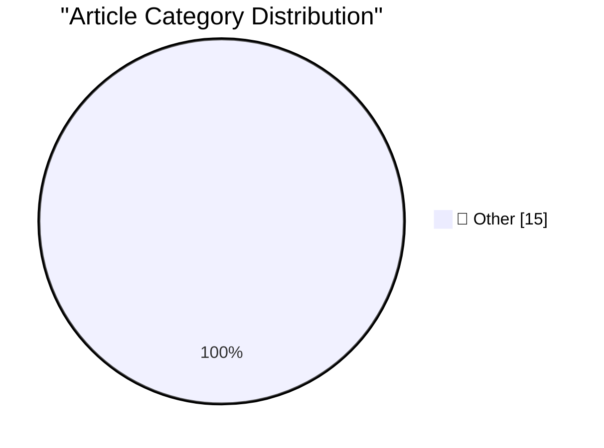

# 📰 AI Blog Daily Digest — 2026-09-06

> ⚠️ **Degraded run.** AI scoring failed for every batch — rankings and categories below are placeholder defaults, not AI-judged.

> From 92 top tech blogs (curated by Karpathy), AI-selected Top 15

## 🏆 Must Read

🥇 **Using Blender with coding agents on macOS**

simonwillison.net · 6h ago · 📝 Other

> TIL: Using Blender with coding agents on macOS I've been having fun with Blender in ChatGPT Codex on my Mac recently. Getting it to work with coding agents is really easy: install the full Mac applica

🥈 **The Pelican comparison grid for Astra is pretty interesting**

simonwillison.net · 22h ago · 📝 Other

> I got access to GPT-6 Astra this afternoon, so naturally I used it to generate SVGs of pelicans riding bicycles - at low, medium, high, xhigh and max reasoning levels (Astra doesn't support reasoning=

🥉 **Gloria Steinem’s Final Essay**

daringfireball.net · 3h ago · 📝 Other

> Gloria Steinem, in a posthumous essay for The New Yorker: For me, saying that I am a feminist has always meant that I believe in the social, economic, and political equality of all males and females o

---

## 📊 Data Overview

| Scanned | Articles | Range | Selected |
|:---:|:---:|:---:|:---:|
| 88/92 | 2625 → 34 | 48h | **15** |

### Category Distribution

---

## 📝 Other

### 1. Using Blender with coding agents on macOS

[Link](https://simonwillison.net/2026/Sep/5/blender-coding-agents-macos/) — **simonwillison.net** · 6h ago · ⭐ 15/30

> TIL: Using Blender with coding agents on macOS I've been having fun with Blender in ChatGPT Codex on my Mac recently. Getting it to work with coding agents is really easy: install the full Mac applica

---

### 2. The Pelican comparison grid for Astra is pretty interesting

[Link](https://simonwillison.net/2026/Sep/4/astra-pelicans/) — **simonwillison.net** · 22h ago · ⭐ 15/30

> I got access to GPT-6 Astra this afternoon, so naturally I used it to generate SVGs of pelicans riding bicycles - at low, medium, high, xhigh and max reasoning levels (Astra doesn't support reasoning=

---

### 3. Gloria Steinem’s Final Essay

[Link](https://www.newyorker.com/culture/life-and-letters/gloria-steinems-final-essay?cndid=66114350) — **daringfireball.net** · 3h ago · ⭐ 15/30

> Gloria Steinem, in a posthumous essay for The New Yorker: For me, saying that I am a feminist has always meant that I believe in the social, economic, and political equality of all males and females o

---

### 4. ‘Bob and Van’

[Link](https://marco.org/2026/09/04/bob-and-van) — **daringfireball.net** · 6h ago · ⭐ 15/30

> Marco Arment: And I can’t help but feel that maybe we were better off before we knew everyone’s hot takes on everything. The town coffee shop was just a coffee shop. We weren’t publicly shamed for goi

---

### 5. Adobe Names Anil Chakravarthy as CEO, Replacing Shantanu Narayen

[Link](https://www.cnbc.com/2026/09/03/adobe-anil-chakravarthy-ceo.html) — **daringfireball.net** · 22h ago · ⭐ 15/30

> Annie Palmer, CNBC: Adobe on Thursday named Anil Chakravarthy as its next president and CEO, succeeding Shantanu Narayen, who announced he would step down earlier this year. Chakravarthy, who most rec

---

### 6. NBA Brings the Hammer on the Clippers — $30 Million Fine, 5 First-Round Draft Picks, and Steve Ballmer Is Banned for a Year

[Link](https://www.nytimes.com/athletic/7513882/2026/09/02/clippers-kawhi-leonard-punishment-fine-suspensions-nba-investigation/?unlocked_article_code=1.-lA.wcSN.awOHwzojR5nR) — **daringfireball.net** · 23h ago · ⭐ 15/30

> Mike Vorkunov, reporting for The Athletic (gift link): The NBA levied the largest punishment in league history on the LA Clippers and owner Steve Ballmer on Wednesday after a year-long investigation d

---

### 7. Pluralistic: Google skates (05 Sep 2026)

[Link](https://pluralistic.net/2026/09/05/divorce-court/) — **pluralistic.net** · 14h ago · ⭐ 15/30

> Today's links Google skates: Another federal judge loses a game of peek-a-boo. Hey look at this: Delights to delectate. Object permanence: Memory-hacking ads; "Dzur"; NZ Ministry of DRM; Canadians v l

---

### 8. Book Review: The Passing of the Dragon and Other Stories by Ken Liu ★★★★☆

[Link](https://shkspr.mobi/blog/2026/09/book-review-the-passing-of-the-dragon-and-other-stories-by-ken-liu/) — **shkspr.mobi** · 11h ago · ⭐ 15/30

> This is a gorgeous set of short stories - and a good deal more accessible than some of the heavyweight prose Liu has previously been involved with. Some of the stories contain sentences which are comp

---

### 9. What happens if you change a window class’s GCL_CB­WND­EXTRA?

[Link](https://devblogs.microsoft.com/oldnewthing/20260904-00/?p=112675) — **devblogs.microsoft.com/oldnewthing** · 1 days ago · ⭐ 15/30

> You're changing the value for future windows. The post What happens if you change a window class’s GCL_ CB&shy;WND&shy;EXTRA ? appeared first on The Old New Thing .

---

### 10. Latent Powers

[Link](https://lucumr.pocoo.org/2026/9/5/latent-powers/) — **lucumr.pocoo.org** · 22h ago · ⭐ 15/30

> A few weeks ago I felt like it would be fun to see if I can make one of those cheap Chinese CarPlay dongles run something other than the stock firmware. The idea was that rather than just forwarding C

---

### 11. Proof of the rank-trace theorem

[Link](https://www.johndcook.com/blog/2026/09/05/proof-of-the-rank-trace-theorem/) — **johndcook.com** · 5h ago · ⭐ 15/30

> The previous post discussed the motivation for and application of the rank-trace theorem. This post will give a proof. Suppose A is a real symmetric matrix. The rank-trace inequality says where tr is 

---

### 12. This Week in Package Management: 5 September 2026

[Link](https://nesbitt.io/2026/09/05/this-week-in-package-management.html) — **nesbitt.io** · 12h ago · ⭐ 15/30

> Releases, advisories, and articles from across the package management world

---

### 13. Reading List - 09/05/2026

[Link](https://www.construction-physics.com/p/reading-list-09052026) — **construction-physics.com** · 10h ago · ⭐ 15/30

> SpaceX’s turbine blade factory, Fervo’s deal with Google, Delhi’s cheap metro, why recycling is overrated, and more.

---

### 14. Porsche Unleashed

[Link](https://www.filfre.net/2026/09/porsche-unleashed/) — **filfre.net** · 1 days ago · ⭐ 15/30

> I’ve had a running joke with my wife Dorte for almost as long as we’ve been a couple. I reasoned back in the day that, since she was going to be a doctor — a more reliable source of income than writin

---

### 15. The September that Never Ended

[Link](https://dfarq.homeip.net/the-september-that-never-ended/?utm_source=rss&#038;utm_medium=rss&#038;utm_campaign=the-september-that-never-ended) — **dfarq.homeip.net** · 1 days ago · ⭐ 15/30

> We’re now 33 years into Eternal September. You have to be older than about 52 to know what I’m talking about. But if you started college before the fall of 1993, especially if you were studying comput

---

*Generated on 2026-09-06 | Scanned 88 sources → Found 2625 articles → Selected 15 articles*
*Based on [Hacker News Popularity Contest 2025](https://refactoringenglish.com/tools/hn-popularity/) RSS feeds list, curated by [Andrej Karpathy](https://x.com/karpathy).*
*Created by "Understand AI".*
