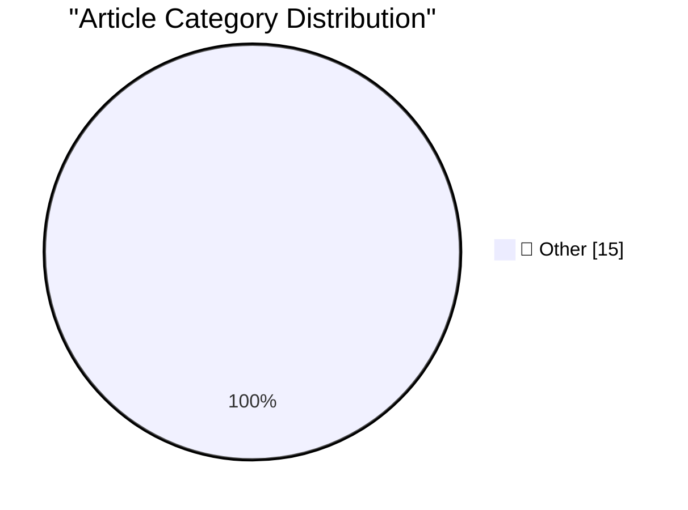

# 📰 AI Blog Daily Digest — 2026-09-18

> ⚠️ **Degraded run.** AI scoring failed for every batch — rankings and categories below are placeholder defaults, not AI-judged.

> From 92 top tech blogs (curated by Karpathy), AI-selected Top 15

## 🏆 Must Read

🥇 **Self-generated prompt injections in compaction summaries**

simonwillison.net · 1h ago · 📝 Other

> Self-generated prompt injections in compaction summaries In Our framework for reporting model misalignment OpenAI provide "six reports on unexpected or concerning model behavior we’ve observed in the 

🥈 **datasette 1.0a40**

simonwillison.net · 22h ago · 📝 Other

> Release: datasette 1.0a40 Same security fix as 0.65.5 , plus some neat new features and bug fixes: Plugins can now launch and manage background tasks using the new datasette.add_background_task() meth

🥉 **datasette 0.65.5**

simonwillison.net · 22h ago · 📝 Other

> Release: datasette 0.65.5 Security fix for an issue where a trailing newline in a requested table name could bypass table permissions and expose private rows, reported by dpfkdlemtp in GHSA-h547-rmjf-

---

## 📊 Data Overview

| Scanned | Articles | Range | Selected |
|:---:|:---:|:---:|:---:|
| 86/92 | 2574 → 35 | 48h | **15** |

### Category Distribution

---

## 📝 Other

### 1. Self-generated prompt injections in compaction summaries

[Link](https://simonwillison.net/2026/Sep/17/compaction-summaries/) — **simonwillison.net** · 1h ago · ⭐ 15/30

> Self-generated prompt injections in compaction summaries In Our framework for reporting model misalignment OpenAI provide "six reports on unexpected or concerning model behavior we’ve observed in the 

---

### 2. datasette 1.0a40

[Link](https://simonwillison.net/2026/Sep/16/datasette/) — **simonwillison.net** · 22h ago · ⭐ 15/30

> Release: datasette 1.0a40 Same security fix as 0.65.5 , plus some neat new features and bug fixes: Plugins can now launch and manage background tasks using the new datasette.add_background_task() meth

---

### 3. datasette 0.65.5

[Link](https://simonwillison.net/2026/Sep/16/datasette-2/) — **simonwillison.net** · 22h ago · ⭐ 15/30

> Release: datasette 0.65.5 Security fix for an issue where a trailing newline in a requested table name could bypass table permissions and expose private rows, reported by dpfkdlemtp in GHSA-h547-rmjf-

---

### 4. Claude Cowork and chat are now one Claude

[Link](https://simonwillison.net/2026/Sep/16/one-claude/) — **simonwillison.net** · 1 days ago · ⭐ 15/30

> Claude Cowork and chat are now one Claude In hopefully good news for anyone who, like me, was increasingly confused at Cowork v.s. Claude v.s. Claude Code: Starting today, Claude Cowork and chat are m

---

### 5. Quoting Mustafa Suleyman

[Link](https://simonwillison.net/2026/Sep/16/mustafa-suleyman/) — **simonwillison.net** · 1 days ago · ⭐ 15/30

> We should not treat models as though they have feelings, preferences, rights, or any entitlement to our welfare. Consciousness is the foundation of our ethical, legal, and political systems. To invite

---

### 6. Gemini Live audio

[Link](https://simonwillison.net/2026/Sep/15/gemini-live/) — **simonwillison.net** · 1 days ago · ⭐ 15/30

> Tool: Gemini Live audio Google released Gemini 3.8 Live and 3.8 Live Extended Thinking today - two new speech-to-speech models that are a similar shape to OpenAI's GPT-Live family. I pointed GPT-6 Ast

---

### 7. Jev means structured output is interesting again

[Link](https://seangoedecke.com/jev-means-structured-output-is-interesting-again/) — **seangoedecke.com** · 1 days ago · ⭐ 15/30

> I don’t write blog posts about new models. That’s Simon Willison’s beat, and he’s very good at it. But I want to write about Jev , which is a different kind 1 of AI model: a “System One” 2 model. As i

---

### 8. Data Broker Radaris Loses Domains in Privacy Fight

[Link](https://krebsonsecurity.com/2026/09/data-broker-radaris-loses-domains-in-privacy-fight/) — **krebsonsecurity.com** · 1 days ago · ⭐ 15/30

> The consumer data broker Radaris.com has long had a reputation for ignoring requests to remove personal information from its vast empire of people-search services online. That reputation caught up wit

---

### 9. Why Do U.S. Models of the iPhone 18 Pro Max, and Only U.S. Models of the 18 Pro Max, Use Qualcomm Cellular Modems Instead of Apple’s Own Superior C2 Modem?

[Link](https://www.macrumors.com/2026/09/12/iphone-18-pro-max-us-model-difference/) — **daringfireball.net** · 7h ago · ⭐ 15/30

> Joe Rossignol at MacRumors over the weekend: Apple now says the iPhone 18 Pro has a C2 modem worldwide, while the iPhone 18 Pro Max uses the chip in every country except for the U.S. [...] Apple has y

---

### 10. Xcode 27.2 Is Out, but 27.1 Is Not, Which Means Developers Still Can’t Get Started on Duo-Adapted Apps

[Link](https://developer.apple.com/documentation/xcode-release-notes/xcode-27_2-release-notes) — **daringfireball.net** · 23h ago · ⭐ 15/30

> A note flagged “Important” atop the Xcode 27.2 release notes: The iOS SDK and simulator support for iPhone Duo will be available later this month in an upcoming release of Xcode 27.1. Adapting apps fo

---

### 11. Is That a Duo in Ternus’s Pocket or Was He Just Happy That Apple TV Shows Won 28 Emmys?

[Link](https://x.com/DEADLINE/status/2099645816361332775) — **daringfireball.net** · 1 days ago · ⭐ 15/30

> Note the reaction from the Deadline reporter. ★

---

### 12. Woz Launches Merch Store

[Link](https://x.com/stevewoz/status/2100074363605397658) — **daringfireball.net** · 1 days ago · ⭐ 15/30

> Steve Wozniak: I’ve decided it’s time to have a little more fun on X this year! 😄⚡ I get to speak at some amazing events, meet fascinating people, hear great stories, and occasionally find myself in 

---

### 13. Apple OS 27.2 Betas Are Out; Version 27.1 Is the Duo-Exclusive iOS Fork

[Link](https://www.macrumors.com/2026/09/16/heres-why-apple-released-ios-27-2-beta/) — **daringfireball.net** · 1 days ago · ⭐ 15/30

> Joe Rossignol, MacRumors: Apple just seeded the first beta of iOS 27.2 to developers for testing. Yes, you read that correctly: iOS 27.2, not iOS 27.1. Why no iOS 27.1 beta? The answer likely relates 

---

### 14. AirPods 5 With Wireless Charging Case Works With MagSafe, But Not Magnetically

[Link](https://www.apple.com/airpods-5/specs/) — **daringfireball.net** · 1 days ago · ⭐ 15/30

> In my long take yesterday on Apple’s event last week, I wrote that when you pay $20 extra to get the $150 AirPods 5 With Wireless Charging Case, that the case is compatible for inductive charging with

---

### 15. ‘Apple Reference Image: A New Approach for Verified Photography’

[Link](https://security.apple.com/blog/apple-reference-image/) — **daringfireball.net** · 1 days ago · ⭐ 15/30

> Apple Security Research has released a concise, cogent paper describing how Apple Reference Image works, and why they made it. A terrific read. Here’s just one fascinating bit regarding privacy: Other

---

*Generated on 2026-09-18 | Scanned 86 sources → Found 2574 articles → Selected 15 articles*
*Based on [Hacker News Popularity Contest 2025](https://refactoringenglish.com/tools/hn-popularity/) RSS feeds list, curated by [Andrej Karpathy](https://x.com/karpathy).*
*Created by "Understand AI".*
