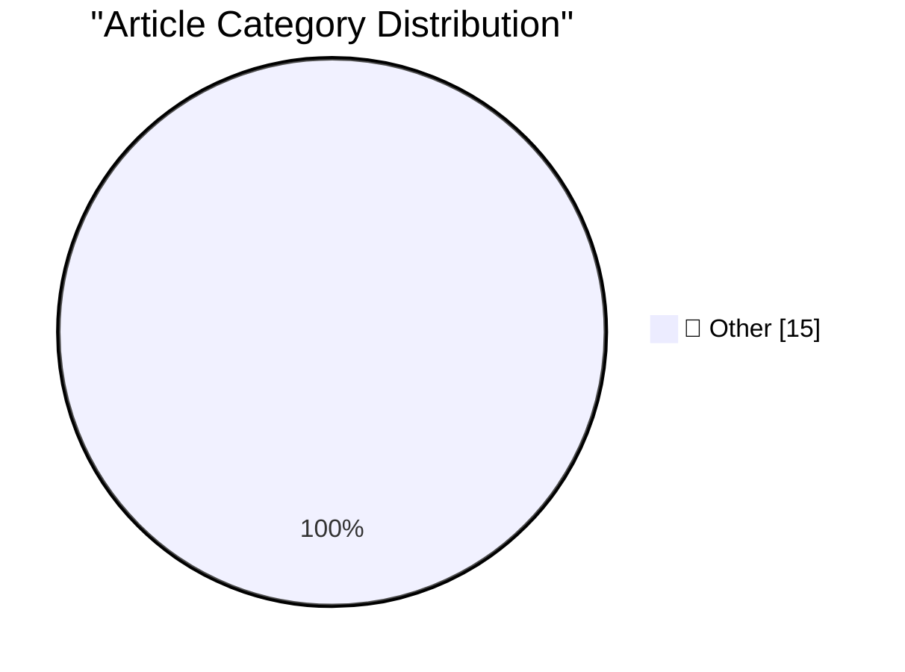

# 📰 AI Blog Daily Digest — 2026-09-19

> ⚠️ **Degraded run.** AI scoring failed for every batch — rankings and categories below are placeholder defaults, not AI-judged.

> From 92 top tech blogs (curated by Karpathy), AI-selected Top 15

## 🏆 Must Read

🥇 **Note on 18th September 2026**

simonwillison.net · 3h ago · 📝 Other

> Being a computer scientist who refuses to find anything about LLMs interesting right now is a bit like being a geneticist who refuses to find anything interesting about the recently opened Jurassic Pa

🥈 **Quoting Thariq Shihipar**

simonwillison.net · 3h ago · 📝 Other

> We're adding support for AGENTS.md to Claude Code. Starting today in version 2.1.277, if there is no CLAUDE.md in a folder, Claude will check for and use AGENTS.md. AGENTS.md support is built off of C

🥉 **The Creative Spirit of Who Framed Roger Rabbit**

simonwillison.net · 8h ago · 📝 Other

> The Creative Spirit of Who Framed Roger Rabbit I love Who Framed Roger Rabbit , the 1988 movie by Robert Zemeckis. I haven't watched it in quite a few years, and Cypress Frankenfeld just pointed out t

---

## 📊 Data Overview

| Scanned | Articles | Range | Selected |
|:---:|:---:|:---:|:---:|
| 86/92 | 2596 → 43 | 48h | **15** |

### Category Distribution

---

## 📝 Other

### 1. Note on 18th September 2026

[Link](https://simonwillison.net/2026/Sep/18/probably-gonna-eat-you/) — **simonwillison.net** · 3h ago · ⭐ 15/30

> Being a computer scientist who refuses to find anything about LLMs interesting right now is a bit like being a geneticist who refuses to find anything interesting about the recently opened Jurassic Pa

---

### 2. Quoting Thariq Shihipar

[Link](https://simonwillison.net/2026/Sep/18/thariq-shihipar/) — **simonwillison.net** · 3h ago · ⭐ 15/30

> We're adding support for AGENTS.md to Claude Code. Starting today in version 2.1.277, if there is no CLAUDE.md in a folder, Claude will check for and use AGENTS.md. AGENTS.md support is built off of C

---

### 3. The Creative Spirit of Who Framed Roger Rabbit

[Link](https://simonwillison.net/2026/Sep/18/the-creative-spirit-of-who-framed-roger-rabbit/) — **simonwillison.net** · 8h ago · ⭐ 15/30

> The Creative Spirit of Who Framed Roger Rabbit I love Who Framed Roger Rabbit , the 1988 movie by Robert Zemeckis. I haven't watched it in quite a few years, and Cypress Frankenfeld just pointed out t

---

### 4. Be alert: targeted attacks on prominent Rustaceans

[Link](https://simonwillison.net/2026/Sep/17/targeted-attacks-on-rustaceans/) — **simonwillison.net** · 22h ago · ⭐ 15/30

> Be alert: targeted attacks on prominent Rustaceans Important warning from Adam Harvey and the crates security team: We believe that there is an ongoing campaign targeting rust-lang members and owners 

---

### 5. How To Write With An LLM

[Link](https://simonwillison.net/2026/Sep/17/how-to-write-with-an-llm/) — **simonwillison.net** · 23h ago · ⭐ 15/30

> How To Write With An LLM Thomas Ptacek on using LLMs as copyeditors, not as writing assistants: Rule Number One: You may not use a single word an LLM suggests to you. [...] I think that as a form of i

---

### 6. NTP, an atomic clock, and having a great time at the world's largest VCF

[Link](https://www.jeffgeerling.com/blog/2026/vcf-midwest-21-ntp-time/) — **jeffgeerling.com** · 8h ago · ⭐ 15/30

> I'm back from VCF Midwest 21 , arguably the largest vintage computer festival on the planet. After being blown away last year, I decided to get a table of my own this year, to demonstrate NTP Time on 

---

### 7. Two techniques for working with System One models

[Link](https://seangoedecke.com/two-techniques-for-working-with-system-one-models/) — **seangoedecke.com** · 22h ago · ⭐ 15/30

> I recently wrote about Jev , a new “System One” language model that only outputs decisions : the answers to a set of user-provided multiple-choice questions. This means it’s nowhere near as flexible 1

---

### 8. Just Me or Does This Argument Not Add Up?

[Link](https://www.nytimes.com/2026/09/16/opinion/university-of-california-sat.html?unlocked_article_code=1.CFE.bXBA.V6BFzBn1jlKG) — **daringfireball.net** · 1h ago · ⭐ 15/30

> Miriam Pawel, in an op-ed in The New York Times arguing that University of California should not bring back the SAT requirement for admission: What has made the University of California exceptional is

---

### 9. Will Oremus Is a Duo Doubter

[Link](https://www.theatlantic.com/technology/2026/09/apple-folding-iphone/688562/?gift=aQyUJR7AIw1mJWdQ6Ed6yE6RbvpIGGpQGFPIX827p48) — **daringfireball.net** · 2h ago · ⭐ 15/30

> Will Oremus, writing for The Atlantic last week, “Okay, Sure, a Folding iPhone” (gift link): Apple’s next big invention, the company revealed at a launch event in Cupertino, is a $2,000 iPhone that sp

---

### 10. Apple Releases Xcode 27.1, First SDK With Support for iPhone Duo

[Link](https://developer.apple.com/news/?id=nyuppv9r) — **daringfireball.net** · 2h ago · ⭐ 15/30

> In addition to the Duo-specific 27.1 SDK, which allows third-party developers to get start adapting apps to the Duo’s new screen sizes and layouts, Apple’s developer site also has Figma and Sketch des

---

### 11. Warren Buffett, at 96, Steps Down as Chairman at Berkshire Hathaway

[Link](https://www.berkshirehathaway.com/news/sep1826.pdf) — **daringfireball.net** · 3h ago · ⭐ 15/30

> Warren Buffett, in a letter to Berkshire shareholders: Recently, I celebrated my 96th birthday with family and friends, including one of my great-grandchildren, who had just turned one. He’s moving a 

---

### 12. Trump Says He’s Banning MS NOW, CNN, and Politico From White House

[Link](https://truthsocial.com/@realDonaldTrump/posts/117293599348325006) — **daringfireball.net** · 3h ago · ⭐ 15/30

> Let’s check in on the president of the United States, having a normal one on his blog: I am proud to announce that, effective immediately, I am banning Fake News CNN, MSNOW (who recently changed their

---

### 13. Hollywood Wants the Duo

[Link](https://pagesix.com/2026/09/16/hollywood/mysterious-apple-ceo-charms-hollywood-following-big-emmys-night-by-showing-off-new-iphone/) — **daringfireball.net** · 5h ago · ⭐ 15/30

> Page Six Hollywood: Ternus attended an intimate Apple party the night before the Emmys, filled with stars and powerbrokers, where some talent brazenly hit him up for the phone. “The new phone is big n

---

### 14. Gauging Interest in the iPhone Duo

[Link](https://maxfrequency.net/2026/09/17/iphone-duo-mkbhd-popularity-or-curiosity/) — **daringfireball.net** · 5h ago · ⭐ 15/30

> Max Roberts, after looking at the list of MKBHD’s all-time most popular videos, and noting that his Duo first-look is #3, and a Duo follow-up is already at #36: Apple enters the category and in a week

---

### 15. ★ One More Thing About the iPhones 18 Pro: the Bigger/Smaller Dynamic Island

[Link](https://daringfireball.net/2026/09/iphone_18_pro_dynamic_island) — **daringfireball.net** · 6h ago · ⭐ 15/30

> A next-day addition to my iPhones 18 Pro review.

---

*Generated on 2026-09-19 | Scanned 86 sources → Found 2596 articles → Selected 15 articles*
*Based on [Hacker News Popularity Contest 2025](https://refactoringenglish.com/tools/hn-popularity/) RSS feeds list, curated by [Andrej Karpathy](https://x.com/karpathy).*
*Created by "Understand AI".*
