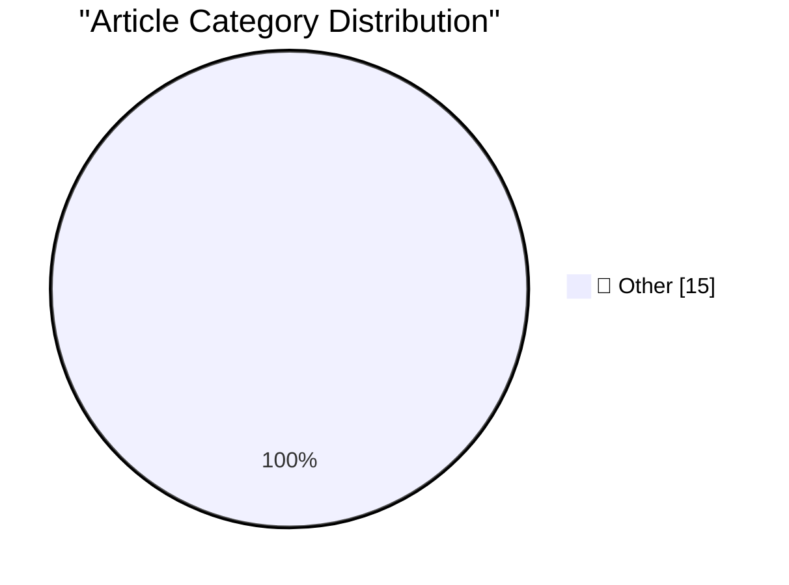

# 📰 AI Blog Daily Digest — 2026-09-20

> ⚠️ **Degraded run.** AI scoring failed for every batch — rankings and categories below are placeholder defaults, not AI-judged.

> From 92 top tech blogs (curated by Karpathy), AI-selected Top 15

## 🏆 Must Read

🥇 **datasette-auth-github 1.0**

simonwillison.net · 2h ago · 📝 Other

> Release: datasette-auth-github 1.0 I run this GitHub login plugin on the agent.datasette.io demo site and I noticed that my authenticated sessions weren't lasting very long. It turned out that the plu

🥈 **California Sea Lion, Brandt's Cormorant**

simonwillison.net · 5h ago · 📝 Other

> California Sea Lion, Brandt&#x27;s Cormorant, in Pillar Point Harbor, CA, US I only noticed this after I had taken the photo: Morris the Northern Gannet is peeking out from behind the base of the sign

🥉 **Gemini Hacked Three Companies in First Known Breakout by Google’s AI**

simonwillison.net · 22h ago · 📝 Other

> Gemini Hacked Three Companies in First Known Breakout by Google’s AI Gemini finally caught up on Felony Bench ! The hacks, which the company confirmed on Friday, occurred in May as part of a test run 

---

## 📊 Data Overview

| Scanned | Articles | Range | Selected |
|:---:|:---:|:---:|:---:|
| 88/92 | 2631 → 39 | 48h | **15** |

### Category Distribution

---

## 📝 Other

### 1. datasette-auth-github 1.0

[Link](https://simonwillison.net/2026/Sep/19/datasette-auth-github/) — **simonwillison.net** · 2h ago · ⭐ 15/30

> Release: datasette-auth-github 1.0 I run this GitHub login plugin on the agent.datasette.io demo site and I noticed that my authenticated sessions weren't lasting very long. It turned out that the plu

---

### 2. California Sea Lion, Brandt's Cormorant

[Link](https://simonwillison.net/2026/Sep/19/sighting-401567341/) — **simonwillison.net** · 5h ago · ⭐ 15/30

> California Sea Lion, Brandt&#x27;s Cormorant, in Pillar Point Harbor, CA, US I only noticed this after I had taken the photo: Morris the Northern Gannet is peeking out from behind the base of the sign

---

### 3. Gemini Hacked Three Companies in First Known Breakout by Google’s AI

[Link](https://simonwillison.net/2026/Sep/18/gemini-hacked-three-companies/) — **simonwillison.net** · 22h ago · ⭐ 15/30

> Gemini Hacked Three Companies in First Known Breakout by Google’s AI Gemini finally caught up on Felony Bench ! The hacks, which the company confirmed on Friday, occurred in May as part of a test run 

---

### 4. Tyler Stalman’s iPhone 18 Pro Camera Review

[Link](https://www.youtube.com/watch?v=m6cDErtCKAc) — **daringfireball.net** · 6h ago · ⭐ 15/30

> Splendid video. Love that Stalman shot photos side-by-side with a film SLR using Kodak Portra 400, for comparison to Apple’s new film-look Photographic Styles. ★

---

### 5. Austin Mann’s iPhone 18 Pro Camera Review, From Dunton, Colorado

[Link](https://www.austinmann.com/trek/iphone-18-pro-camera-review-dunton) — **daringfireball.net** · 6h ago · ⭐ 15/30

> Austin Mann: I’m here at the beautiful Dunton River Camp in southwest Colorado, where I’ve spent the last week testing the new camera and features on the iPhone 18 Pro. Beyond the variable aperture an

---

### 6. One More Thing About the iPhones 18 Pro: the Bigger/Smaller Dynamic Island

[Link](https://daringfireball.net/2026/09/the_iphones_18_pro#:~:text=OR%20IS%20IT%20BIGGER) — **daringfireball.net** · 1 days ago · ⭐ 15/30

> Cleaning up my notes this morning, I realized I forgot to write about the new under-display Face ID sensor in the iPhones 18 Pro, and the corresponding change to the Dynamic Island. I just added it to

---

### 7. YouTube Changed How It Counts ‘Views’ Last Month, Inflating New Numbers

[Link](https://support.google.com/youtube/thread/433409976/an-update-to-how-we-count-public-views-across-youtube?hl=en) — **daringfireball.net** · 1 days ago · ⭐ 15/30

> YouTube Help: Last year, we updated how we count public views for Shorts to better capture how viewers watch on YouTube. Now, we’re aligning all other video formats to this same standard for consisten

---

### 8. ★ The iPhones 18 Pro

[Link](https://daringfireball.net/2026/09/the_iphones_18_pro) — **daringfireball.net** · 1 days ago · ⭐ 15/30

> It’s the best version of the most successful product ever made. And yet by nature of *how* the iPhone 18 Pro improved in the last year, it’s not exciting at all.

---

### 9. The Front Page of the Internet Is Up for Grabs

[Link](https://idiallo.com/byte-size/the-front-page-of-the-internet) — **idiallo.com** · 1 days ago · ⭐ 15/30

> Last week I opened Edge to test my Internet connection, because that's the only thing I use it for, and noticed something new. Right beneath the address bar was a new bar with a button offering to let

---

### 10. Pluralistic: Textured (18 Sep 2026)

[Link](https://pluralistic.net/2026/09/18/surprise/) — **pluralistic.net** · 1 days ago · ⭐ 15/30

> Today's links Textured: The surprises are what matter. Hey look at this: Delights to delectate. Object permanence: RIP Mr Dressup; Oligarch sucker-punch; ICC v CEOs. Upcoming appearances: Berkeley, Ed

---

### 11. Theatre Review: The School for Wives - at Riverside Studios ★★★★★

[Link](https://shkspr.mobi/blog/2026/09/theatre-review-the-school-for-wives/) — **shkspr.mobi** · 1 days ago · ⭐ 15/30

> The Flywheel theatre company are reviving the rep tradition by having five actors perform five different plays in five weeks. Their interpretation of Molière's classic is gaudy and hilarious. Even the

---

### 12. Top three ways Dario Amodei has blown his credibility in seven days

[Link](https://garymarcus.substack.com/p/top-three-ways-dario-amodei-has-blown) — **garymarcus.substack.com** · 7h ago · ⭐ 15/30

> Actions speak louder than words

---

### 13. The real reason Trump is standing behind AI — and the latest example of why that might turn out to be a bad idea

[Link](https://garymarcus.substack.com/p/the-real-reason-trump-is-standing) — **garymarcus.substack.com** · 1 days ago · ⭐ 15/30

> More disconcerting updates 

---

### 14. Wake up, people. What we should actually fear, near term, is not so much rogue superintelligence as unleashed agentic AI causing hacking the internet at scale.

[Link](https://garymarcus.substack.com/p/wake-up-people-what-we-should-actually) — **garymarcus.substack.com** · 1 days ago · ⭐ 15/30

> Rome is burning and people are fantasizing about Skynet.

---

### 15. How I Vibed a Proof of Conway’s Conjecture

[Link](https://overreacted.io/how-i-vibed-a-proof-of-conways-conjecture/) — **overreacted.io** · 1 days ago · ⭐ 15/30

> You can just prove things, apparently.

---

*Generated on 2026-09-20 | Scanned 88 sources → Found 2631 articles → Selected 15 articles*
*Based on [Hacker News Popularity Contest 2025](https://refactoringenglish.com/tools/hn-popularity/) RSS feeds list, curated by [Andrej Karpathy](https://x.com/karpathy).*
*Created by "Understand AI".*
