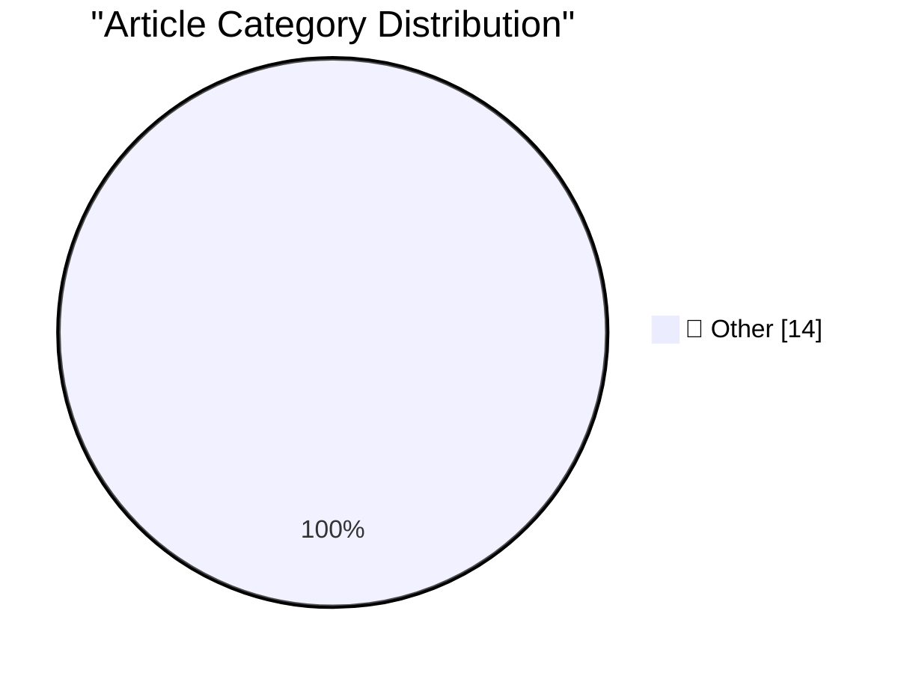

# 📰 AI Blog Daily Digest — 2026-09-21

> ⚠️ **Degraded run.** AI scoring failed for every batch — rankings and categories below are placeholder defaults, not AI-judged.

> From 92 top tech blogs (curated by Karpathy), AI-selected Top 14

## 🏆 Must Read

🥇 **Quoting voxium**

simonwillison.net · 1h ago · 📝 Other

> It has been half a month since I started a new role at a big company. Nobody knows anything here. The specs, code, tests, PRDs, tickets, resolution of those tickets, reports, etc., everything is made 

🥈 **llm-keys-ui 0.1**

simonwillison.net · 3h ago · 📝 Other

> Release: llm-keys-ui 0.1 This plugin solves a very specific problem. I've started using Codex Remote to run coding agents on various machines while controlling them from my phone. Sometimes I use thos

🥉 **Grit your teeth and ship it**

seangoedecke.com · 22h ago · 📝 Other

> Being good at building and being good at shipping are two separate skills. In the short term, they’re actually countervailing: if you have a gift for building, you’re likely to be worse at shipping. I

---

## 📊 Data Overview

| Scanned | Articles | Range | Selected |
|:---:|:---:|:---:|:---:|
| 88/92 | 2631 → 20 | 48h | **14** |

### Category Distribution

---

## 📝 Other

### 1. Quoting voxium

[Link](https://simonwillison.net/2026/Sep/20/voxium/) — **simonwillison.net** · 1h ago · ⭐ 15/30

> It has been half a month since I started a new role at a big company. Nobody knows anything here. The specs, code, tests, PRDs, tickets, resolution of those tickets, reports, etc., everything is made 

---

### 2. llm-keys-ui 0.1

[Link](https://simonwillison.net/2026/Sep/20/llm-keys-ui/) — **simonwillison.net** · 3h ago · ⭐ 15/30

> Release: llm-keys-ui 0.1 This plugin solves a very specific problem. I've started using Codex Remote to run coding agents on various machines while controlling them from my phone. Sometimes I use thos

---

### 3. Grit your teeth and ship it

[Link](https://seangoedecke.com/grit-your-teeth-and-ship-it/) — **seangoedecke.com** · 22h ago · ⭐ 15/30

> Being good at building and being good at shipping are two separate skills. In the short term, they’re actually countervailing: if you have a gift for building, you’re likely to be worse at shipping. I

---

### 4. System One models like Jev can train their own replacements

[Link](https://seangoedecke.com/system-one-models-can-train-their-own-replacements/) — **seangoedecke.com** · 22h ago · ⭐ 15/30

> “System One” models like Jev are fast general classifiers. Classifiers have existed since 1958 , but they have to be trained for specific tasks: if you build a classifier to identify images of dogs, i

---

### 5. WorkOS: How SSO Works and the Fastest Way to Add It

[Link](https://workos.com/guide/the-developers-guide-to-sso?utm_source=daringfireball&amp;utm_medium=newsletter&amp;utm_campaign=q32026) — **daringfireball.net** · 4h ago · ⭐ 15/30

> My thanks to WorkOS for sponsoring this last week — a big week — at DF. SSO is table stakes for enterprise deals, but building it into your app yourself means writing SAML controllers, parsing XML ass

---

### 6. GM Revives CarPlay for 2027 Trucks

[Link](https://www.autoweek.com/news/a73761352/gm-revives-apple-carplay-for-2027-chevy-silverado-gmc-sierra/) — **daringfireball.net** · 5h ago · ⭐ 15/30

> Natalie Neff, Autoweek: General Motors is reversing course after having begun to remove Apple CarPlay from its vehicles, showing off instead a redesigned infotainment interface for the 2027 Chevrolet 

---

### 7. Marques Brownlee’s iPhone 18 Pro Review

[Link](https://www.youtube.com/watch?v=ohqxP8EEumo) — **daringfireball.net** · 6h ago · ⭐ 15/30

> He takes the same “ this is pretty much exactly what Apple used to label an ‘S’ year ” angle I did, so, unsurprisingly, I think his review is spot-on. Brownlee emphasizes one point that I should have,

---

### 8. Book Review: How to Build a Space Station by Jonathan Morrison ★★★⯪☆

[Link](https://shkspr.mobi/blog/2026/09/book-review-how-to-build-a-space-station-by-jonathan-morrison/) — **shkspr.mobi** · 10h ago · ⭐ 15/30

> This book, by The Times' former Architecture Correspondent, stands in direct opposition to A City on Mars. Whereas that book presented a (perhaps too) sceptical look at the realities of living on othe

---

### 9. This is why we play

[Link](https://xeiaso.net/blog/2026/this-is-why-we-play/) — **xeiaso.net** · -89m ago · ⭐ 15/30

> A meditation on gaming, community, and the purpose of negative space

---

### 10. Why fitting a logistic is nearly impossible from early data

[Link](https://www.johndcook.com/blog/2026/09/18/logistic-fit-sensitivity/) — **johndcook.com** · 1 days ago · ⭐ 15/30

> Nothing grows exponentially forever. What appears to be an exponential curve often turns out to be some sort of S curve, such as a logistic curve. Suppose you’re collecting data on the left side of th

---

### 11. Finding Bugs

[Link](https://matklad.github.io/2026/09/19/finding-bugs.html) — **matklad.github.io** · 1 days ago · ⭐ 15/30

> Are generative (randomized) tests significantly more effective than example-based unit-tests at discovering bugs? There's an interesting discussion about this on lobste.rs. One argument in favor of un

---

### 12. This Week in Package Management: 19 September 2026

[Link](https://nesbitt.io/2026/09/19/this-week-in-package-management.html) — **nesbitt.io** · 1 days ago · ⭐ 15/30

> Releases, advisories, and articles from across the package management world

---

### 13. Reading List 09/19/2026

[Link](https://www.construction-physics.com/p/reading-list-09192026) — **construction-physics.com** · 1 days ago · ⭐ 15/30

> AirBnB’s housing accelerator, rising steel prices, a resurgence of US coal power, low-head dams, and more.

---

### 14. Notes on discrete-time Fourier series and transform

[Link](https://eli.thegreenplace.net/2026/notes-on-discrete-time-fourier-series-and-transform/) — **eli.thegreenplace.net** · 1 days ago · ⭐ 15/30

> The following are my notes on discrete-time Fourier series (DTFS), as well as the discrete-time Fourier transform (DTFT). These topics serve as an important theoretical underpinning to the digital pro

---

*Generated on 2026-09-21 | Scanned 88 sources → Found 2631 articles → Selected 14 articles*
*Based on [Hacker News Popularity Contest 2025](https://refactoringenglish.com/tools/hn-popularity/) RSS feeds list, curated by [Andrej Karpathy](https://x.com/karpathy).*
*Created by "Understand AI".*
