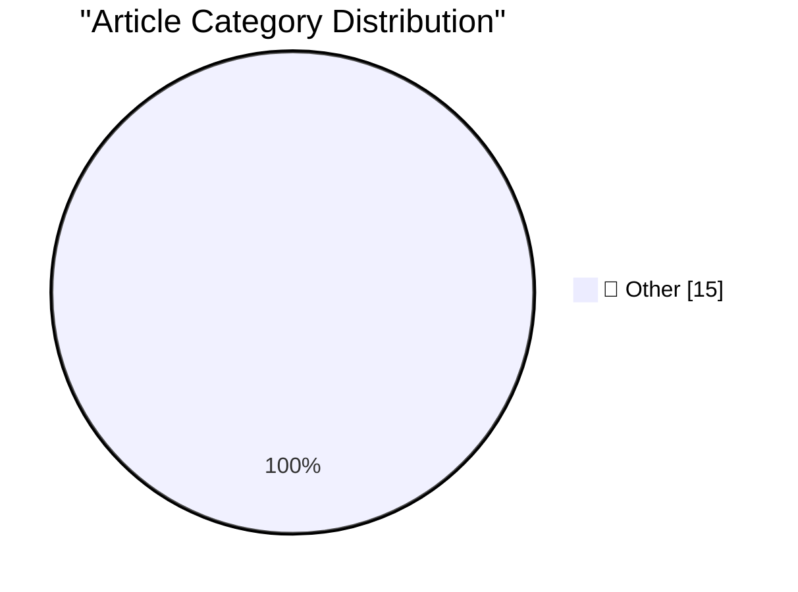

# 📰 AI Blog Daily Digest — 2026-09-22

> ⚠️ **Degraded run.** AI scoring failed for every batch — rankings and categories below are placeholder defaults, not AI-judged.

> From 92 top tech blogs (curated by Karpathy), AI-selected Top 15

## 🏆 Must Read

🥇 **MCP was always a bad idea?**

simonwillison.net · 1 days ago · 📝 Other

> My comment on MCP was always a bad idea? &mdash; Hacker News. This article entirely misses the value that MCP brings today. Sure, there's almost no reason to use MCPs if you are running a full-blown t

🥈 **datasette-explain 0.2.2**

simonwillison.net · 1 days ago · 📝 Other

> Release: datasette-explain 0.2.2 Explain plans now work on read-only stored-query pages. I upgraded datasette.simonwillison.net to Datasette 1.0a40, which inspired me to ship a new version of this exp

🥉 **Raspberry Pi locks down Pi 5 RAM upgrades in firmware**

jeffgeerling.com · 5h ago · 📝 Other

> Raspberry Pi added a feature in their firmware that restricts users from swapping RAM chips , sometimes even RAM chips of the same capacity from other Raspberry Pi boards. Apparently there were people

---

## 📊 Data Overview

| Scanned | Articles | Range | Selected |
|:---:|:---:|:---:|:---:|
| 88/92 | 2631 → 29 | 48h | **15** |

### Category Distribution

---

## 📝 Other

### 1. MCP was always a bad idea?

[Link](https://simonwillison.net/2026/Sep/20/hn-49779718/) — **simonwillison.net** · 1 days ago · ⭐ 15/30

> My comment on MCP was always a bad idea? &mdash; Hacker News. This article entirely misses the value that MCP brings today. Sure, there's almost no reason to use MCPs if you are running a full-blown t

---

### 2. datasette-explain 0.2.2

[Link](https://simonwillison.net/2026/Sep/20/datasette-explain/) — **simonwillison.net** · 1 days ago · ⭐ 15/30

> Release: datasette-explain 0.2.2 Explain plans now work on read-only stored-query pages. I upgraded datasette.simonwillison.net to Datasette 1.0a40, which inspired me to ship a new version of this exp

---

### 3. Raspberry Pi locks down Pi 5 RAM upgrades in firmware

[Link](https://www.jeffgeerling.com/blog/2026/raspberry-pi-ram-lockdown/) — **jeffgeerling.com** · 5h ago · ⭐ 15/30

> Raspberry Pi added a feature in their firmware that restricts users from swapping RAM chips , sometimes even RAM chips of the same capacity from other Raspberry Pi boards. Apparently there were people

---

### 4. GM Confirms They’re Still Smoking Crack

[Link](https://x.com/JoannaStern/status/2102105565195288859) — **daringfireball.net** · 38m ago · ⭐ 15/30

> Joanna Stern, on X: GM has confirmed it is NOT rolling phone projection to GM EVs. Instead this announcement is specific to JUST their new gas powered light-duty pickups, which have always supported A

---

### 5. America’s Decline Can Be Measured by the Names of Ballparks and Arenas

[Link](https://www.mlb.com/news/tigers-ballpark-name-changed-to-fifth-third-park) — **daringfireball.net** · 1h ago · ⭐ 15/30

> MLB: Comerica Park has had several alternate identities since it became the Tigers’ home in 2000. Some have called it Comerica National Park for its spacious dimensions. Some fans simply came to call 

---

### 6. Ichiro, at 52, Throws 127-Pitch Shutout Against All-Star Girls Team in Japan

[Link](https://www.seattletimes.com/sports/mariners/ichiro-at-52-throws-127-pitch-shutout-against-all-star-girls-team-in-japan/) — **daringfireball.net** · 4h ago · ⭐ 15/30

> Sofia Schwarzwalder, reporting for The Seattle Times: Since turning 50, the Mariners legend has been inducted into the Hall of Fame, launched eight homers at the Mariners Alumni Home Run Derby this su

---

### 7. Glenn Fleishman on the Increasing Impracticality of Shipping From the U.S. to the E.U.

[Link](https://glog.glennf.com/blog/2026/09/17/u-s-small-biz-cant-ship-to-the-eu-anymore/) — **daringfireball.net** · 4h ago · ⭐ 15/30

> Glenn Fleishman: Recent protectionist changes by the European Union further effectively exclude U.S. small businesses like mine from selling to EU customers. It’s a little complicated, but it has to d

---

### 8. David Pogue: ‘125 Tests of the New AI Siri’

[Link](https://pogueman.substack.com/p/125-tests-of-the-new-ai-siri) — **daringfireball.net** · 5h ago · ⭐ 15/30

> David Pogue: The hardest part will be getting out of the habit of opening apps, and remembering that you have Siri. Give it a few tries. Learn to trust it. You’ll save incredible amounts of time and f

---

### 9. Matthew Butterick: ‘Big AI to Humanity: Drop Dead’

[Link](https://matthewbutterick.com/chron/drop-dead.html) — **daringfireball.net** · 5h ago · ⭐ 15/30

> Matthew Butterick: So let’s not take the bait. Nor overcomplicate. We needn’t spin our collective wheels spitballing answers to big-picture, long-term Al-policy questions. We don’t know enough yet. Th

---

### 10. ‘Measuring Nothing (With Great Accuracy)’

[Link](https://seths.blog/2014/01/measuring-nothing-with-great-accuracy/) — **daringfireball.net** · 7h ago · ⭐ 15/30

> Seth Godin back in 2014: You can’t tell if a book is any good by the number of words it contains, even though it’s quite easy and direct to measure this. (Vis-à-vis my sidenote over the weekend about 

---

### 11. Apple TV to Finally Air ‘The Savant’ in Early 2027, Supposedly

[Link](https://deadline.com/2026/09/jessica-chastain-the-savant-new-release-date-apple-tv-1237108228/) — **daringfireball.net** · 21h ago · ⭐ 15/30

> Nellie Andreeva, reporting for Deadline: The release of The Savant is back on. A year after Apple TV put the thriller starring Jessica Chastain on hold three days before it was slated to premiere on S

---

### 12. Yours Truly on CNBC’s ‘Squawk on the Street’ Friday

[Link](https://youtu.be/WrwY_jVaN-w) — **daringfireball.net** · 21h ago · ⭐ 15/30

> I genuinely enjoyed that Sara Eisen laughed a little when introducing me as having written a 5,000-word review of the iPhone 18 Pro. ★

---

### 13. Pluralistic: The Claude Delusion (21 Sep 2026)

[Link](https://pluralistic.net/2026/09/21/sunsetting/) — **pluralistic.net** · 11h ago · ⭐ 15/30

> Today's links The Claude Delusion: What if we're the ones having hallucinations? Hey look at this: Delights to delectate. Object permanence: 9/11 v sex; 9/11 v flags; US customs v diplomatic Vegemite;

---

### 14. What’s the highest legal FILETIME? Is it safe to use?

[Link](https://devblogs.microsoft.com/oldnewthing/20260921-00/?p=112711) — **devblogs.microsoft.com/oldnewthing** · 8h ago · ⭐ 15/30

> Being wary of how people use it and how it interacts with other types. The post What’s the highest legal FILETIME ? Is it safe to use? appeared first on The Old New Thing .

---

### 15. Big news at the UN

[Link](https://garymarcus.substack.com/p/big-news-at-the-un) — **garymarcus.substack.com** · 1h ago · ⭐ 15/30

> Sometimes, maybe dreams come true?

---

*Generated on 2026-09-22 | Scanned 88 sources → Found 2631 articles → Selected 15 articles*
*Based on [Hacker News Popularity Contest 2025](https://refactoringenglish.com/tools/hn-popularity/) RSS feeds list, curated by [Andrej Karpathy](https://x.com/karpathy).*
*Created by "Understand AI".*
