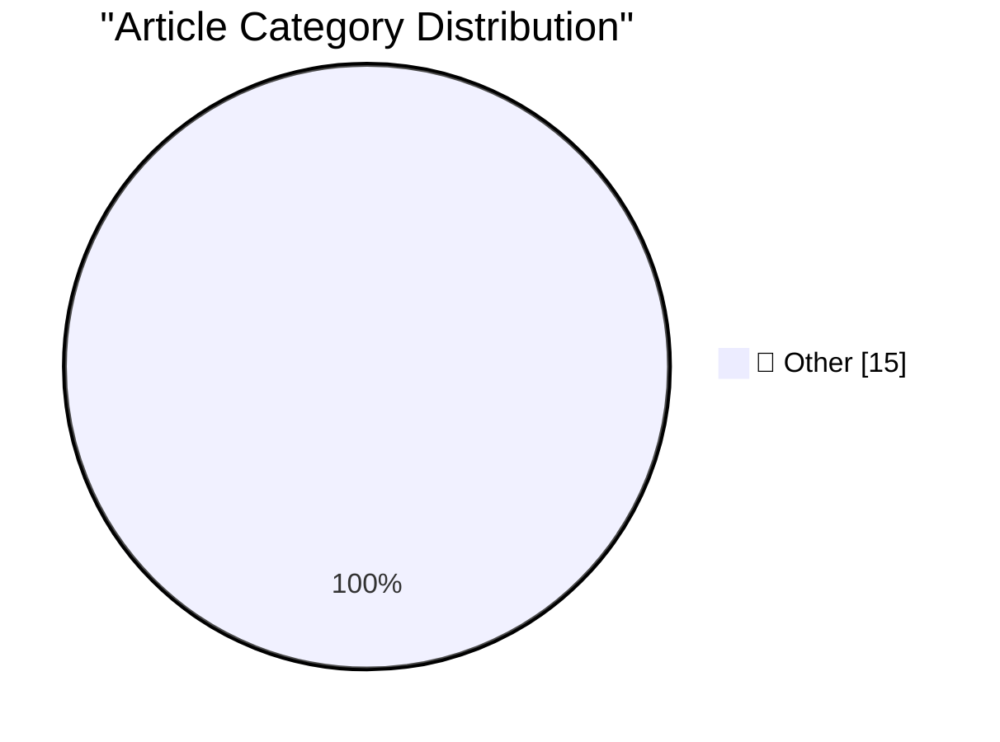

# 📰 AI Blog Daily Digest — 2026-09-23

> ⚠️ **Degraded run.** AI scoring failed for every batch — rankings and categories below are placeholder defaults, not AI-judged.

> From 92 top tech blogs (curated by Karpathy), AI-selected Top 15

## 🏆 Must Read

🥇 **Quoting @therealcornpop**

simonwillison.net · 4h ago · 📝 Other

> Hey, you know it's like super obvious if you're using AI to write your scripts for TikTok and YouTube, right? [...] It's not just the general AI-isms of "it's not X, it's Y", or the rule of three, or 

🥈 **llm-typesafe 0.1a0**

simonwillison.net · 6h ago · 📝 Other

> Release: llm-typesafe 0.1a0 I built this new plugin for LLM to add support for TypeSafe AI's new Jev model . Install it like this: llm install llm-typesafe Then set an API key ( get one here , the wai

🥉 **Jev introduces a new shape of LLM - System One, aka Decision Models**

simonwillison.net · 23h ago · 📝 Other

> Last week TypeSafe AI unveiled Jev , their first example of a new category of model that they are calling "System One models" (I'm with Maggie Appleton, I think "decision models" is a better name for 

---

## 📊 Data Overview

| Scanned | Articles | Range | Selected |
|:---:|:---:|:---:|:---:|
| 87/92 | 2622 → 43 | 48h | **15** |

### Category Distribution

---

## 📝 Other

### 1. Quoting @therealcornpop

[Link](https://simonwillison.net/2026/Sep/22/therealcornpop/) — **simonwillison.net** · 4h ago · ⭐ 15/30

> Hey, you know it's like super obvious if you're using AI to write your scripts for TikTok and YouTube, right? [...] It's not just the general AI-isms of "it's not X, it's Y", or the rule of three, or 

---

### 2. llm-typesafe 0.1a0

[Link](https://simonwillison.net/2026/Sep/22/llm-typesafe/) — **simonwillison.net** · 6h ago · ⭐ 15/30

> Release: llm-typesafe 0.1a0 I built this new plugin for LLM to add support for TypeSafe AI's new Jev model . Install it like this: llm install llm-typesafe Then set an API key ( get one here , the wai

---

### 3. Jev introduces a new shape of LLM - System One, aka Decision Models

[Link](https://simonwillison.net/2026/Sep/21/jev/) — **simonwillison.net** · 23h ago · ⭐ 15/30

> Last week TypeSafe AI unveiled Jev , their first example of a new category of model that they are calling "System One models" (I'm with Maggie Appleton, I think "decision models" is a better name for 

---

### 4. Cloudflare Python Workers are now generally available

[Link](https://simonwillison.net/2026/Sep/21/cloudflare-python-worker/) — **simonwillison.net** · 1 days ago · ⭐ 15/30

> Cloudflare Python Workers are now generally available After a two year preview, Cloudflare's support for running Python code in their server-side Workers platform is now stable: "Python is now a first

---

### 5. Meta’s New Muse AI Agent Read Jason Aten’s Messages Database

[Link](https://www.inc.com/jason-aten/metas-new-muse-ai-agent-read-my-private-messages-i-never-asked-it-to/91408202) — **daringfireball.net** · 1h ago · ⭐ 15/30

> Jason Aten, writing for Inc: Then, yesterday, I was having a conversation with my Primary Technology podcast co-host, Stephen Robles, about the new iPhones. Moments later, I got a push notification fr

---

### 6. Why Didn’t Google Build Muse?

[Link](https://spyglass.org/why-didnt-google-build-muse/) — **daringfireball.net** · 1h ago · ⭐ 15/30

> MG Siegler, writing at Spyglass: The number one response I’ve gotten to my thoughts on Meta’s Muse personal assistant agent is some variation of “I will never trust Meta with my data.” But the number 

---

### 7. Amazon Blocks Meta’s Muse AI Assistant

[Link](https://www.geekwire.com/2026/amazon-blocks-metas-muse-ai-assistant-in-new-standoff-over-agentic-shopping/) — **daringfireball.net** · 2h ago · ⭐ 15/30

> Todd Bishop, reporting at GeekWire: Amazon says it has cut off Meta’s new Muse personal AI agent from shopping on Amazon.com on behalf of customers, after attempting unsuccessfully to get the Facebook

---

### 8. Meta’s New Muse AI Agent App Overtakes ChatGPT as Top iPhone App

[Link](https://9to5mac.com/2026/09/18/metas-new-muse-ai-agent-app-overtakes-chatgpt-as-top-iphone-app/) — **daringfireball.net** · 2h ago · ⭐ 15/30

> Zac Hall, writing for 9to5 Mac on Friday: Meta’s new Muse AI agent app has taken the top spot on the free iPhone charts for the U.S. App Store, displacing OpenAI’s ChatGPT from the first place. Muse b

---

### 9. Siri AI Class-Action Lawsuit Settlement Website Is Now Live

[Link](https://www.macrumors.com/2026/09/20/siri-ai-settlement-website-now-live/) — **daringfireball.net** · 7h ago · ⭐ 15/30

> Joe Rossignol, MacRumors: In May, Apple agreed to pay $250 million to settle a U.S. class action lawsuit over Siri AI’s delayed launch, and the settlement website is now live. Apple will pay an estima

---

### 10. Lex Friedman Brings Back Strategery

[Link](https://lexontech.org/strategery-is-back-and-im-the-developer) — **daringfireball.net** · 23h ago · ⭐ 15/30

> I first recommended Strategery back in May 2009 , including a link to Friedman’s review at Macworld . I described it thus: Strategery is a beautiful $2 Risk-like strategy game for the iPhone. Lots of 

---

### 11. It's Not Just True, It's False

[Link](https://idiallo.com/byte-size/its-not-just-true-its-false) — **idiallo.com** · 21h ago · ⭐ 15/30

> We’ve given in to using LLMs for writing at work. From emails and Slack comments to full-on documentation, everything is AI-generated. However, I’ve realized it only ever saves me time when I’m being 

---

### 12. Pluralistic: Bonta sold us out to Trump's oligarchs (22 Sep 2026)

[Link](https://pluralistic.net/2026/09/22/happy-chudmas/) — **pluralistic.net** · 14h ago · ⭐ 15/30

> Today's links Bonta sold us out to Trump's oligarchs: A "settlement" that promises less than nothing. Hey look at this: Delights to delectate. Object permanence: Warren on taxing the rich and class wa

---

### 13. Are LLMs still surprisingly bad at some simple tasks?

[Link](https://shkspr.mobi/blog/2026/09/are-llms-still-surprisingly-bad-at-some-simple-tasks/) — **shkspr.mobi** · 11h ago · ⭐ 15/30

> Last year I ran an experiment to test the ability of modern LLMs to correctly answer a relatively straightforward question. Every single one of them got it wrong. Some missed information, some made up

---

### 14. The secret behind Meta’s Muse

[Link](https://garymarcus.substack.com/p/the-secret-behind-metas-muse) — **garymarcus.substack.com** · 19m ago · ⭐ 15/30

> The new secret is the old secret

---

### 15. BREAKING: Arsonist to write fire code at UN

[Link](https://garymarcus.substack.com/p/breaking-arsonist-to-write-fire-code) — **garymarcus.substack.com** · 4h ago · ⭐ 15/30

> Can’t wait to see what tomorrow brings

---

*Generated on 2026-09-23 | Scanned 87 sources → Found 2622 articles → Selected 15 articles*
*Based on [Hacker News Popularity Contest 2025](https://refactoringenglish.com/tools/hn-popularity/) RSS feeds list, curated by [Andrej Karpathy](https://x.com/karpathy).*
*Created by "Understand AI".*
