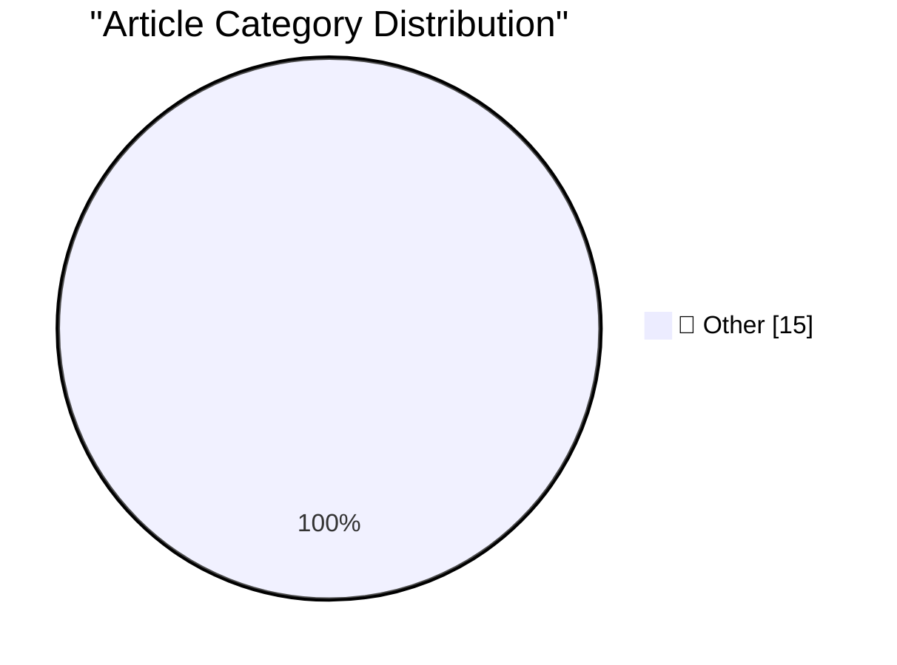

# 📰 AI Blog Daily Digest — 2026-09-24

> ⚠️ **Degraded run.** AI scoring failed for every batch — rankings and categories below are placeholder defaults, not AI-judged.

> From 92 top tech blogs (curated by Karpathy), AI-selected Top 15

## 🏆 Must Read

🥇 **Gemini 3.8 TTS Playground**

simonwillison.net · 5h ago · 📝 Other

> Tool: Gemini 3.8 TTS Playground Google released two new Gemini text-to-speech models today - gemini-3.8-flash-tts and gemini-3.8-flash-lite-tts . They come with a library of over 2,000 voices, plus th

🥈 **Shadow roots, explained with live examples**

simonwillison.net · 5h ago · 📝 Other

> Tool: Shadow roots, explained with live examples Prompt to Fable 5.1 Medium: Build an artifact to explain shadow roots in CSS with interactive examples Tags: css

🥉 **SF October 14th: A Birds of a Feather Session on Agentic Engineering**

simonwillison.net · 19h ago · 📝 Other

> SF October 14th: A Birds of a Feather Session on Agentic Engineering I'm hosting an evening event with Jesse Vincent in San Francisco on Wednesday 14th October for people who are building weird and in

---

## 📊 Data Overview

| Scanned | Articles | Range | Selected |
|:---:|:---:|:---:|:---:|
| 88/92 | 2632 → 44 | 48h | **15** |

### Category Distribution

---

## 📝 Other

### 1. Gemini 3.8 TTS Playground

[Link](https://simonwillison.net/2026/Sep/23/gemini-tts-playground/) — **simonwillison.net** · 5h ago · ⭐ 15/30

> Tool: Gemini 3.8 TTS Playground Google released two new Gemini text-to-speech models today - gemini-3.8-flash-tts and gemini-3.8-flash-lite-tts . They come with a library of over 2,000 voices, plus th

---

### 2. Shadow roots, explained with live examples

[Link](https://simonwillison.net/2026/Sep/23/shadow-roots/) — **simonwillison.net** · 5h ago · ⭐ 15/30

> Tool: Shadow roots, explained with live examples Prompt to Fable 5.1 Medium: Build an artifact to explain shadow roots in CSS with interactive examples Tags: css

---

### 3. SF October 14th: A Birds of a Feather Session on Agentic Engineering

[Link](https://simonwillison.net/2026/Sep/23/bof-agentic-engineering/) — **simonwillison.net** · 19h ago · ⭐ 15/30

> SF October 14th: A Birds of a Feather Session on Agentic Engineering I'm hosting an evening event with Jesse Vincent in San Francisco on Wednesday 14th October for people who are building weird and in

---

### 4. Claude Opus 5.5, GPT-6 Sol, GPT-6 Luna, and a new price war

[Link](https://simonwillison.net/2026/Sep/22/opus-and-sol-and-luna/) — **simonwillison.net** · 22h ago · ⭐ 15/30

> Yesterday was Grok 4.7 ( pelicans ) and MiMo v2.6 Flash/Pro ( more pelicans ). Today Anthropic released Claude Opus 5.5 , and around an hour later OpenAI released GPT-6 Sol and GPT-6 Luna . It's going

---

### 5. llm 0.36

[Link](https://simonwillison.net/2026/Sep/22/llm/) — **simonwillison.net** · 1 days ago · ⭐ 15/30

> Release: llm 0.36 New OpenAI models: gpt-6-sol for GPT-6 Sol and gpt-6-luna for GPT-6 Luna . #1702 Model plugins can now declare supports_conversation = False for models that only accept single-turn p

---

### 6. llm-anthropic 0.29

[Link](https://simonwillison.net/2026/Sep/22/llm-anthropic/) — **simonwillison.net** · 1 days ago · ⭐ 15/30

> Release: llm-anthropic 0.29 Adds support for Claude Opus 5.5 : llm -m claude-opus-5.5 "prompt goes here" Tags: llm , anthropic

---

### 7. ★ The iPhone 4 ‘Antennagate’ Press Conference Q&A — Finally

[Link](https://daringfireball.net/2026/09/iphone_4_antennagate_q_and_a) — **daringfireball.net** · 16m ago · ⭐ 15/30

> I don’t know what truck this video fell off the back of, why it took 16 years, or how it came into the hands of “Sir Mix-A-Lot Rare Music”, but I’m sure glad it did.

---

### 8. ‘Prepare to Ship’ Is a Clever Software Solution That Allows iPhone 18 Pro Max to Ship With a Battery That Would Otherwise Exceed International Shipping Regulations

[Link](https://support.apple.com/en-us/127848) — **daringfireball.net** · 2h ago · ⭐ 15/30

> Apple Support: iPhone 18 Pro Max offers a huge increase in battery life, in part due to increasing the battery capacity to over 20 watt-hours (Wh). Devices with a single-cell battery over 20 Wh have a

---

### 9. App Store Scam of the Week: ‘Update My Phone & Apps: Guide’ by Tair Olzhasev

[Link](https://apps.apple.com/us/app/update-my-phone-apps-guide/id6753936837) — **daringfireball.net** · 3h ago · ⭐ 15/30

> “Update My Phone & Apps: Guide” is an iOS app from developer Tair Olzhasev. By default, the only thing it does for free is give you a “Check for Updates” button that launches the system Settings app. 

---

### 10. ★ AppZapper 3000

[Link](https://daringfireball.net/2026/09/appzapper_3000) — **daringfireball.net** · 5h ago · ⭐ 15/30

> Is it absolutely ridiculous and unnecessary to make an uninstall utility with an exquisitely detailed 3D laser gun as its UI? Fuckin’-A right it is.

---

### 11. Super Intelligence, Indeed

[Link](https://bsky.app/profile/atrupar.com/post/3mw4it5l5fd23) — **daringfireball.net** · 8h ago · ⭐ 15/30

> President Donald Trump, in a prepared speech before the United Nations General Assembly yesterday (one-minute video clip from Aaron Rupar, posted on Bluesky): The United States also totally rejects an

---

### 12. Meta’s Muse Logomark, Designed by Jessica Hische

[Link](https://thedieline.com/jessica-hische-metas-muse-and-the-ethical-landmines-of-design/) — **daringfireball.net** · 23h ago · ⭐ 15/30

> Bill McCool, writing at Dieline: This past Wednesday, lettering artist, designer, and author Jessica Hische took to Threads to announce that she had worked alongside Meta’s team to create the icon and

---

### 13. A brief history of Windows scroll bar shortcuts

[Link](https://devblogs.microsoft.com/oldnewthing/20260922-00/?p=112719/) — **devblogs.microsoft.com/oldnewthing** · 1 days ago · ⭐ 15/30

> Right-clicking and shift-clicking. The post A brief history of Windows scroll bar shortcuts appeared first on The Old New Thing .

---

### 14. Historic UN Security Council Briefing on AI

[Link](https://garymarcus.substack.com/p/historic-un-security-council-briefing) — **garymarcus.substack.com** · 45m ago · ⭐ 15/30

> We all agree on what needs to be done. Now let’s do it.

---

### 15. Dear President Trump, here’s a deal you can actually make that will make you look great

[Link](https://garymarcus.substack.com/p/dear-president-trump-heres-a-deal) — **garymarcus.substack.com** · 9h ago · ⭐ 15/30

> An open letter about how you could change the world, tomorrow

---

*Generated on 2026-09-24 | Scanned 88 sources → Found 2632 articles → Selected 15 articles*
*Based on [Hacker News Popularity Contest 2025](https://refactoringenglish.com/tools/hn-popularity/) RSS feeds list, curated by [Andrej Karpathy](https://x.com/karpathy).*
*Created by "Understand AI".*
