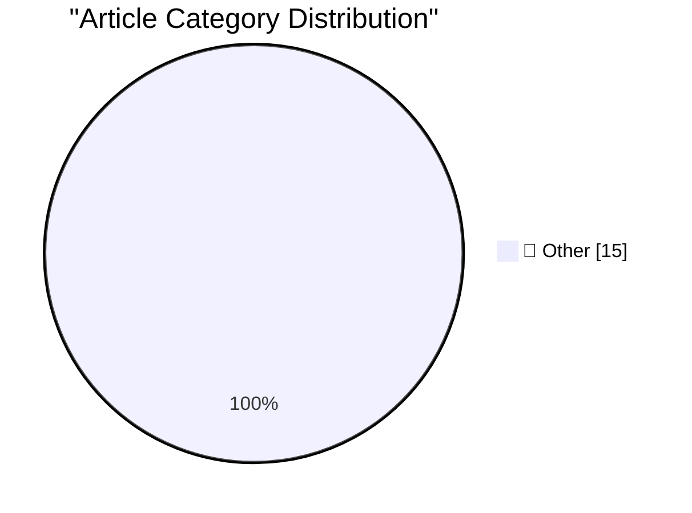

# 📰 AI Blog Daily Digest — 2026-09-27

> ⚠️ **Degraded run.** AI scoring failed for every batch — rankings and categories below are placeholder defaults, not AI-judged.

> From 92 top tech blogs (curated by Karpathy), AI-selected Top 15

## 🏆 Must Read

🥇 **Quoting John Gruber**

simonwillison.net · 1 days ago · 📝 Other

> Muse is getting a lot of attention — including mine — because it’s both groundbreaking technically (each user gets their own entire persistent Linux VM running in Meta’s cloud) and because it’s packag

🥈 **Northern Gannet, Great Blue Heron, California Brown Pelican**

simonwillison.net · 1 days ago · 📝 Other

> Northern Gannet, Great Blue Heron, California Brown Pelican, in Monterey Bay National Marine Sanctuary, CA, US, CA New 200-800mm Canon EF lens got me my best photo of Morris yet. They really like hang

🥉 **Note on 24th September 2026**

simonwillison.net · 1 days ago · 📝 Other

> The more time I spend working with coding agents, the more convinced I am that they make software engineering even harder. We can do amazing things with them, but unlocking their full potential requir

---

## 📊 Data Overview

| Scanned | Articles | Range | Selected |
|:---:|:---:|:---:|:---:|
| 87/92 | 2603 → 36 | 48h | **15** |

### Category Distribution

---

## 📝 Other

### 1. Quoting John Gruber

[Link](https://simonwillison.net/2026/Sep/25/john-gruber/) — **simonwillison.net** · 1 days ago · ⭐ 15/30

> Muse is getting a lot of attention — including mine — because it’s both groundbreaking technically (each user gets their own entire persistent Linux VM running in Meta’s cloud) and because it’s packag

---

### 2. Northern Gannet, Great Blue Heron, California Brown Pelican

[Link](https://simonwillison.net/2026/Sep/25/sighting-403293902/) — **simonwillison.net** · 1 days ago · ⭐ 15/30

> Northern Gannet, Great Blue Heron, California Brown Pelican, in Monterey Bay National Marine Sanctuary, CA, US, CA New 200-800mm Canon EF lens got me my best photo of Morris yet. They really like hang

---

### 3. Note on 24th September 2026

[Link](https://simonwillison.net/2026/Sep/24/harder/) — **simonwillison.net** · 1 days ago · ⭐ 15/30

> The more time I spend working with coding agents, the more convinced I am that they make software engineering even harder. We can do amazing things with them, but unlocking their full potential requir

---

### 4. I'm starting HomelabFest (in St. Louis, Sep 2027)

[Link](https://www.jeffgeerling.com/blog/2026/homelabfest-announcement/) — **jeffgeerling.com** · 1 days ago · ⭐ 15/30

> I've been working on my homelab for years, and I enjoy sharing what I learn through this blog and my YouTube channel. Over the past few years, I realized the homelab community (which isn't really a de

---

### 5. Advice to a beginning software engineer

[Link](https://seangoedecke.com/advice-to-a-beginning-software-engineer/) — **seangoedecke.com** · 22h ago · ⭐ 15/30

> In general, you should be suspicious of engineers who are trying to give you advice. Even during ordinary times, this industry is so wide and changes so quickly that nobody really knows anything for s

---

### 6. You should all be asking way more questions

[Link](https://seangoedecke.com/you-should-all-be-asking-way-more-questions/) — **seangoedecke.com** · 1 days ago · ⭐ 15/30

> When someone is explaining something to me, I ask on average one question every thirty seconds. I’m sure this is frustrating to some people, but it’s actually a good habit and you should do it too. Tr

---

### 7. U.S. Soldier Gets 70 Months in Prison for AT&T, Verizon Extortions

[Link](https://krebsonsecurity.com/2026/09/u-s-soldier-gets-70-months-in-prison-for-att-verizon-extortions/) — **krebsonsecurity.com** · 1 days ago · ⭐ 15/30

> A U.S. Army soldier who pleaded guilty to hacking into multiple telecommunications companies and stealing mobile call and text metadata for more than 100 million AT&T customers in 2024 was sentenced t

---

### 8. Reelizer Returns

[Link](https://www.reelizer.com/) — **daringfireball.net** · 1h ago · ⭐ 15/30

> Back in 2011 I linked to Reelizer, a splendid archive of movie posters curated by Roger Erik Tinch . Reelizer went away for a few years, but Tinch has brought it back, seemingly better than ever. Huzz

---

### 9. Alexandr Wang: ‘Why I’m Building Muse’

[Link](https://x.com/alexandr_wang/status/2103551714536439951) — **daringfireball.net** · 1h ago · ⭐ 15/30

> Alexandr Wang, blogging on X: Now imagine every person on earth with a second mind beyond their own. A general manager whose whole job is to find out what you want and make sure it happens. Someone th

---

### 10. Apple’s Other Recent ‘Duo’

[Link](https://support.apple.com/en-us/111812) — **daringfireball.net** · 2h ago · ⭐ 15/30

> I keep mentioning Apple’s 1992 groundbreaking PowerBook Duo series as a precedent of the iPhone Duo’s name. But of course in 2020, Apple released the MagSafe Duo Charger, a wonderful Lightning periphe

---

### 11. International Standard Paper Sizes

[Link](https://www.cl.cam.ac.uk/~mgk25/iso-paper.html) — **daringfireball.net** · 3h ago · ⭐ 15/30

> Markus Kuhn: In the ISO paper size system, the height-to-width ratio of all pages is the square root of two (1.4142 : 1). In other words, the width and the height of a page relate to each other like t

---

### 12. Microsoft Took the ‘Copilot+ PC’ Brand Out Behind the Shed

[Link](https://www.windowscentral.com/microsoft/windows-11/the-copilot-pc-brand-is-dead-microsoft-and-pc-makers-quietly-pull-back-on-tarnished-windows-11-ai-pc-branding) — **daringfireball.net** · 5h ago · ⭐ 15/30

> Zac Bowden, Windows Central: In 2024, Microsoft and Qualcomm kicked off a new category of Windows hardware it called “Copilot+ PCs” that set the baseline for a new wave of AI-first computers, and laun

---

### 13. The Talk Show: ‘I’m Thinking X, Not X’

[Link](https://daringfireball.net/thetalkshow/2026/09/25/ep-455) — **daringfireball.net** · 6h ago · ⭐ 15/30

> Andru Edwards returns to the show to discuss Apple’s big September event and their new products: the iPhones 18 Pro and Duo, AirPods 5, and Apple Watch Series 12/Ultra 4. Sponsored by: Factor : Health

---

### 14. Mr. Choyka Is Apparently Doing Well

[Link](https://www.usatoday.com/story/sports/golf/2020/02/02/golf-amateur-gary-choyka-sinks-two-holes-one-same-round/4639969002/) — **daringfireball.net** · 22h ago · ⭐ 15/30

> A reader asked if this Gary Choyka who hit two holes-in-one in the same round of golf back in 2020 is the same Gary Choyka who was my history teacher 30+ years ago. Indeed it is. He looks good. (He wa

---

### 15. Stock UI in MacOS 27 Eschews Clarity

[Link](https://mastodon.design/@thibault/117320401426286497) — **daringfireball.net** · 1 days ago · ⭐ 15/30

> “Thibault”, in post on Mastodon responding to Brent Simmons’s “stock Mac UI” post that I just linked to : It reminded me of my own explorations with the macOS design language, especially the modern ti

---

*Generated on 2026-09-27 | Scanned 87 sources → Found 2603 articles → Selected 15 articles*
*Based on [Hacker News Popularity Contest 2025](https://refactoringenglish.com/tools/hn-popularity/) RSS feeds list, curated by [Andrej Karpathy](https://x.com/karpathy).*
*Created by "Understand AI".*
