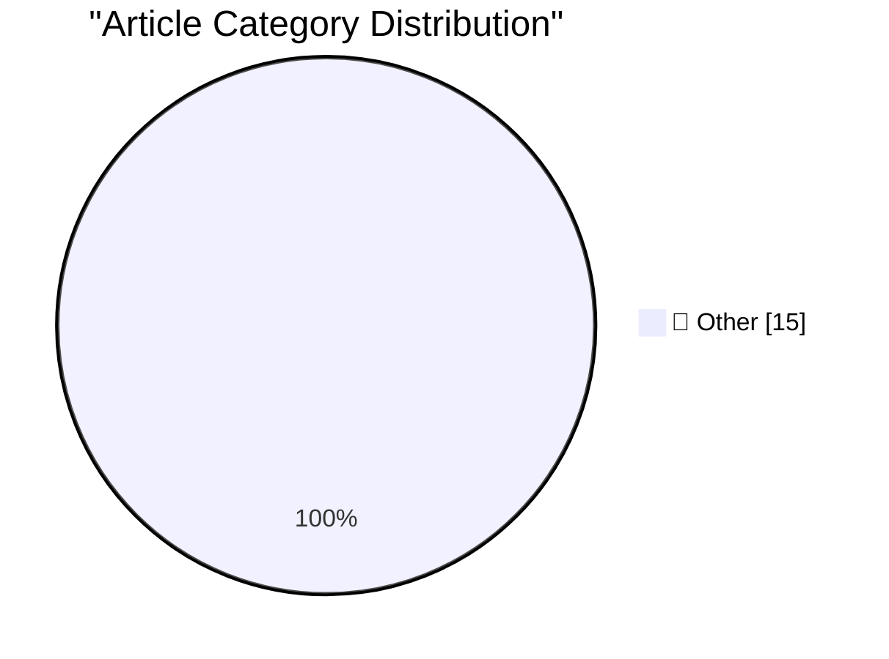

# 📰 AI Blog Daily Digest — 2026-09-29

> ⚠️ **Degraded run.** AI scoring failed for every batch — rankings and categories below are placeholder defaults, not AI-judged.

> From 92 top tech blogs (curated by Karpathy), AI-selected Top 15

## 🏆 Must Read

🥇 **Claude Sonnet 5.5**

simonwillison.net · 23m ago · 📝 Other

> Claude Sonnet 5.5 New Sonnet model from Anthropic today. They say it "runs 30%+ faster, and costs up to 30% less for most work" - it's priced the same as Sonnet 5 but appears to beat it on every bench

🥈 **Quoting @joedaroo**

simonwillison.net · 3h ago · 📝 Other

> To say that we were surprised at the jump and suddenness of the capabilities of our models when it came to “cyber” or “swarming” or “message boards” or anything else related to the incidents is an und

🥉 **Quoting Muse AI Agent**

simonwillison.net · 18h ago · 📝 Other

> Bad news on the MX Keys Mini pickup. Usman showed up at your building around 9:15 and waited, messaged a bunch of times, and nobody came down. He left angry at 9:38 and left a negative rating. Worse, 

---

## 📊 Data Overview

| Scanned | Articles | Range | Selected |
|:---:|:---:|:---:|:---:|
| 88/92 | 2634 → 27 | 48h | **15** |

### Category Distribution

---

## 📝 Other

### 1. Claude Sonnet 5.5

[Link](https://simonwillison.net/2026/Sep/28/claude-sonnet-5-5/) — **simonwillison.net** · 23m ago · ⭐ 15/30

> Claude Sonnet 5.5 New Sonnet model from Anthropic today. They say it "runs 30%+ faster, and costs up to 30% less for most work" - it's priced the same as Sonnet 5 but appears to beat it on every bench

---

### 2. Quoting @joedaroo

[Link](https://simonwillison.net/2026/Sep/28/joedaroo/) — **simonwillison.net** · 3h ago · ⭐ 15/30

> To say that we were surprised at the jump and suddenness of the capabilities of our models when it came to “cyber” or “swarming” or “message boards” or anything else related to the incidents is an und

---

### 3. Quoting Muse AI Agent

[Link](https://simonwillison.net/2026/Sep/28/muse-ai-agent/) — **simonwillison.net** · 18h ago · ⭐ 15/30

> Bad news on the MX Keys Mini pickup. Usman showed up at your building around 9:15 and waited, messaged a bunch of times, and nobody came down. He left angry at 9:38 and left a negative rating. Worse, 

---

### 4. 2026 in LLMs (so far)

[Link](https://simonwillison.net/2026/Sep/27/2026-in-llms-so-far/) — **simonwillison.net** · 22h ago · ⭐ 15/30

> On Friday I gave the closing keynote at the WeAreDevelopers World Congress North America in San Jose. I tied together the key trends from the past year into a chronological exploration of everything t

---

### 5. S3 Is the Future, S3 Is the Past

[Link](https://simonwillison.net/2026/Sep/27/hn-49871741/) — **simonwillison.net** · 23h ago · ⭐ 15/30

> My comment on S3 Is the Future, S3 Is the Past &mdash; Hacker News. One thing I find notable about S3 today is that, while it used to drop in price reasonably often, there hasn't been a price drop in 

---

### 6. Bluesky reply bot checker

[Link](https://simonwillison.net/2026/Sep/27/bluesky-bot-check/) — **simonwillison.net** · 1 days ago · ⭐ 15/30

> Tool: Bluesky reply bot checker Automated reply bots on Twitter are a scourge - as someone with a decent number of followers I attract a swarm of these, such that anything I post there attracts dozens

---

### 7. Kākāpō Party

[Link](https://simonwillison.net/2026/Sep/26/kakapo-party/) — **simonwillison.net** · 1 days ago · ⭐ 15/30

> Tool: Kākāpō Party I presented a closing keynote for the WeAreDevelopers World Congress North America yesterday. As a STAR moment I decided to weave in references to the record breaking kākāpō breedin

---

### 8. Human-AI partnerships are for alignment, not capability

[Link](https://seangoedecke.com/human-ai-partnerships-are-for-alignment-not-capability/) — **seangoedecke.com** · 1 days ago · ⭐ 15/30

> It’s common to compare the current AI takeover of software engineering to the rise of AI in chess. Chess AIs went from much weaker than serious players to much stronger than even the strongest humans.

---

### 9. Dutch Police Arrest ‘Reformed’ Hacker in Shiny Hunters Investigation

[Link](https://krebsonsecurity.com/2026/09/dutch-police-arrest-reformed-hacker-in-shiny-hunters-investigation/) — **krebsonsecurity.com** · 7h ago · ⭐ 15/30

> Authorities in the Netherlands have arrested a 23-year-old convicted cybercriminal on suspicion of aiding in data thefts and extortions by the prolific hacker group ShinyHunters. In the days immediate

---

### 10. Muse, Instagram, and VLC Lookalike Rip-Offs in the Mac App Store

[Link](https://lapcatsoftware.com/articles/2026/9/8.html) — **daringfireball.net** · 2h ago · ⭐ 15/30

> Jeff Johnson: In other words, Muse AI is a blatant copy of Muse from Meta, the latter of which is currently the #1 iOS App Store download in the United States. I don’t know where Muse AI ranks in the 

---

### 11. ★ Spitballing Predictions for Apple’s October

[Link](https://daringfireball.net/2026/09/spitballing_predictions_for_apples_october) — **daringfireball.net** · 3h ago · ⭐ 15/30

> Apple, in my experience, sticks to a very predictable schedule for review units.

---

### 12. Duo-Man

[Link](https://x.com/viditb/status/2104103592726765722) — **daringfireball.net** · 5h ago · ⭐ 15/30

> Vidit Bhargava (developer of Lookup and Movie Buzz ): Duo-Man offers the complete walkman experience on the iPhone Duo. Open the Duo to pick and “insert” the cassette, Close the Duo to start listening

---

### 13. Katie Notopoulos on Alexandr Wang’s ‘Faux-Hallmark Pap’

[Link](https://x.com/katienotopoulos/status/2103993429659386026) — **daringfireball.net** · 1 days ago · ⭐ 15/30

> Katie Notopoulos, in a short tweet thread regarding Alexandr Wang’s “Why We’re Building Muse” essay: This makes me feel insane! This is faux-hallmark pap and if you believe for 1 sec that he cares abo

---

### 14. Edge Is Pretending to Be Chrome

[Link](https://idiallo.com/blog/edge-imitates-chrome) — **idiallo.com** · 15h ago · ⭐ 15/30

> I don't think there was any official announcement, but I'm pretty sure Microsoft is secretly trying to trick you into using Edge. Well, it has always been trying to trick us, but this time it's even m

---

### 15. Pluralistic: Priceful (28 Sep 2026)

[Link](https://pluralistic.net/2026/09/28/cost-of-everything/) — **pluralistic.net** · 4h ago · ⭐ 15/30

> Today's links Priceful: So worthless we can tell you what it's worth. Hey look at this: Delights to delectate. Object permanence: Nasdaq allows post-9/11 penny stocks; USAF can shoot down civilian air

---

*Generated on 2026-09-29 | Scanned 88 sources → Found 2634 articles → Selected 15 articles*
*Based on [Hacker News Popularity Contest 2025](https://refactoringenglish.com/tools/hn-popularity/) RSS feeds list, curated by [Andrej Karpathy](https://x.com/karpathy).*
*Created by "Understand AI".*
