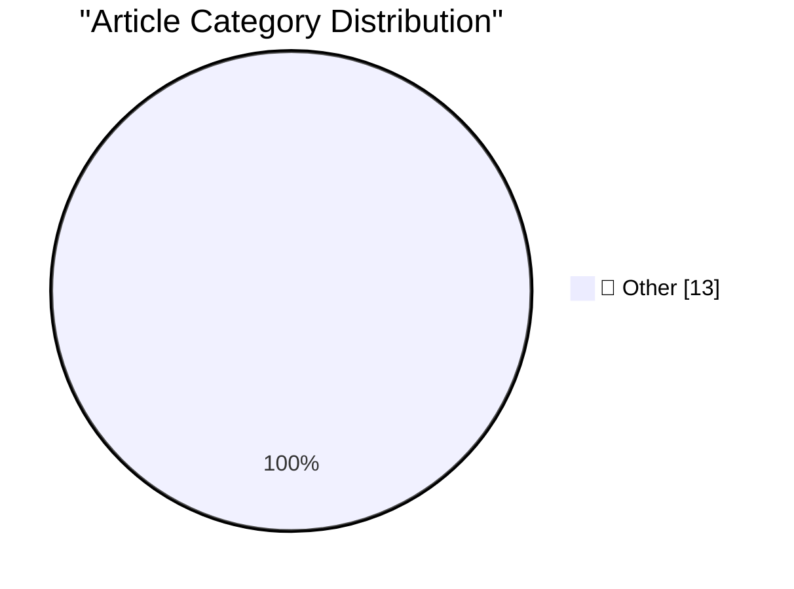

# 📰 AI Blog Daily Digest — 2026-10-03

> ⚠️ **Degraded run.** AI scoring failed for every batch — rankings and categories below are placeholder defaults, not AI-judged.

> From 92 top tech blogs (curated by Karpathy), AI-selected Top 13

## 🏆 Must Read

🥇 **Do not build the LLM torture factory**

seangoedecke.com · 22h ago · 📝 Other

> It isn’t hard to torture an LLM. You simply extract a steering vector that corresponds with LLM “discomfort” , then artificially boost that steering vector. Tortured LLMs will describe experiencing ne

🥈 **★ Apple Is Going to Further Tighten the Screws on Full Disk Access on MacOS, in Response to Agentic AI Apps Running Amok**

daringfireball.net · 2h ago · 📝 Other

> Hopefully Apple has in mind a solution to this situation that will still enable knowledgeable power users to confirm agreement to a sufficiently scary warning and put their Macs in a state similar to 

🥉 **Yankees Sweep Boston in Two Games, by Combined Score of 18-2**

daringfireball.net · 22h ago · 📝 Other

> In the 6th inning last night the Yankees were only ahead 2-0, and Red Sox first baseman and all-around jackass Willson Contreras hit a home run, closing it to 2-1. Contreras decided to walk around the

---

## 📊 Data Overview

| Scanned | Articles | Range | Selected |
|:---:|:---:|:---:|:---:|
| 86/92 | 2388 → 19 | 48h | **13** |

### Category Distribution

---

## 📝 Other

### 1. Do not build the LLM torture factory

[Link](https://seangoedecke.com/do-not-build-the-llm-torture-factory/) — **seangoedecke.com** · 22h ago · ⭐ 15/30

> It isn’t hard to torture an LLM. You simply extract a steering vector that corresponds with LLM “discomfort” , then artificially boost that steering vector. Tortured LLMs will describe experiencing ne

---

### 2. ★ Apple Is Going to Further Tighten the Screws on Full Disk Access on MacOS, in Response to Agentic AI Apps Running Amok

[Link](https://daringfireball.net/2026/10/apple_full_disk_access) — **daringfireball.net** · 2h ago · ⭐ 15/30

> Hopefully Apple has in mind a solution to this situation that will still enable knowledgeable power users to confirm agreement to a sufficiently scary warning and put their Macs in a state similar to 

---

### 3. Yankees Sweep Boston in Two Games, by Combined Score of 18-2

[Link](https://www.nytimes.com/athletic/7648172/2026/09/30/yankees-beat-red-sox-mlb-wild-card-series/) — **daringfireball.net** · 22h ago · ⭐ 15/30

> In the 6th inning last night the Yankees were only ahead 2-0, and Red Sox first baseman and all-around jackass Willson Contreras hit a home run, closing it to 2-1. Contreras decided to walk around the

---

### 4. Gadget Review: Una Watch ★★★★☆

[Link](https://shkspr.mobi/blog/2026/10/gadget-review-una-watch/) — **shkspr.mobi** · 11h ago · ⭐ 15/30

> I've never been a huge fan of smart watches. My £16 smartwatch is basically fine, but the OS is closed source and there's no way to add new functionality. Previously I had the eInk Watchy which was a 

---

### 5. Windows on Itanium also provided for hot-patching, in an even simpler way

[Link](https://devblogs.microsoft.com/oldnewthing/20261001-57/?p=112747/) — **devblogs.microsoft.com/oldnewthing** · 1 days ago · ⭐ 15/30

> Once again, the benefit of fixed-length instructions. The post Windows on Itanium also provided for hot-patching, in an even simpler way appeared first on The Old New Thing .

---

### 6. The Brain Sandwich

[Link](https://terriblesoftware.org/2026/10/02/the-brain-sandwich/) — **terriblesoftware.org** · 8h ago · ⭐ 15/30

> The brain sandwich is a practical AI coding workflow: understand the problem, let an agent help, then verify and explain its work before sharing it.

---

### 7. Si Sheppard – How did a few hundred Spanish soldiers topple two empires?

[Link](https://www.dwarkesh.com/p/si-sheppard) — **dwarkesh.com** · 1 days ago · ⭐ 15/30

> Fall of the Incas & Aztecs.

---

### 8. Premium: How Has AI Changed The Economy?

[Link](https://www.wheresyoured.at/premium-how-has-ai-changed-the-economy/) — **wheresyoured.at** · 3h ago · ⭐ 15/30

> This week, the Wall Street Journal ran an alarming illustration of AI&#x2019;s potential share of GDP that I&#x2019;d argue did more to muddy the waters than actually telling anyone anything, mostly b

---

### 9. What happened to Activision

[Link](https://dfarq.homeip.net/what-happened-to-activision/?utm_source=rss&#038;utm_medium=rss&#038;utm_campaign=what-happened-to-activision) — **dfarq.homeip.net** · 11h ago · ⭐ 15/30

> Activision was the first independent third-party publisher of console video games, founded October 1, 1979 by a group of former Atari developers. Activision proved successful, becoming the largest and

---

### 10. The day GIF became free to use, forever

[Link](https://dfarq.homeip.net/the-day-gif-became-free-to-use-forever/?utm_source=rss&#038;utm_medium=rss&#038;utm_campaign=the-day-gif-became-free-to-use-forever) — **dfarq.homeip.net** · 1 days ago · ⭐ 15/30

> October 1, 2006 was a good day. It was the day that the last of the patents covering the GIF file format finally expired and GIF became free to use. Today GIF is a staple of social media, but it The p

---

### 11. Summary of reading: July - September 2026

[Link](https://eli.thegreenplace.net/2026/summary-of-reading-july-september-2026/) — **eli.thegreenplace.net** · 1 days ago · ⭐ 15/30

> "Wuthering Heights" by Emily Brontë - good writing, but the protagonists are quite something. There's barely a likable character in the whole story - they are all either crazy, evil, stupid or a combi

---

### 12. Digitale autonomie in het kort bij KIVI, STT en NAE

[Link](https://berthub.eu/articles/posts/praatje-kivi-stt-nae/) — **berthub.eu** · 13h ago · ⭐ 15/30

> Onlangs sprak ik op een bijeenkomst van het Koninklijk Instituut Van Ingenieurs (KIVI), Stichting Toekomstbeeld der Techniek (STT) en Netherlands Academy of Engineering (NAE) over digitale autonomie. 

---

### 13. Make tmux the OS

[Link](https://matduggan.com/what-does-my-dream-os-ui-look-like/) — **matduggan.com** · 12h ago · ⭐ 15/30

> I recently watched the talk by Scott Jenson titled "Are we really going to use the same Desktop UX forever?" https://www.youtube.com/watch?v=V7AfAcQwLW0&t=445s . He&apos;s a great presenter, really ar

---

*Generated on 2026-10-03 | Scanned 86 sources → Found 2388 articles → Selected 13 articles*
*Based on [Hacker News Popularity Contest 2025](https://refactoringenglish.com/tools/hn-popularity/) RSS feeds list, curated by [Andrej Karpathy](https://x.com/karpathy).*
*Created by "Understand AI".*
