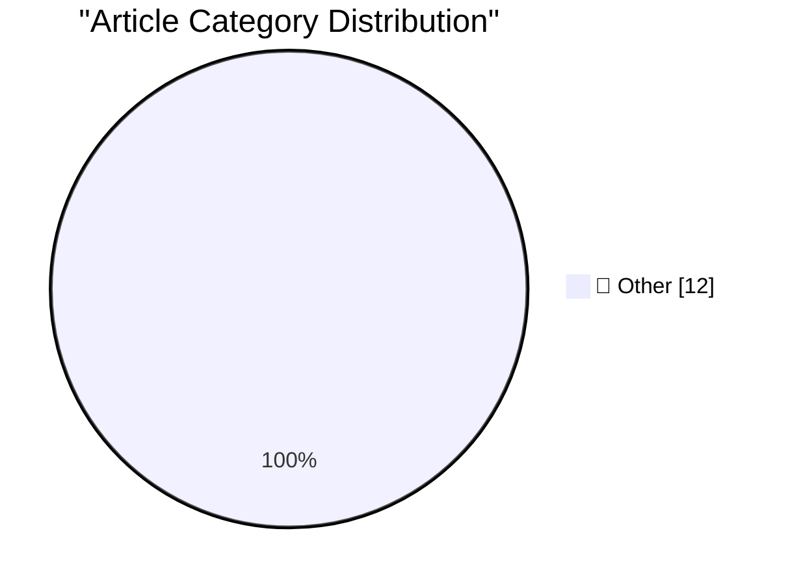

# 📰 AI Blog Daily Digest — 2026-10-04

> ⚠️ **Degraded run.** AI scoring failed for every batch — rankings and categories below are placeholder defaults, not AI-judged.

> From 92 top tech blogs (curated by Karpathy), AI-selected Top 12

## 🏆 Must Read

🥇 **September sponsors-only newsletter**

simonwillison.net · 32m ago · 📝 Other

> I just sent the September edition of my sponsors-only monthly newsletter . If you are a sponsor (or start a sponsorship now) you can access it here . This month: More Fable class models A pricing war 

🥈 **Rex's Dino Store**

simonwillison.net · 23h ago · 📝 Other

> Museum: Rex&#x27;s Dino Store Located just before the turnstiles in the Grand Army Plaza subway station at the north end of Brooklyn's Prospect Park is this former newsstand which is now operated by a

🥉 **Superpersuasion will look like bribery**

seangoedecke.com · 22h ago · 📝 Other

> The idea of “superpersuasion” has been floating around the AI safety community for decades. Now that powerful and difficult-to-control LLMs have appeared, people are again talking about the idea that 

---

## 📊 Data Overview

| Scanned | Articles | Range | Selected |
|:---:|:---:|:---:|:---:|
| 87/92 | 2418 → 22 | 48h | **12** |

### Category Distribution

---

## 📝 Other

### 1. September sponsors-only newsletter

[Link](https://simonwillison.net/2026/Oct/3/newsletter/) — **simonwillison.net** · 32m ago · ⭐ 15/30

> I just sent the September edition of my sponsors-only monthly newsletter . If you are a sponsor (or start a sponsorship now) you can access it here . This month: More Fable class models A pricing war 

---

### 2. Rex's Dino Store

[Link](https://simonwillison.net/2026/Oct/2/rex-s-dino-store/) — **simonwillison.net** · 23h ago · ⭐ 15/30

> Museum: Rex&#x27;s Dino Store Located just before the turnstiles in the Grand Army Plaza subway station at the north end of Brooklyn's Prospect Park is this former newsstand which is now operated by a

---

### 3. Superpersuasion will look like bribery

[Link](https://seangoedecke.com/superpersuasion-will-look-like-bribery/) — **seangoedecke.com** · 22h ago · ⭐ 15/30

> The idea of “superpersuasion” has been floating around the AI safety community for decades. Now that powerful and difficult-to-control LLMs have appeared, people are again talking about the idea that 

---

### 4. Shipping is the foundation

[Link](https://seangoedecke.com/shipping-is-the-foundation/) — **seangoedecke.com** · 22h ago · ⭐ 15/30

> There are lots of skills involved in being a successful engineer at a big tech company. Running effective meetings, writing good design docs, fleshing out tickets and epics, improving team processes, 

---

### 5. Apple Confirms iPhone 18 Pro Max AT&T Cellular Issues, Affected Devices Require Hardware Replacement

[Link](https://9to5mac.com/2026/10/02/apple-confirms-iphone-18-pro-max-att-cellular-issues-affected-devices-require-hardware-replacement/) — **daringfireball.net** · 4h ago · ⭐ 15/30

> Chance Miller, 9to5Mac: In a statement to 9to5Mac, Apple said: We have identified an issue affecting a small number of iPhone 18 Pro Max users on the AT&T network that may cause a device to lose servi

---

### 6. Pluralistic: Economic probabilities for our grandchildren (03 Oct 2026)

[Link](https://pluralistic.net/2026/10/03/full-employment/) — **pluralistic.net** · 10h ago · ⭐ 15/30

> Today's links Economic probabilities for our grandchildren: If only data centers would stop hogging all the copper. Hey look at this: Delights to delectate. Object permanence: RIAA v P2P; Infoseek's a

---

### 7. Haunted by the ghosts of materialism

[Link](https://blog.coredump.cx/p/haunted-by-the-ghosts-of-materialism) — **lcamtuf.substack.com** · 17h ago · ⭐ 15/30

> Is philosophy real? We sent our correspondent to find out.

---

### 8. This Week in Package Management: 3 October 2026

[Link](https://nesbitt.io/2026/10/03/this-week-in-package-management.html) — **nesbitt.io** · 12h ago · ⭐ 15/30

> Releases, advisories, and articles from across the package management world

---

### 9. Reading List 2026-10-03

[Link](https://www.construction-physics.com/p/reading-list-2026-10-03) — **construction-physics.com** · 9h ago · ⭐ 15/30

> A Senate permitting reform bill, the potential of Tesla’s Cybercab, the Navy’s $200 billion worth of shipyard renovations, returning a SR-71 to service, and more.

---

### 10. Connect Sony WH-1000XM3 on Arch Linux and a buggy UGREEN Bluetooth adapter

[Link](https://jayd.ml/2026/10/03/sony-headphones-action-bluetooth-adapter.html) — **jayd.ml** · 13h ago · ⭐ 15/30

> Tried to connect to my Sony WH-1000XM3 headphones on Arch Linux KDE, it would try and connect but fail with The setup of WH-1000XM3 failed.

---

### 11. Cull lumber at Menards

[Link](https://dfarq.homeip.net/cull-lumber-at-menards/?utm_source=rss&#038;utm_medium=rss&#038;utm_campaign=cull-lumber-at-menards) — **dfarq.homeip.net** · 11h ago · ⭐ 15/30

> The Home Depot near me stopped doing cull lumber. I don’t know if that’s just a local thing or if the whole chain stopped doing it. That sent me looking for alternatives, and I found one at Menards. M

---

### 12. Altera Quartus Linux jtagd bug fixes

[Link](https://www.downtowndougbrown.com/2026/10/altera-quartus-linux-jtagd-bug-fixes/) — **downtowndougbrown.com** · 16h ago · ⭐ 15/30

> I went kind of overboard looking into issues with Altera USB Blaster clones a couple of years ago. While writing that post, I ran into some really frustrating intermittent problems in Linux with jtagd

---

*Generated on 2026-10-04 | Scanned 87 sources → Found 2418 articles → Selected 12 articles*
*Based on [Hacker News Popularity Contest 2025](https://refactoringenglish.com/tools/hn-popularity/) RSS feeds list, curated by [Andrej Karpathy](https://x.com/karpathy).*
*Created by "Understand AI".*
