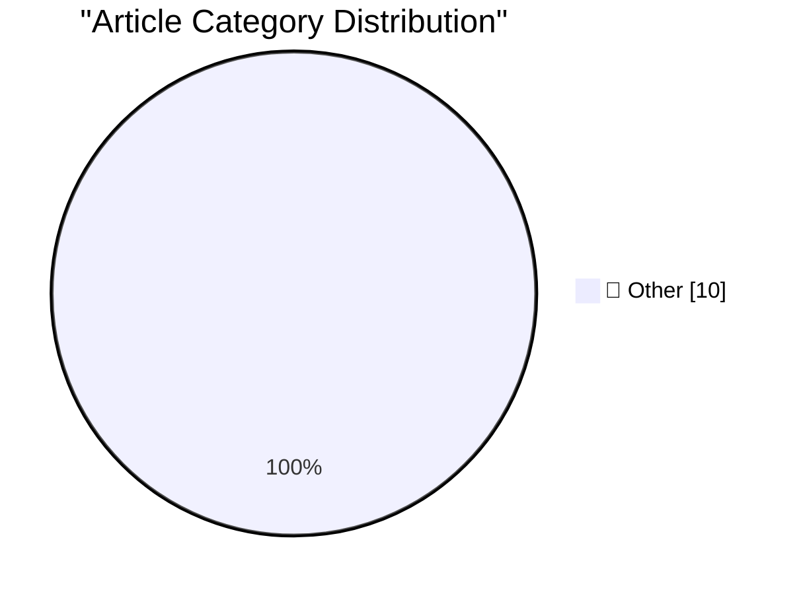

# 📰 AI Blog Daily Digest — 2026-10-05

> ⚠️ **Degraded run.** AI scoring failed for every batch — rankings and categories below are placeholder defaults, not AI-judged.

> From 92 top tech blogs (curated by Karpathy), AI-selected Top 10

## 🏆 Must Read

🥇 **We're going to need default hard budget caps on pretty much everything**

simonwillison.net · 22h ago · 📝 Other

> Here's a product feature which the world is going to need a whole lot more of over the coming months and years: default hard budget caps . I'm talking about the feature of pay-by-usage services and AP

🥈 **Why My Asus Laptop Kept Rebooting After Sleep and How to Fix it**

idiallo.com · 20h ago · 📝 Other

> Three years ago, I bought an Asus laptop, specifically the Zenbook Pro 17. It's a powerful machine and works just fine for my needs, but it had one problem that made me want to either return it or thr

🥉 **My Pitch for the New Season of Doctor Who**

shkspr.mobi · 10h ago · 📝 Other

> With the news that the BBC are tendering for a new series of Doctor Who, I thought I'd write down what I want from the show. This is, to be fair, pure fan-service wankery with zero chance of being mad

---

## 📊 Data Overview

| Scanned | Articles | Range | Selected |
|:---:|:---:|:---:|:---:|
| 87/92 | 2418 → 23 | 48h | **10** |

### Category Distribution

---

## 📝 Other

### 1. We're going to need default hard budget caps on pretty much everything

[Link](https://simonwillison.net/2026/Oct/3/default-hard-budget-caps/) — **simonwillison.net** · 22h ago · ⭐ 15/30

> Here's a product feature which the world is going to need a whole lot more of over the coming months and years: default hard budget caps . I'm talking about the feature of pay-by-usage services and AP

---

### 2. Why My Asus Laptop Kept Rebooting After Sleep and How to Fix it

[Link](https://idiallo.com/blog/asus-laptop-keeps-rebooting-after-sleep) — **idiallo.com** · 20h ago · ⭐ 15/30

> Three years ago, I bought an Asus laptop, specifically the Zenbook Pro 17. It's a powerful machine and works just fine for my needs, but it had one problem that made me want to either return it or thr

---

### 3. My Pitch for the New Season of Doctor Who

[Link](https://shkspr.mobi/blog/2026/10/my-pitch-for-the-new-season-of-doctor-who/) — **shkspr.mobi** · 10h ago · ⭐ 15/30

> With the news that the BBC are tendering for a new series of Doctor Who, I thought I'd write down what I want from the show. This is, to be fair, pure fan-service wankery with zero chance of being mad

---

### 4. Miquel’s pentagon theorem

[Link](https://www.johndcook.com/blog/2026/10/04/miquels-pentagon-theorem/) — **johndcook.com** · 9h ago · ⭐ 15/30

> An earlier post presented an elegant plane geometry theorem discovered by the 19th century school teacher Auguste Miquel. This post presents his pentagon theorem. Start with a pentagon. It may be irre

---

### 5. Topological models of modal logic

[Link](https://www.johndcook.com/blog/2026/10/04/topological-models-of-modal-logic/) — **johndcook.com** · 10h ago · ⭐ 15/30

> The previous post discussed a superficial connection between modal logic and topology, that both use the terms regular and normal to indicate added sets of axioms. McKinsey and Tarski developed a deep

---

### 6. Modal logic and topology

[Link](https://www.johndcook.com/blog/2026/10/04/modal-topology/) — **johndcook.com** · 10h ago · ⭐ 15/30

> You can’t say much about modal logic in general. You have to be more specific to get anywhere. You have to choose some axioms. Ideally the axioms you need for your application correspond to a named se

---

### 7. Miquel’s pivot theorem

[Link](https://www.johndcook.com/blog/2026/10/03/miquels-pivot-theorem/) — **johndcook.com** · 23h ago · ⭐ 15/30

> Euclidean geometry dates back at least to Euclid (circa 300 BC), and so you might think it’s been pretty well picked over by now. And yet people still occasionally discover new plane geometry theorems

---

### 8. Weekend content through the end of 2026

[Link](https://dfarq.homeip.net/weekend-content-through-the-end-of-2026/?utm_source=rss&#038;utm_medium=rss&#038;utm_campaign=weekend-content-through-the-end-of-2026) — **dfarq.homeip.net** · 9h ago · ⭐ 15/30

> About three and a half years ago, I had to make some changes to my format and workflow. It wasn’t the first time I’d done things like that and probably won’t be the last. And usually when I make chang

---

### 9. Zenith Data Systems, Part I

[Link](https://www.abortretry.fail/p/zenith-data-systems-part-i) — **abortretry.fail** · 22m ago · ⭐ 15/30

> The quality goes in before the name goes on

---

### 10. Weekly Update 524: Live From Copenhagen

[Link](https://www.troyhunt.com/weekly-update-524/) — **troyhunt.com** · 10h ago · ⭐ 15/30

> I&apos;m in Denmark! Well, just, I&apos;m now at Copenhagen airport ready to begin the long trek home, with the final event at GOTO now done and going just perfectly. This week, there are two ShinyHun

---

*Generated on 2026-10-05 | Scanned 87 sources → Found 2418 articles → Selected 10 articles*
*Based on [Hacker News Popularity Contest 2025](https://refactoringenglish.com/tools/hn-popularity/) RSS feeds list, curated by [Andrej Karpathy](https://x.com/karpathy).*
*Created by "Understand AI".*
