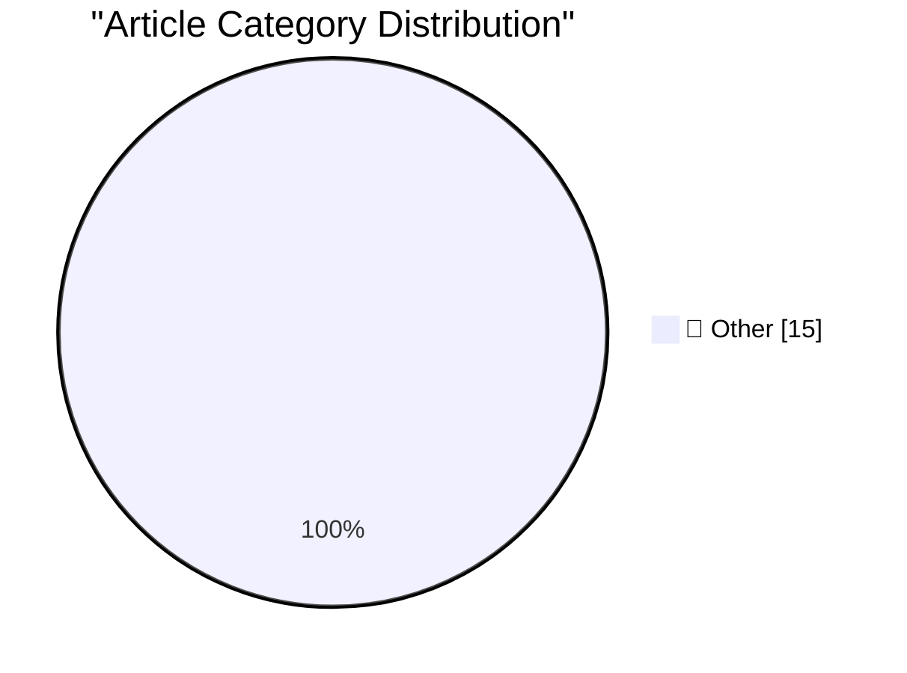

# 📰 AI Blog Daily Digest — 2026-10-07

> ⚠️ **Degraded run.** AI scoring failed for every batch — rankings and categories below are placeholder defaults, not AI-judged.

> From 92 top tech blogs (curated by Karpathy), AI-selected Top 15

## 🏆 Must Read

🥇 **llm-mistral 0.16**

simonwillison.net · 3h ago · 📝 Other

> Release: llm-mistral 0.16 Adds support for reasoning models, such as the newly released Mistral Large 4 . Tags: llm , mistral , llm-reasoning

🥈 **EmbeddingGemma 2**

simonwillison.net · 4h ago · 📝 Other

> My comment on EmbeddingGemma 2 &mdash; Hacker News. I really appreciate that EmbeddingGemma 2 is under the Apache 2.0 license. For embedding models in particular, I don't think it makes sense to use a

🥉 **Introducing Mistral Large 4: Le chonk**

simonwillison.net · 4h ago · 📝 Other

> Introducing Mistral Large 4: Le chonk Mistral are back in the game. Today they're releasing a preview of Mistral Large 4, a 1 trillion parameter, 49 billion active parameter model trained on their own

---

## 📊 Data Overview

| Scanned | Articles | Range | Selected |
|:---:|:---:|:---:|:---:|
| 84/92 | 2369 → 30 | 48h | **15** |

### Category Distribution

---

## 📝 Other

### 1. llm-mistral 0.16

[Link](https://simonwillison.net/2026/Oct/6/llm-mistral/) — **simonwillison.net** · 3h ago · ⭐ 15/30

> Release: llm-mistral 0.16 Adds support for reasoning models, such as the newly released Mistral Large 4 . Tags: llm , mistral , llm-reasoning

---

### 2. EmbeddingGemma 2

[Link](https://simonwillison.net/2026/Oct/6/hn-49983751/) — **simonwillison.net** · 4h ago · ⭐ 15/30

> My comment on EmbeddingGemma 2 &mdash; Hacker News. I really appreciate that EmbeddingGemma 2 is under the Apache 2.0 license. For embedding models in particular, I don't think it makes sense to use a

---

### 3. Introducing Mistral Large 4: Le chonk

[Link](https://simonwillison.net/2026/Oct/6/le-chonk/) — **simonwillison.net** · 4h ago · ⭐ 15/30

> Introducing Mistral Large 4: Le chonk Mistral are back in the game. Today they're releasing a preview of Mistral Large 4, a 1 trillion parameter, 49 billion active parameter model trained on their own

---

### 4. Using Parseable with Datasette for OpenTelemetry traces

[Link](https://simonwillison.net/2026/Oct/6/datasette-parseable-opentelemetry/) — **simonwillison.net** · 5h ago · ⭐ 15/30

> TIL: Using Parseable with Datasette for OpenTelemetry traces I saw Parseable in a Show HN today - it's a new observability platform with both an open source (AGPL) Rust implementation (a single ~180MB

---

### 5. Mistral Large 4

[Link](https://simonwillison.net/2026/Oct/6/hn-49982139/) — **simonwillison.net** · 6h ago · ⭐ 15/30

> My comment on Mistral Large 4 &mdash; Hacker News. wren6991 : The benchmark is saturated. Frontier models are tested with an armadillo in fishnet tights jaywalking on Mars. OK well I couldn't resist t

---

### 6. datasette-atom 0.11a0

[Link](https://simonwillison.net/2026/Oct/6/datasette-atom/) — **simonwillison.net** · 7h ago · ⭐ 15/30

> Release: datasette-atom 0.11a0 A minor fix for compatibility with the latest Datasette alphas. This meant we could upgrade the datasette.io site to Datasette 1.0a41. Tags: atom , datasette

---

### 7. Scrimshaw Jukebox

[Link](https://simonwillison.net/2026/Oct/6/scrimshaw-jukebox/) — **simonwillison.net** · 9h ago · ⭐ 15/30

> Tool: Scrimshaw Jukebox I wanted to see if Claude Opus 5.5 could compose music, so I tried this : I want you to write some computer game music for me. First design simple text based format for the mus

---

### 8. Quoting Felix Rieseberg

[Link](https://simonwillison.net/2026/Oct/5/felix-rieseberg/) — **simonwillison.net** · 1 days ago · ⭐ 15/30

> The "old" version of Cowork runs model inference in the cloud, executing tool calls in an Anthropic-provided VM we shipped to your computer. We added the VM for capability, safety, and security reason

---

### 9. Unofficial Command-Line Tool Removes Apple Intelligence From MacOS 27

[Link](https://arstechnica.com/apple/2026/10/command-line-tool-quickly-removes-apple-intelligence-from-macos-27/) — **daringfireball.net** · 6h ago · ⭐ 15/30

> Scharon Harding, Ars Technica: Unlike with previous versions of macOS, macOS 27 Golden Gate doesn’t have a toggle for turning off Apple Intelligence. That makes disabling AI features that you may not 

---

### 10. Steve Jobs, Walking Through a Mockup for Apple Park in 2010

[Link](https://book.stevejobsarchive.com/#photo-37) — **daringfireball.net** · 22h ago · ⭐ 15/30

> What an apt photo, today of all days. What a gift Make Something Wonderful is. ★

---

### 11. [Sponsor] Sunnny

[Link](https://sunnny.com/) — **daringfireball.net** · 1 days ago · ⭐ 15/30

> How can B2B software be so friggin’ delicious? Early access drops 10/19. Spread the love. ★

---

### 12. OpenAI Announces Their Text Watermarking Plans

[Link](https://openai.com/index/eu-text-provenance/) — **daringfireball.net** · 1 days ago · ⭐ 15/30

> OpenAI, today: The EU AI Act requires generative AI providers to make generated text identifiable in a machine-readable way. Text watermarking and detection remain early technologies with significant 

---

### 13. Ternus and Cook Tweet Brief Remembrances on the 15th Anniversary of Steve Jobs’s Death

[Link](https://x.com/johnternus/status/2107093462118199562) — **daringfireball.net** · 1 days ago · ⭐ 15/30

> John Ternus, posting on X: The way Steve taught us to care about every detail, every experience, every person, still guides our work today. Forever grateful. Tim Cook , also on X (with a photo I don’t

---

### 14. Pluralistic: Swapping money for expertise (06 Oct 2026)

[Link](https://pluralistic.net/2026/10/06/nonfungible/) — **pluralistic.net** · 12h ago · ⭐ 15/30

> Today's links Swapping money for expertise: Money can't buy me love. Hey look at this: Delights to delectate. Object permanence: "Tempo"; Yahoo censors MEP's torture debate video; Scotland's money-lau

---

### 15. Pluralistic: Scrutinized (05 Oct 2026)

[Link](https://pluralistic.net/2026/10/05/pervert-glasses/) — **pluralistic.net** · 1 days ago · ⭐ 15/30

> Today's links Scrutinized: Pervert glasses vs the authentic self. Hey look at this: Delights to delectate. Object permanence: DRM-free in the UK; Maple-leaf roses; Italian Wikipedia shuts down; Vancou

---

*Generated on 2026-10-07 | Scanned 84 sources → Found 2369 articles → Selected 15 articles*
*Based on [Hacker News Popularity Contest 2025](https://refactoringenglish.com/tools/hn-popularity/) RSS feeds list, curated by [Andrej Karpathy](https://x.com/karpathy).*
*Created by "Understand AI".*
