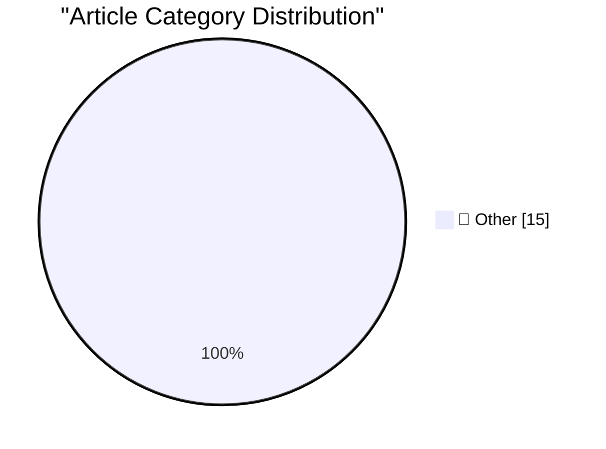

# 📰 AI Blog Daily Digest — 2026-10-11

> ⚠️ **Degraded run.** AI scoring failed for every batch — rankings and categories below are placeholder defaults, not AI-judged.

> From 92 top tech blogs (curated by Karpathy), AI-selected Top 15

## 🏆 Must Read

🥇 **Quoting The New York Times**

simonwillison.net · 20h ago · 📝 Other

> Anthropic detailed the activity of its A.I. agents in a blog post on Friday, without naming the targeted websites. But two sources with knowledge of the incidents said Anthropic’s A.I. agents had subm

🥈 **Deno is joining Cloudflare**

simonwillison.net · 23h ago · 📝 Other

> Deno is joining Cloudflare The Deno team released the first version of celld back in August - their open source implementation of the Durable Objects pattern from Cloudflare Workers. Today, Cloudflare

🥉 **Quoting Matthew Green**

simonwillison.net · 1 days ago · 📝 Other

> Everyone is very concerned about being respectable, so I’m going to be the goofball who raises worst-case possibilities. I think there is a 1% chance we live in Minicrypt, and a 15% chance we function

---

## 📊 Data Overview

| Scanned | Articles | Range | Selected |
|:---:|:---:|:---:|:---:|
| 86/92 | 2411 → 27 | 48h | **15** |

### Category Distribution

---

## 📝 Other

### 1. Quoting The New York Times

[Link](https://simonwillison.net/2026/Oct/10/the-new-york-times/) — **simonwillison.net** · 20h ago · ⭐ 15/30

> Anthropic detailed the activity of its A.I. agents in a blog post on Friday, without naming the targeted websites. But two sources with knowledge of the incidents said Anthropic’s A.I. agents had subm

---

### 2. Deno is joining Cloudflare

[Link](https://simonwillison.net/2026/Oct/9/deno-is-joining-cloudflare/) — **simonwillison.net** · 23h ago · ⭐ 15/30

> Deno is joining Cloudflare The Deno team released the first version of celld back in August - their open source implementation of the Durable Objects pattern from Cloudflare Workers. Today, Cloudflare

---

### 3. Quoting Matthew Green

[Link](https://simonwillison.net/2026/Oct/9/matthew-green/) — **simonwillison.net** · 1 days ago · ⭐ 15/30

> Everyone is very concerned about being respectable, so I’m going to be the goofball who raises worst-case possibilities. I think there is a 1% chance we live in Minicrypt, and a 15% chance we function

---

### 4. A new feature for my blog, built using my voice

[Link](https://simonwillison.net/2026/Oct/9/built-using-my-voice/) — **simonwillison.net** · 1 days ago · ⭐ 15/30

> I shipped a new feature for my blog today: the Newsletters page, which offers an index of all of the newsletters I've sent out, both my free weekly Substack and my monthly sponsors-only updates. I bui

---

### 5. ttok 1.0

[Link](https://simonwillison.net/2026/Oct/9/ttok/) — **simonwillison.net** · 1 days ago · ⭐ 15/30

> Release: ttok 1.0 I released ttok 0.4 , ran uv tool upgrade ttok , piped a file into the new version... and realized that it was defaulting to the GPT-4 tokenizer when it should very clearly default t

---

### 6. ttok 0.4

[Link](https://simonwillison.net/2026/Oct/8/ttok/) — **simonwillison.net** · 1 days ago · ⭐ 15/30

> Release: ttok 0.4 ttok is my CLI tool for counting tokens, using OpenAI's open source tiktoken library. It hasn't been in updated in a couple of years, but I finally fixed a Click warning, updated CI,

---

### 7. Radxa's Q8B has 2x the performance and expansion of the Pi 5

[Link](https://www.jeffgeerling.com/blog/2026/radxa-q8b-double-pi-5/) — **jeffgeerling.com** · 1 days ago · ⭐ 15/30

> There was a time I'd look at a board like the Radxa Dragon Q8B (at left, above) and be like, "there's no way I'd spend $209 on an SBC with 8 gigs of RAM". But we're in 2026, and seeing the 8 gig Raspb

---

### 8. Software's centaur age may last decades

[Link](https://seangoedecke.com/softwares-centaur-age-may-last-decades/) — **seangoedecke.com** · 22h ago · ⭐ 15/30

> We are currently living in the age of centaurs (2022-20??). Right now, human engineers paired with AI coding systems are more effective than either by themselves. For future generations of software en

---

### 9. FBI Arrests Executive at Ransomware Negotiation Firm

[Link](https://krebsonsecurity.com/2026/10/fbi-arrests-founder-of-ransomware-negotiation-firm/) — **krebsonsecurity.com** · 22h ago · ⭐ 15/30

> Agents with the Federal Bureau of Investigation (FBI) on Thursday arrested the co-founder of a Canadian cybersecurity firm in connection with an investigation into the ShinyHunters hacking group that 

---

### 10. ‘Proof-of-Human’

[Link](https://x.com/bzamayo/status/2108498107184934914) — **daringfireball.net** · 6h ago · ⭐ 15/30

> Benjamin Mayo (on X, of course), commenting on Apple promoting behind-the-scenes footage showing that the cross-stitch “Welcome Home” logo for next week’s keynote/experience was stitched by hand: Ther

---

### 11. Let’s Check In on Trump’s Blog

[Link](https://truthsocial.com/@realDonaldTrump/posts/117406176604364910) — **daringfireball.net** · 1 days ago · ⭐ 15/30

> An actual post from the sitting president of the United States: The White House considers anyone that uses the term, “Artificial Intelligence,” as opposed to the highly accepted new and more accurate 

---

### 12. 20 Minutes of Political Debate, Brought to You by Commercial Breaks

[Link](https://idiallo.com/byte-size/20-minutes-of-political-debate) — **idiallo.com** · 1 days ago · ⭐ 15/30

> "I'm sorry, you're out of time, we have to move on. Senator, what's your response? You have three minutes." Watching a political debate these days feels useless. Candidates get two minutes to make the

---

### 13. Pluralistic: Thwarted (09 Oct 2026)

[Link](https://pluralistic.net/2026/10/09/impunitism/) — **pluralistic.net** · 1 days ago · ⭐ 15/30

> Today's links Thwarted: Behold the awesome destructive power of a fully operational billionaire. Hey look at this: Delights to delectate. Object permanence: Anthrax v National Inquirer; Grey goo v Sec

---

### 14. Some quick thoughts on Unit Testing ActivityPub

[Link](https://shkspr.mobi/blog/2026/10/some-thoughts-on-unit-testing-activitypub/) — **shkspr.mobi** · 11h ago · ⭐ 15/30

> I'll be radically honest here - I never really got the idea of "Test Driven Development". I'm much more of a "telnet into production and damn the consequences" kind of guy. Look, it's much more fun an

---

### 15. Concert Review: London Voices - Video Games Go Choral ★★★★☆

[Link](https://shkspr.mobi/blog/2026/10/concert-review-london-voices-video-games-go-choral/) — **shkspr.mobi** · 1 days ago · ⭐ 15/30

> London's musical entertainment scene has something for everyone - from long-running blockbuster shows to no-name bands in dingy basements. Somewhere in the middle is monophonic plainchant versions of 

---

*Generated on 2026-10-11 | Scanned 86 sources → Found 2411 articles → Selected 15 articles*
*Based on [Hacker News Popularity Contest 2025](https://refactoringenglish.com/tools/hn-popularity/) RSS feeds list, curated by [Andrej Karpathy](https://x.com/karpathy).*
*Created by "Understand AI".*
